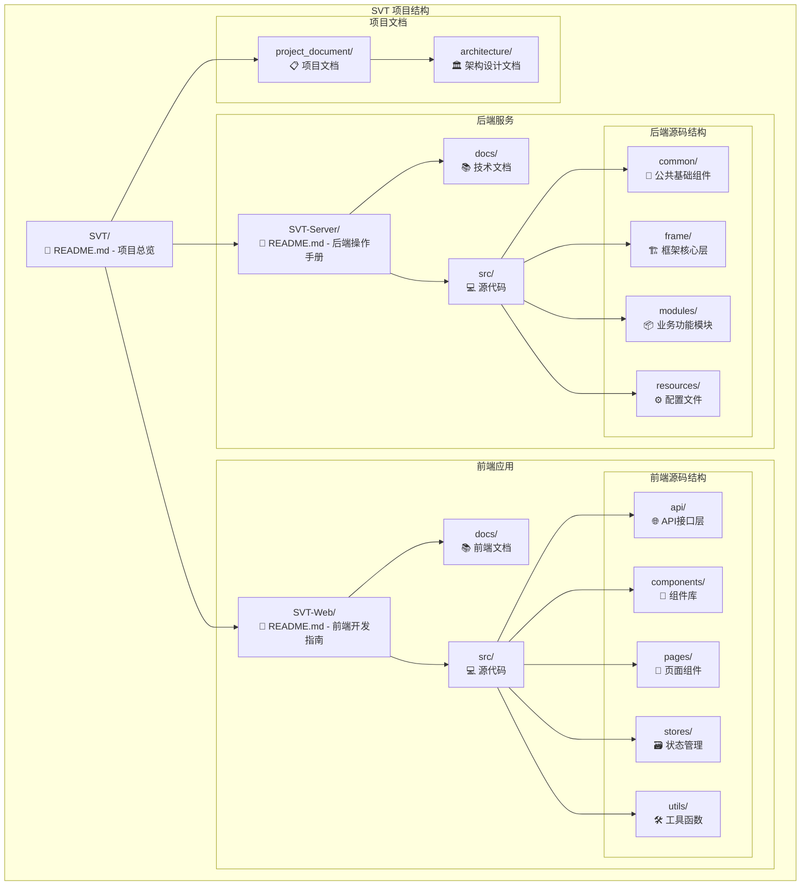
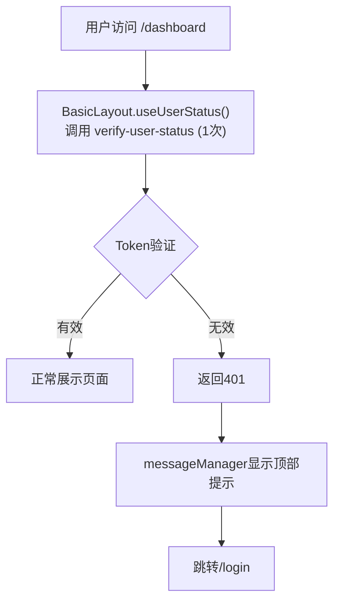

# SVT (Secure Vision Tesseract) 项目

## 📋 项目概述

SVT是一个采用现代化前后端分离架构的企业级Web应用系统，专为保密性要求较高的企业内部使用而设计。系统集成了完整的安全加密体系、JWT认证和权限管理功能，经过多轮安全优化和用户体验改进，实现了生产级的安全认证流程。

### 🏗️ 系统架构

```Mermaid
graph LR
    A["SVT-Web (React 19)<br/>• React Router<br/>• Ant Design<br/>• Zustand<br/>• CryptoJS"]
    B["AES加密通道 (端到端加密)<br/>• AES-256-CBC<br/>• JWT黑名单<br/>• 防重放攻击<br/>• 消息管理器"]
    C["SVT-Server (Spring Boot)<br/>• Spring Security<br/>• Mybatis-Flex<br/>• Redis缓存<br/>• Argon2哈希"]

    A <--> B
    B <--> C
```


## 🔒 核心安全特性

### 1. JWT认证 + 安全黑名单机制 ⭐ 
**重大设计亮点**: 智能区分系统颁发Token vs 恶意Token

- **多层验证**: Token签名→黑名单→IP检查→Token一致性
- **安全黑名单**: 仅对系统合法Token进行黑名单管理，防止恶意Token无限膨胀
- **Token失效流程**: verify-user-status(401) → 直接清理状态 → 跳转login → 顶部toast消息
- **防重复调用**: BasicLayout统一验证，避免多次API调用
- **本地缓存**: Caffeine高性能缓存 + Session Sticky负载均衡

### 2. AES-256-CBC端到端加密
- **完整的API加密**: 请求响应数据全程加密传输
- **调试模式支持**: 开发环境可选择明文传输，便于调试
- **智能配置检测**: 前端自动检测密钥配置，智能启用加密
- **时间戳防重放**: 10分钟容差保护，防止重放攻击
- **响应头支持**: 自动处理`X-Encrypted`加密标识头

### 3. 用户状态验证系统 ⭐ 
**2025-06-20 全面重构**: 解决Token失效验证问题
- **统一验证入口**: BasicLayout负责所有页面的用户状态验证
- **防重复调用机制**: useRef防重复+依赖优化，确保verify-user-status只调用1次
- **智能错误处理**: 401时先跳转再显示消息，避免全屏错误页面
- **消息管理器**: 解决Ant Design静态消息Context警告，支持顶部toast提示
- **安全退出机制**: Token过期时直接清理本地状态，不调用后端logout API

### 4. 配置文件加密 (Jasypt)
- **敏感信息保护**: 数据库密码、JWT密钥等使用AES-256加密
- **环境变量管理**: 通过`JASYPT_ENCRYPTOR_PASSWORD`统一管理
- **多环境支持**: 开发、UAT、生产环境独立加密配置

### 5. 密码安全 (Argon2)
- **现代哈希算法**: 替代传统MD5/SHA，抗彩虹表攻击
- **自适应成本**: 可调节计算复杂度，应对硬件发展
- **盐值保护**: 每个密码使用独立随机盐值

## 🚀 技术栈

### 后端技术栈
| 技术 | 版本 | 说明 |
|------|------|------|
| Spring Boot | 3.3.2 | 主框架，JDK 21支持 |
| Spring Security | 6.2+ | 安全框架 + JWT认证 |
| MyBatis-Flex | 1.10.9 | 高性能数据访问层 |
| Caffeine + Redis | 3.1.8 | 多级缓存策略 |
| BouncyCastle | 1.69 | AES-256-CBC加密 |
| Argon2 | - | 现代化密码哈希 |
| Jasypt | 3.0+ | 配置文件加密 |

### 前端技术栈
| 技术 | 版本 | 说明 |
|------|------|------|
| React | 19.x | 现代化UI框架 |
| TypeScript | 5.x | 类型安全 |
| Vite | 6.x | 极速构建工具 |
| Ant Design | 5.x | 企业级UI组件 |
| Zustand | 5.x | 轻量状态管理 |
| React Router | 7.x | 声明式路由 |
| CryptoJS | 4.x | AES-256-CBC |

## 📁 项目结构



## 🚀 快速开始

### 环境要求
- **后端**: Java 21+, Maven 3.6+, SQL Server, Redis
- **前端**: Node.js 18+, npm 8+
- **环境变量**: `JASYPT_ENCRYPTOR_PASSWORD` (配置文件解密)

### 启动步骤

1. **配置环境变量**
   ```bash
   # 必需：Jasypt配置文件解密密钥
   export JASYPT_ENCRYPTOR_PASSWORD=your-jasypt-password
   ```

2. **启动后端服务**
   ```bash
   cd SVT-Server
   mvn spring-boot:run
   # 默认端口: 8080
   ```

3. **启动前端应用**
   ```bash
   cd SVT-Web
   npm install
   npm run dev        # 开发环境
   npm run dev:uat    # UAT环境
   npm run dev:prod   # 生产配置测试
   # 默认端口: 5173
   ```

## 🔧 Token失效验证流程 (2025-06-20)

### 正常验证流程



### 关键修复点
1. **统一验证入口**: BasicLayout负责所有页面验证，避免重复调用
2. **防重复机制**: useRef存储hasVerified状态，不加入useEffect依赖
3. **安全退出**: 401时直接清理本地状态，不调用logout API
4. **UX优化**: 顶部toast消息替代全屏错误页面

## 🛡️ 安全设计亮点

### JWT黑名单机制 (2025-06-20 重大安全升级)
```java
// JwtUtils.java - 安全验证逻辑
public boolean isValidSystemToken(String token) {
    try {
        // 1. 验证JWT签名和格式
        Jws<Claims> claimsJws = Jwts.parserBuilder()
            .setSigningKey(getSecretKey())
            .build()
            .parseClaimsJws(token);
            
        // 2. 验证是否为系统颁发的Token
        Claims claims = claimsJws.getBody();
        String issuer = claims.getIssuer();
        
        return SYSTEM_ISSUER.equals(issuer);
    } catch (Exception e) {
        return false; // 恶意或无效Token
    }
}
```

### 前端消息管理器 (2025-06-20)
```typescript
// messageManager.ts - 全局消息管理
class MessageManager {
  private messageApi: any = null;
  
  init(messageApi: any) {
    this.messageApi = messageApi;
  }
  
  error(content: string) {
    if (this.messageApi) {
      this.messageApi.error(content);
    }
  }
}
```

### 用户状态验证Hook (2025-06-20)
```typescript
// useUserStatus.ts - 防重复调用机制
export const useUserStatus = () => {
  const hasVerifiedRef = useRef(false); // 关键：使用useRef避免循环依赖

  useEffect(() => {
    // 只在已认证且有token的情况下才进行验证
    if (!isAuthenticated || !token) {
      setLoading(false);
      return;
    }

    if (isAuthenticated && token && !hasVerifiedRef.current) {
      hasVerifiedRef.current = true;
      verifyStatus();
    }
  }, [isAuthenticated, token, logout, navigate]); // 依赖认证状态
};
```

## 🌍 多环境支持

| 环境 | 后端端口 | AES加密 | JWT黑名单 | 数据脱敏 | 配置文件 |
|------|----------|---------|-----------|----------|----------|
| **开发** | 8080 | 可选 | 启用 | 禁用 | application-dev.yml |
| **UAT** | 8080 | 启用 | 启用 | 启用 | application-uat.yml |
| **生产** | 8080 | 启用 | 启用 | 启用 | application-prod.yml |

## 📚 详细文档导航

### 🏗️ 架构设计
- **[核心架构设计文档](./project_document/SVT_核心架构设计文档_2025-06-20.md)** - 整体架构概览
- **[架构设计决策记录 (ADR)](./docs/architecture/ADR.md)** - 关键架构决策的背景和理由

### 🔙 后端文档
- **[后端操作手册](./SVT-Server/README.md)** - 完整的部署和开发文档
- **[后端安全设计原理](./SVT-Server/docs/Security-Design-Principles.md)** - 完整的安全架构设计原理
- **[AES加密实现](./SVT-Server/docs/API-Encryption-AES.md)** - 后端加密详细设计
- **[JWT认证系统](./SVT-Server/docs/Authentication-and-Security.md)** - 认证和安全机制

### 🔜 前端文档
- **[前端开发指南](./SVT-Web/README.md)** - 完整的前端开发文档
- **[前端设计原理](./SVT-Web/docs/Frontend-Design-Principles.md)** - 前端架构和安全机制
- **[状态管理说明](./SVT-Web/docs/State-Management.md)** - Zustand状态管理

### 📋 项目沟通记录
- **[JWT安全修复](./project_document/SVT_JWT安全黑名单修复任务_2025-06-20.md)** - 黑名单机制设计
- **[用户状态验证修复](./project_document/SVT_用户状态验证修复任务_2025-06-20.md)** - Token失效问题解决方案

### 💡 设计说明
新增的设计文档补充了原有文档中缺失的设计思想和决策过程：
- **ADR文档**: 记录了5个关键架构决策的完整背景和理由
- **安全设计原理**: 详细阐述了金融级安全设计的完整原理
- **前端设计原理**: 说明了前端架构设计和用户体验优化策略

## ⚡ 性能特性

- **前端**: Vite构建，React 19并发特性，代码分割，消息管理器优化
- **后端**: Caffeine本地缓存，Redis分布式缓存，JWT黑名单优化
- **加密**: 硬件加速AES，密钥缓存，批量处理
- **网络**: 请求拦截器优化，防重复调用机制

## 🏆 项目亮点

### 安全性 (A+级别)
1. **多层认证防护**: JWT + 黑名单 + 签名验证 + IP检查
2. **恶意Token防护**: 智能区分系统Token vs 恶意Token，防止黑名单攻击
3. **端到端加密**: AES-256-CBC全链路数据保护
4. **现代密码哈希**: Argon2抗GPU攻击

### 用户体验 (A级别)
1. **统一状态验证**: BasicLayout集中处理，避免重复验证
2. **智能消息提示**: 顶部toast替代全屏错误，用户体验友好
3. **无感刷新**: Token自动续期，用户无感知
4. **快速响应**: 多级缓存策略，毫秒级响应

### 架构设计 (A级别)
1. **现代化技术栈**: React 19 + Spring Boot 3 + JDK 21
2. **模块化设计**: 前后端完全分离，组件化架构
3. **可扩展性**: 支持微服务演进，容器化部署
4. **文档完整性**: 全面的开发和运维文档

## 🔍 验证指南

### Token失效验证流程测试
```bash
# 1. 正常登录
访问 http://localhost:5173/login → 登录成功 → 跳转/dashboard

# 2. Token失效测试
登录后 → 手动让后端Token失效 → 刷新/dashboard页面
期望结果：
- verify-user-status调用1次返回401
- 跳转到/login页面  
- 顶部显示toast消息（非全屏错误）
- 无重复API调用

# 3. 恶意Token防护测试
修改localStorage中token为随机字符串 → 访问/dashboard
期望结果：
- 恶意token不加入黑名单
- 正常跳转login页面
- 系统日志记录恶意访问
```

---

**最后更新**: 2025-06-20 18:46:54 +08:00  
**项目状态**: 生产就绪  
**安全等级**: A+ 🛡️ 