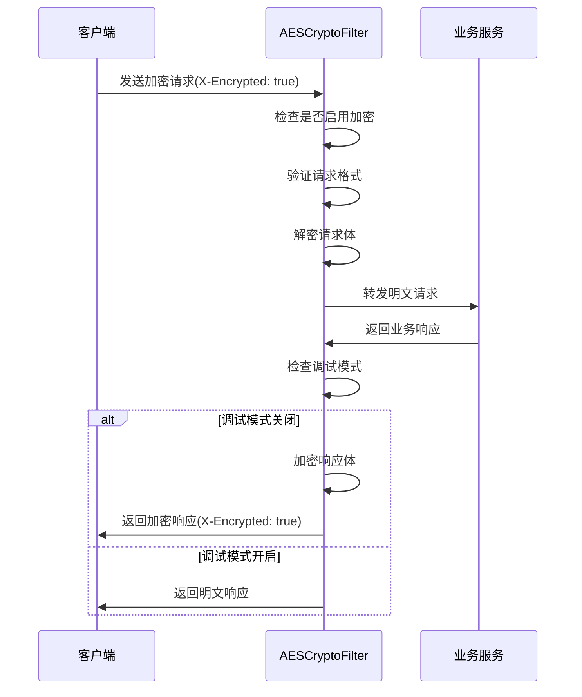

# SVT-Server 后端服务

## 📋 项目概述

SVT-Server是一个基于Spring Boot的现代化后端服务，采用微服务架构思想，集成了完整的安全加密体系、权限管理和高性能缓存方案。

### 🏗️ 技术架构

```
┌─────────────────────────────────────────────────────────────┐
│                     SVT-Server 架构层次                      │
├─────────────────────────────────────────────────────────────┤
│  Web层           │ Controller + AES加密过滤器 + JWT认证      │
├─────────────────────────────────────────────────────────────┤
│  业务层          │ Service + 事务管理 + 权限控制             │
├─────────────────────────────────────────────────────────────┤
│  数据访问层      │ MyBatis-Flex + 分布式ID + 审计日志       │
├─────────────────────────────────────────────────────────────┤
│  缓存层          │ Redis + 本地缓存 + 分布式锁              │
├─────────────────────────────────────────────────────────────┤
│  安全层          │ AES加密 + Argon2哈希 + Jasypt配置加密    │
└─────────────────────────────────────────────────────────────┘
```

### 🔒 安全特性

#### 1. AES-256-CBC API加密系统

**核心特性**:
- **端到端加密**: 所有API请求/响应数据使用AES-256-CBC加密
- **调试模式**: 开发环境支持明文传输，便于调试和开发
- **智能过滤**: 自动排除静态资源、监控页面等非业务请求
- **时间戳防重放**: 10分钟容差保护，防止重放攻击
- **数据大小限制**: 10MB传输限制，防止恶意大文件攻击

**过滤器执行顺序**:
```
HTTP请求 → AESCryptoFilter(@Order(10)) → RequestWrapperFilter(@Order(50)) 
→ JwtAuthenticationFilter(@Order(70)) → 业务Controller
```

**CORS配置支持**:
```java
// WebMvcConfig.java
.exposedHeaders("X-Encrypted", "Content-Type") // 暴露加密标识头
```

**调试模式设计**:
```yaml
# application-dev.yml
svt:
  security:
    aes:
      enabled: true     # 启用AES加密
      debug: true       # 调试模式：返回明文响应
```

#### 2. 配置文件加密 (Jasypt)

**敏感信息保护**:
- 数据库密码、JWT密钥、AES密钥等全部加密存储
- 使用`PBEWITHHMACSHA512ANDAES_256`算法
- 通过环境变量`JASYPT_ENCRYPTOR_PASSWORD`统一管理

**配置示例**:
```yaml
spring:
  datasource:
    password: ENC(MgtqLx7TCcVS9OlboFeo8Qi+Awm0knkLom756drzSsl/nKPXIQapluwRYA9PGJUD)
```

#### 3. Argon2密码哈希

**现代化密码保护**:
- 替代传统MD5/SHA算法
- 抗彩虹表攻击，GPU攻击防护
- 自适应成本参数，可调节计算复杂度

#### 4. JWT认证与授权

**无状态认证**:
- 支持分布式部署
- 自动令牌刷新机制
- 与RBAC权限系统深度集成

### 🚀 核心技术栈

| 技术领域 | 技术选型 | 版本 | 说明 |
|----------|----------|------|------|
| **框架** | Spring Boot | 3.2+ | 主框架 |
| **安全** | Spring Security | 6.2+ | 安全框架 |
| **ORM** | MyBatis-Flex | 1.7+ | 数据访问层 |
| **缓存** | Redis + Caffeine | - | 分布式+本地缓存 |
| **加密** | CryptoJS兼容 | - | AES-256-CBC |
| **密码** | Argon2 | - | 现代哈希算法 |
| **配置** | Jasypt | 3.0+ | 配置文件加密 |
| **数据库** | SQL Server | 2019+ | 主数据库 |

### 📁 项目结构

```
src/main/java/com/seventeen/svt/
├── common/                          # 公共组件
│   ├── annotation/                  # 自定义注解
│   │   ├── audit/                  # 审计注解
│   │   ├── dbkey/                  # 分布式ID注解
│   │   ├── field/                  # 字段填充注解
│   │   ├── permission/             # 权限注解
│   │   └── transaction/            # 事务注解
│   ├── config/                     # 配置类
│   │   ├── AESConfig.java          # AES加密配置
│   │   ├── JasyptConfig.java       # 配置文件加密
│   │   ├── SVTArgon2PasswordEncoder.java # Argon2密码编码器
│   │   └── WebMvcConfig.java       # Web配置(CORS)
│   ├── filter/                     # 过滤器
│   │   ├── AESCryptoFilter.java    # AES加密过滤器
│   │   └── RequestWrapperFilter.java # 请求包装过滤器
│   ├── util/                       # 工具类
│   │   ├── AESUtils.java           # AES加密工具
│   │   └── JasyptEncryptionUtils.java # Jasypt加密工具
│   └── exception/                  # 异常处理
├── frame/                          # 框架层
│   ├── aspect/                     # AOP切面
│   ├── cache/                      # 缓存管理
│   ├── security/                   # 安全模块
│   │   ├── config/SecurityConfig.java # Spring Security配置
│   │   ├── filter/JwtAuthenticationFilter.java # JWT过滤器
│   │   └── service/AuthService.java # 认证服务
│   └── listener/                   # 系统监听器
│       └── SystemStartupListener.java # 启动配置验证
└── modules/                        # 业务模块
    └── system/                     # 系统管理模块
```

### ⚙️ 环境配置

#### 环境变量
```bash
# 必需：Jasypt配置文件解密密钥
export JASYPT_ENCRYPTOR_PASSWORD=your-jasypt-password
```

#### 多环境配置

| 环境 | 配置文件 | AES加密 | 调试模式 | 说明 |
|------|----------|---------|----------|------|
| **开发** | application-dev.yml | 启用 | 启用 | 便于开发调试 |
| **UAT** | application-uat.yml | 启用 | 禁用 | 模拟生产环境 |
| **生产** | application-prod.yml | 启用 | 禁用 | 完整安全配置 |

#### 开发环境配置示例
```yaml
# application-dev.yml
server:
  port: 8080

svt:
  security:
    aes:
      enabled: true           # 启用AES加密
      debug: true             # 调试模式
      key: ENC(...)          # Jasypt加密的AES密钥

# 开发环境数据库
spring:
  datasource:
    url: jdbc:sqlserver://localhost:1433;databaseName=svt-dev
    username: sa
    password: ENC(...)       # Jasypt加密密码
```

### 🚀 快速开始

#### 1. 环境准备
```bash
# 安装Java 17+
java -version

# 安装Maven 3.6+
mvn -version

# 设置Jasypt密钥
export JASYPT_ENCRYPTOR_PASSWORD=your-jasypt-password
```

#### 2. 数据库初始化
```bash
# 执行DDL脚本
sqlcmd -S localhost -d svt-dev -i src/main/resources/db/init/ddl.sql

# 执行DML脚本
sqlcmd -S localhost -d svt-dev -i src/main/resources/db/init/dml.sql
```

#### 3. 启动服务
```bash
# 开发环境启动
mvn spring-boot:run -Dspring.profiles.active=dev

# 或使用IDE启动，设置VM参数：
# -Dspring.profiles.active=dev
# -DJASYPT_ENCRYPTOR_PASSWORD=your-password
```

#### 4. 验证启动
```bash
# 检查健康状态
curl http://localhost:8080/actuator/health

# 访问API文档
http://localhost:8080/doc.html
```

### 🔧 AES加密系统详解

#### 加密流程设计



#### 核心组件详解

**1. AESCryptoFilter (核心过滤器)**
```java
@Component
@Order(10) // 确保在其他过滤器之前执行
public class AESCryptoFilter implements Filter {
    
    // 请求解密逻辑
    private ServletRequest processRequest(HttpServletRequest request) {
        // 检查X-Encrypted头
        // 验证加密数据格式
        // 执行AES解密
        // 创建请求包装器
    }
    
    // 响应加密逻辑
    private void processResponse(HttpServletRequest request, 
                               HttpServletResponse response, 
                               AESResponseWrapper responseWrapper) {
        // 检查调试模式
        // 执行AES加密
        // 设置响应头
    }
}
```

**2. AESUtils (加密工具类)**
```java
@Component
public class AESUtils {
    
    // API专用加密方法
    public Map<String, Object> encryptForAPI(String jsonData) {
        // 生成随机IV
        // 执行AES-256-CBC加密
        // 构造标准格式响应
    }
    
    // API专用解密方法  
    public String decryptFromAPI(Map<String, Object> encryptedData) {
        // 验证时间戳(防重放攻击)
        // 验证数据格式
        // 执行AES解密
    }
}
```

**3. 加密数据格式**
```json
{
  "encrypted": true,
  "data": "Base64编码的密文",
  "iv": "Base64编码的初始化向量",
  "timestamp": 1640995200000,
  "version": "1.0"
}
```

#### 安全特性

**时间戳防重放攻击**:
- 默认10分钟容差时间
- 调试模式下只警告不阻止
- 可配置容差参数

**数据大小限制**:
- 默认10MB最大传输限制
- 防止恶意大文件攻击
- 可配置限制参数

**URL过滤规则**:
```java
private boolean isApiRequest(String uri) {
    // 排除静态资源
    // 排除监控页面
    // 排除API文档页面
}
```

### 🔍 系统监控

#### 启动时配置验证
```java
@Component
public class SystemStartupListener {
    
    @EventListener(ApplicationReadyEvent.class)
    public void onApplicationReady() {
        // 验证AES配置有效性
        // 检查密钥格式和长度
        // 验证数据库连接
        // 检查Redis连接
    }
}
```

#### 日志配置
```xml
<!-- log4j2-spring.xml -->
<Configuration>
    <Appenders>
        <RollingFile name="AESLog">
            <FileName>logs/aes.log</FileName>
            <!-- AES加密相关日志 -->
        </RollingFile>
    </Appenders>
</Configuration>
```

### 🧪 测试与验证

#### 单元测试
```bash
# 运行所有测试
mvn test

# 运行AES加密测试
mvn test -Dtest=AESUtilsTest

# 运行密码安全测试
mvn test -Dtest=PasswordSecurityUpgradeTest
```

#### API测试
```bash
# 测试登录接口(加密)
curl -X POST http://localhost:8080/api/auth/login \
  -H "Content-Type: application/json" \
  -H "X-Encrypted: true" \
  -d '{"encrypted":true,"data":"...","iv":"...","timestamp":...}'

# 测试健康检查(明文)
curl http://localhost:8080/actuator/health
```

### 📚 详细文档

- **[API加密详细设计](./docs/API-Encryption-AES.md)** - AES加密系统完整实现
- **[Argon2密码哈希](./docs/Argon2-Password-Hashing.md)** - 现代密码安全方案
- **[Jasypt配置加密](./docs/Jasypt-Configuration-Encryption.md)** - 配置文件保护方案
- **[认证授权体系](./docs/Authentication-and-Security.md)** - JWT+RBAC权限设计
- **[自动事务管理](./docs/Automated-Transaction-Management.md)** - 声明式事务方案
- **[分布式ID生成](./docs/Distributed-ID-Generation.md)** - 高性能ID生成策略

### ⚡ 性能优化

#### 缓存策略
- **Redis分布式缓存**: JWT Token、用户信息、权限数据
- **Caffeine本地缓存**: 配置数据、字典数据
- **数据库连接池**: Druid高性能连接池
- **查询优化**: MyBatis-Flex动态SQL

#### 并发处理
- **异步处理**: 审计日志、消息通知异步执行
- **线程池配置**: 自定义线程池，避免资源竞争
- **分布式锁**: Redis实现的分布式锁机制

### 🛡️ 安全最佳实践

#### 密钥管理
- **环境变量**: 敏感配置通过环境变量传递
- **密钥轮换**: 定期更换AES密钥和JWT密钥
- **权限最小化**: 数据库用户权限最小化原则

#### 代码安全
- **SQL注入防护**: 使用参数化查询
- **XSS防护**: 输入验证和输出编码
- **CSRF防护**: Token验证机制

### 🚀 部署指南

#### Docker部署
```dockerfile
FROM openjdk:17-jre-slim
COPY target/svt-server.jar app.jar
ENV JASYPT_ENCRYPTOR_PASSWORD=${JASYPT_PASSWORD}
EXPOSE 8080
ENTRYPOINT ["java", "-jar", "/app.jar"]
```

#### 生产环境配置
```yaml
# application-prod.yml
server:
  port: 8080
  
svt:
  security:
    aes:
      enabled: true
      debug: false    # 生产环境关闭调试
      
spring:
  profiles:
    active: prod
```

### 📞 技术支持

- **问题反馈**: 通过Issue提交问题
- **代码贡献**: 遵循项目编码规范
- **安全报告**: 私密报告安全漏洞

---

**最后更新**: 2025-06-18 18:58:17 +08:00  
**版本**: v1.0.0  
**维护者**: SEVENTEEN & Backend Team 