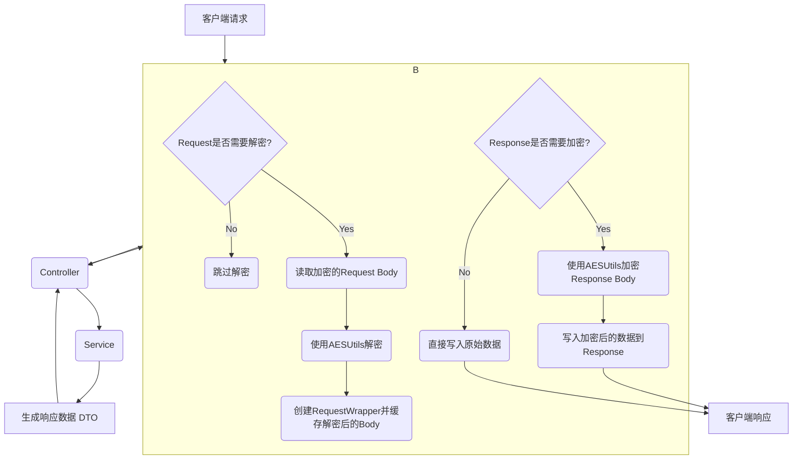

# API加密 (AES)

本文档详细描述了SVT项目后端如何通过AES加密来保护API接口的数据传输安全。

## 1. 设计目标
- **机密性**: 防止API请求和响应在传输过程中被窃听和篡改。
- **自动化**: 加解密过程对业务代码透明，无需开发人员手动干预。
- **高性能**: 选择高效的加密库和实现方式，最小化对性能的影响。
- **可配置**: 加密功能可以全局启用或禁用，便于开发和调试。

## 2. 加密方案
- **算法**: AES-256-CBC
- **密钥长度**: 256位 (32字节)
- **IV (初始化向量)**: 128位 (16字节)，每个请求动态生成
- **填充模式**: PKCS5Padding
- **编码**: 密钥、IV和密文均使用Base64编码进行传输

> **实际实现说明**: 当前项目使用AES-CBC模式，提供可靠的数据机密性保护。

## 3. 实现架构

系统通过一个自定义的`Filter`和可重用`HttpServletRequest`包装器来实现自动化的API加解密。



1.  **`AESCryptoFilter`**: 这是加解密流程的核心。它在Spring Security的`JwtAuthenticationFilter`之前执行。
2.  **请求解密**:
    -   过滤器首先判断请求是否需要解密（例如，排除GET请求和文件上传请求）。
    -   如果需要，它会读取请求的输入流（即加密的请求体）。
    -   调用`AESUtils.decrypt`方法，使用从配置中获取的密钥和请求中携带的IV进行解密。
    -   解密后的明文（通常是JSON字符串）被缓存到一个自定义的`RequestWrapper`中。
    -   后续的业务逻辑（如Controller中的`@RequestBody`）将从这个`RequestWrapper`中读取到解密后的数据，从而实现对业务代码的透明。
3.  **响应加密**:
    -   在业务逻辑执行完毕，返回响应时，控制权回到`AESCryptoFilter`。
    -   过滤器判断响应是否需要加密。
    -   如果需要，它会捕获原始的响应体，调用`AESUtils.encrypt`进行加密。
    -   最终将加密后的数据写入`HttpServletResponse`的输出流中。

## 4. 加密数据格式

为了协同工作，前后端约定了统一的加密荷载格式。

**请求体 (EncryptedRequest):**
```json
{
  "data": "Base64-encoded-ciphertext",
  "iv": "Base64-encoded-iv",
  "timestamp": 1678886400000,
  "version": "1.0"
}
```

**响应体 (EncryptedResponse):**
与请求体格式相同。

## 5. 核心组件

- **`AESCryptoFilter`**: Servlet过滤器，负责拦截请求和响应，调度加解密流程。
- **`RequestWrapper`**: 继承自`HttpServletRequestWrapper`，用于缓存解密后的请求体，以供后续业务逻辑重复读取。
- **`AESUtils`**: 封装了`CryptoJS`或类似Java加密库的核心工具类，提供`encrypt`和`decrypt`静态方法。
- **`AESConfig`**: 用于从`application.yml`中加载和管理AES密钥、开关等配置。

## 6. 配置

在`application.yml`中可以配置AES加密的相关参数。

```yaml
# 实际配置格式 (基于AESConfig.java)
svt:
  security:
    aes:
      enabled: true                      # 启用AES加密
      debug: false                       # 生产环境关闭调试
      algorithm: "AES/CBC/PKCS5Padding"  # CBC模式 + PKCS5填充
      key: ${AES_SECRET_KEY:}            # Base64编码的32字节密钥
      max-data-size: 10485760            # 最大数据大小 (10MB)
      exclude-urls:                      # 排除加密的路径
        - /actuator/**
        - /swagger-ui/**
        - /v3/api-docs/**
```

## 7. 注意事项
- **密钥安全**: AES密钥是系统的最高机密，绝不能硬编码在代码中。必须通过环境变量或安全的配置中心进行管理。
- **IV的唯一性**: 每个加密请求都必须使用一个全新的、随机生成的IV，以保证CBC模式的安全性。重复使用IV会导致严重的安全漏洞。
- **性能开销**: AES加解密会消耗CPU资源，在高并发场景下需要进行充分的性能测试，评估其对系统吞吐量的影响。
- **错误处理**: `AESCryptoFilter`必须妥善处理加解密过程中可能出现的异常（如密钥错误、填充错误、Base64解码失败等），并返回规范的错误响应。 