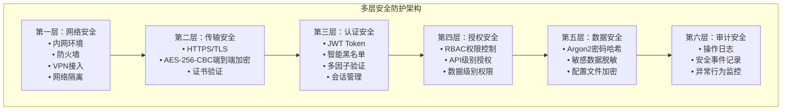

# SVT 安全设计原理文档

**项目**: SVT-Server 后端安全设计
**版本**: v1.0
**创建时间**: 2025-06-21
**文档类型**: 安全设计原理
**适用领域**: 保密性要求较高的企业内部系统
**安全等级**: A+ 级

## 📋 文档说明

本文档详细阐述SVT后端的安全设计原理，包括威胁模型分析、安全架构设计、防护机制原理和安全策略制定。所有设计都基于高安全性要求的企业环境和最佳实践。

---

## 🎯 安全设计目标

### 核心目标
1. **机密性 (Confidentiality)**: 确保敏感数据不被未授权访问
2. **完整性 (Integrity)**: 保证数据在传输和存储过程中不被篡改
3. **可用性 (Availability)**: 确保系统服务的持续可用
4. **可审计性 (Auditability)**: 记录所有安全相关操作
5. **合规性 (Compliance)**: 满足企业行业监管要求

### 威胁模型
基于高安全性企业内部环境的威胁分析：

#### 高风险威胁
- **内部人员恶意操作**: 具有系统访问权限的内部人员
- **权限提升攻击**: 普通用户尝试获取管理员权限
- **数据泄露**: 敏感企业数据被非授权获取
- **会话劫持**: Token被盗用进行非法操作

#### 中风险威胁
- **暴力破解**: 密码或Token的暴力破解攻击
- **重放攻击**: 拦截并重放合法请求
- **配置泄露**: 系统配置信息被获取

#### 低风险威胁
- **外部网络攻击**: 体系内网络相对安全
- **物理访问**: 服务器物理安全有保障

---

## 🛡️ 多层安全防护架构

### 防护层次设计



---

## 🔐 核心安全机制原理

### 1. JWT + 智能黑名单认证机制

#### 设计原理
传统JWT的无状态特性与高安全性系统安全要求存在矛盾，我们设计了智能黑名单机制来解决这个问题。

#### 核心创新点
```java
/**
 * 智能Token识别算法
 * 目标：区分系统合法Token vs 恶意Token
 */
public boolean isValidSystemToken(String token) {
    try {
        // 1. 验证JWT签名和格式
        Claims claims = Jwts.parserBuilder()
            .setSigningKey(getSecretKey())
            .build()
            .parseClaimsJws(token)
            .getBody();
            
        // 2. 验证系统颁发者标识
        String issuer = claims.getIssuer();
        if (!SYSTEM_ISSUER.equals(issuer)) {
            return false;
        }
        
        // 3. 验证必要字段完整性
        return claims.get("userId") != null && 
               claims.get("userName") != null;
               
    } catch (Exception e) {
        return false; // 恶意或格式错误的Token
    }
}
```

#### 安全优势
1. **防止黑名单膨胀攻击**: 恶意Token不会被加入黑名单
2. **保持JWT性能优势**: 大部分验证仍然是无状态的
3. **满足企业安全要求**: 可以立即撤销合法Token
4. **内存使用可控**: 黑名单大小有明确上限

### 2. AES-256-CBC端到端加密

#### 设计原理
在HTTPS基础上增加应用层加密，实现真正的端到端数据保护。

#### 加密流程
```
前端请求 → AES加密 → HTTPS传输 → 后端AES解密 → 业务处理
后端响应 → AES加密 → HTTPS传输 → 前端AES解密 → 数据展示
```

#### 安全考量
1. **密钥管理**: 使用环境变量管理，避免硬编码
2. **IV随机性**: 每次加密使用新的随机IV
3. **时间戳防重放**: 10分钟时间窗口验证
4. **数据大小限制**: 防止大数据攻击

#### 实现细节
```java
// 加密数据格式
{
  "data": "Base64编码的密文",
  "iv": "Base64编码的初始化向量", 
  "timestamp": 1703123456789,
  "version": "1.0"
}
```

### 3. Argon2密码哈希机制

#### 选择理由
- **抗GPU攻击**: 内存密集型算法，GPU优势不明显
- **抗ASIC攻击**: 可调节参数，适应硬件发展
- **抗彩虹表**: 每个密码使用独立盐值

#### 参数配置
```java
// 企业级安全参数
Argon2PasswordEncoder(
    16,    // saltLength: 128位盐值
    32,    // hashLength: 256位哈希
    1,     // parallelism: 单线程（避免时序攻击）
    4096,  // memory: 4MB内存使用
    3      // iterations: 3次迭代
);
```

#### 安全强度
- **时间成本**: 约100-200ms（可接受的用户体验）
- **空间成本**: 4MB内存（服务器可承受）
- **破解成本**: 现有硬件条件下几乎不可能

---

## 🔍 安全策略制定

### 1. 密钥管理策略

#### 分级管理
```yaml
# 密钥安全等级
Level 1 - 系统级密钥:
  - JWT签名密钥
  - AES加密密钥
  - 管理方式: 环境变量 + 硬件安全模块

Level 2 - 配置级密钥:
  - Jasypt加密密钥
  - 数据库连接密钥
  - 管理方式: 环境变量 + 访问控制

Level 3 - 会话级密钥:
  - 用户会话Token
  - 临时加密密钥
  - 管理方式: 内存缓存 + 定期轮换
```

#### 轮换策略
- **JWT密钥**: 季度轮换（配合Token续期机制）
- **AES密钥**: 年度轮换（重大版本更新时）
- **配置密钥**: 按需轮换（安全事件触发）

### 2. 访问控制策略

#### RBAC权限模型
```
用户 (User) → 角色 (Role) → 权限 (Permission) → 资源 (Resource)
```

#### 权限粒度
1. **功能级权限**: 菜单和页面访问控制
2. **API级权限**: 接口调用权限控制
3. **数据级权限**: 数据行级访问控制
4. **字段级权限**: 敏感字段访问控制

### 3. 审计策略

#### 审计范围
- **认证事件**: 登录、登出、Token刷新
- **授权事件**: 权限检查、访问拒绝
- **数据操作**: 增删改查、导入导出
- **系统事件**: 配置变更、系统启停
- **安全事件**: 攻击尝试、异常行为

#### 审计格式
```json
{
  "timestamp": "2025-06-21T10:30:00+08:00",
  "eventType": "AUTHENTICATION",
  "userId": "user123",
  "action": "LOGIN_SUCCESS", 
  "resource": "/api/auth/login",
  "clientIp": "192.168.1.100",
  "userAgent": "Mozilla/5.0...",
  "result": "SUCCESS",
  "details": {
    "loginMethod": "PASSWORD",
    "sessionId": "sess_abc123"
  }
}
```

---

## 🚨 安全事件响应

### 事件分级
1. **严重 (Critical)**: 数据泄露、权限提升
2. **高危 (High)**: 暴力破解、异常访问
3. **中危 (Medium)**: 配置错误、性能异常
4. **低危 (Low)**: 日志异常、监控告警

### 响应流程
```
事件检测 → 事件分析 → 影响评估 → 应急响应 → 事后分析 → 改进措施
```

### 自动化响应
- **账户锁定**: 连续失败登录自动锁定
- **IP封禁**: 异常IP自动加入黑名单
- **Token撤销**: 可疑会话自动终止
- **告警通知**: 关键事件实时通知

---

## 📊 安全指标监控

### 关键指标
1. **认证成功率**: > 99.5%
2. **Token验证性能**: < 10ms
3. **加密解密性能**: < 50ms
4. **安全事件响应时间**: < 5分钟
5. **密码强度合规率**: 100%

### 监控仪表板
- 实时安全状态概览
- 认证和授权统计
- 安全事件趋势分析
- 性能指标监控

---

## 🔒 合规性保障

### 等保要求
- **等保二级**: 基础安全要求
- **等保三级**: 增强安全要求（规划中）

### 行业监管
- **数据安全法**: 数据分类分级保护
- **个人信息保护法**: 个人信息处理规范
- **网络安全法**: 网络安全等级保护

### 内控要求
- **访问控制**: 最小权限原则
- **职责分离**: 关键操作多人审批
- **审计跟踪**: 完整的操作记录

---

**相关文档**:
- [JWT认证实现](./Authentication-and-Security.md)
- [AES加密实现](./API-Encryption-AES.md)
- [Argon2密码哈希](./Argon2-Password-Hashing.md)
- [配置文件加密](./Jasypt-Configuration-Encryption.md)
- [审计日志](./Audit-Logging.md)

**文档维护**: 本文档随安全威胁变化持续更新  
**最后更新**: 2025-06-21  
**下次审查**: 2025-08-21  
**安全责任人**: 系统架构师 + 安全工程师
