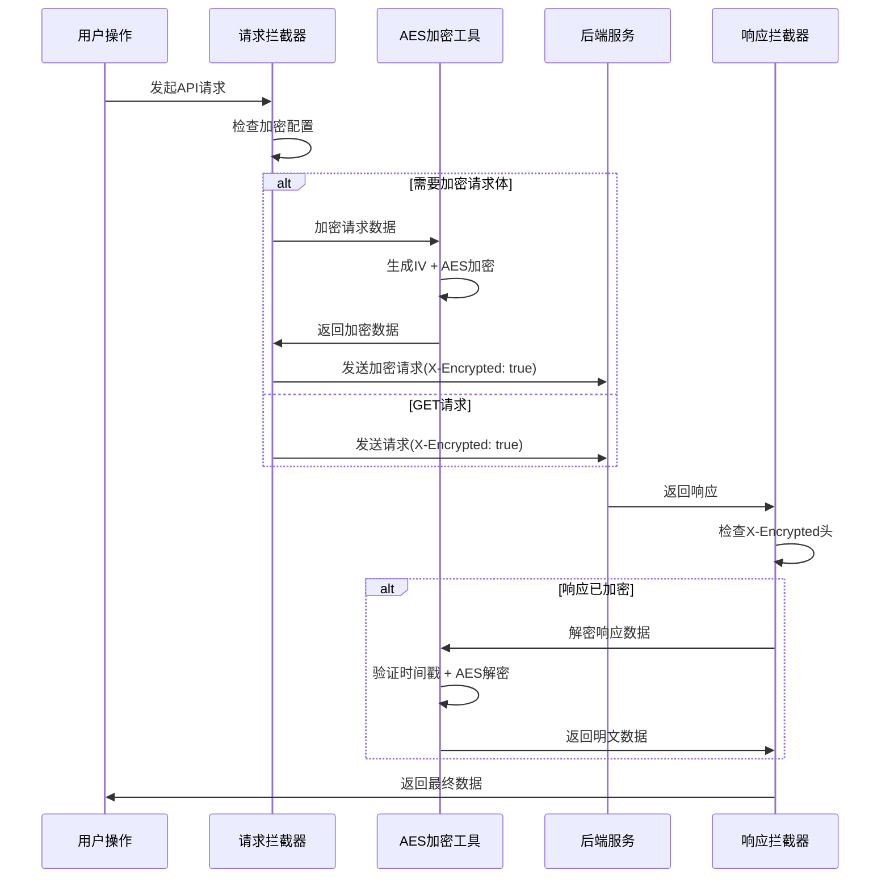

# SVT-Web 前端应用

## 📋 项目概述

SVT-Web是一个基于React 19的现代化前端应用，采用TypeScript开发，集成了完整的AES加密通信、状态管理和组件化架构。

### 🏗️ 技术架构

```
┌─────────────────────────────────────────────────────────────┐
│                     SVT-Web 架构层次                        │
├─────────────────────────────────────────────────────────────┤
│  视图层          │ React 19 + Ant Design + 响应式布局      │
├─────────────────────────────────────────────────────────────┤
│  状态管理        │ Zustand + React Query + 持久化存储      │
├─────────────────────────────────────────────────────────────┤
│  路由层          │ React Router 7 + 权限路由保护           │
├─────────────────────────────────────────────────────────────┤
│  网络层          │ Axios + AES加密拦截器 + 错误处理        │
├─────────────────────────────────────────────────────────────┤
│  加密层          │ CryptoJS + 密钥缓存 + 时间戳防重放      │
└─────────────────────────────────────────────────────────────┘
```

### 🔒 核心安全特性

#### 1. AES-256-CBC端到端加密

**核心特性**:
- **智能配置检测**: 自动检测密钥配置，智能启用/禁用加密
- **请求响应加密**: POST/PUT/PATCH请求体加密，所有响应解密
- **密钥缓存机制**: 1小时密钥缓存，避免重复解析环境变量
- **时间戳防重放**: 10分钟容差保护，防止重放攻击
- **响应头支持**: 自动处理`X-Encrypted`加密标识头

**加密流程设计**:


#### 2. 智能配置管理

**配置检测逻辑**:
```typescript
// 智能启用逻辑
if (aesEnabled !== undefined) {
  // 显式设置了VITE_AES_ENABLED
  this.config.enabled = aesEnabled === 'true';
} else {
  // 未设置时，检查是否有AES密钥，有密钥则默认启用
  const hasAesKey = !!import.meta.env.VITE_AES_KEY;
  this.config.enabled = hasAesKey;
}
```

**多环境配置**:
| 环境 | AES加密 | 调试模式 | 密钥来源 | 用途 |
|------|---------|----------|----------|------|
| **开发** | 可选 | 支持 | 本地配置 | 便于调试 |
| **UAT** | 启用 | 禁用 | 环境变量 | 测试验证 |
| **生产** | 启用 | 禁用 | 密钥管理 | 生产部署 |

#### 3. 响应拦截器优化

**关键修复 - 变量作用域**:
```typescript
// 🔧 关键修复：正确的变量作用域
let { data } = response;

if (AESCryptoUtils.isEnabled() && encryptedHeader === 'true') {
  if (isEncryptedData(data)) {
    const decryptedData = await AESCryptoUtils.decryptFromAPI(data);
    response.data = decryptedData;
    // 🔧 更新本地data变量，确保后续判断使用解密后的数据
    data = decryptedData;
  }
}
```

### 🚀 核心技术栈

| 技术领域 | 技术选型 | 版本 | 说明 |
|----------|----------|------|------|
| **框架** | React | 19.x | 现代化UI框架 |
| **构建** | Vite | 6.x | 极速构建工具 |
| **语言** | TypeScript | 5.x | 类型安全 |
| **UI库** | Ant Design | 5.x | 企业级UI组件 |
| **状态** | Zustand | 5.x | 轻量状态管理 |
| **路由** | React Router | 7.x | 声明式路由 |
| **网络** | Axios | 1.x | HTTP客户端 |
| **加密** | CryptoJS | 4.x | AES-256-CBC |
| **表单** | React Hook Form + Zod | - | 表单验证 |
| **查询** | TanStack Query | 5.x | 服务器状态管理 |

### 📁 项目结构

```
src/
├── api/                             # API接口层
│   └── auth.ts                     # 认证相关API
├── components/                      # 组件库
│   ├── Common/                     # 通用组件
│   │   └── CryptoConfigPanel.tsx   # 加密配置面板
│   ├── Layout/                     # 布局组件
│   └── Loading/                    # 加载组件
├── config/                         # 配置管理
│   ├── crypto.ts                   # 加密配置管理器
│   └── env.ts                      # 环境变量配置
├── hooks/                          # 自定义Hook
│   └── useTokenStatus.ts           # Token状态管理
├── pages/                          # 页面组件
│   ├── Auth/                       # 认证页面
│   ├── Dashboard/                  # 仪表盘
│   └── Error/                      # 错误页面
├── router/                         # 路由配置
│   ├── index.tsx                   # 路由定义
│   └── ProtectedRoute.tsx          # 权限路由
├── stores/                         # 状态管理
│   └── authStore.ts                # 认证状态
├── styles/                         # 样式配置
│   └── theme.ts                    # 主题配置
├── types/                          # 类型定义
│   ├── api.ts                      # API类型
│   ├── user.ts                     # 用户类型
│   └── org-role.ts                 # 组织角色类型
├── utils/                          # 工具函数
│   ├── crypto.ts                   # AES加密工具
│   ├── request.ts                  # HTTP请求工具
│   ├── tokenManager.ts             # Token管理
│   └── storageCleanup.ts           # 存储清理
└── main.tsx                        # 应用入口
```

### ⚙️ 环境配置

#### 环境变量配置

**必需配置**:
```bash
# API基础地址
VITE_API_BASE_URL=http://localhost:8080/api

# AES加密密钥（32字节）
VITE_AES_KEY=your-32-byte-aes-key
```

**可选配置**:
```bash
# AES加密开关（默认根据密钥自动检测）
VITE_AES_ENABLED=true

# 请求超时时间
VITE_API_TIMEOUT=15000

# 调试模式
VITE_ENABLE_DEBUG=false

# 主题配置
VITE_THEME_PRIMARY_COLOR=#1890ff
```

#### 多环境文件

| 文件 | 环境 | 说明 |
|------|------|------|
| `.env.development` | 开发环境 | 本地开发配置 |
| `.env.uat` | UAT环境 | 测试环境配置 |
| `.env.production` | 生产环境 | 生产部署配置 |
| `.env.local` | 本地覆盖 | 个人本地配置 |

### 🚀 快速开始

#### 1. 环境准备
```bash
# 检查Node.js版本 (需要18+)
node --version

# 检查npm版本 (需要8+)
npm --version
```

#### 2. 安装依赖
```bash
# 安装项目依赖
npm install

# 或使用yarn
yarn install
```

#### 3. 配置环境变量
```bash
# 复制环境变量模板
cp .env.development .env.local

# 编辑本地配置
nano .env.local
```

#### 4. 启动开发服务器
```bash
# 开发环境启动
npm run dev

# UAT环境启动
npm run dev:uat

# 生产配置测试
npm run dev:prod
```

#### 5. 验证启动
```bash
# 访问应用
http://localhost:5173

# 检查控制台输出
# 确认AES配置状态
```

### 🔧 AES加密系统详解

#### 核心组件详解

**1. CryptoConfigManager (配置管理器)**
```typescript
class CryptoConfigManager {
  private config: CryptoConfig;
  
  // 智能配置检测
  private init(): void {
    const aesEnabled = import.meta.env.VITE_AES_ENABLED;
    
    if (aesEnabled !== undefined) {
      this.config.enabled = aesEnabled === 'true';
    } else {
      // 自动检测：有密钥则启用
      const hasAesKey = !!import.meta.env.VITE_AES_KEY;
      this.config.enabled = hasAesKey;
    }
  }
}
```

**2. AESCryptoUtils (加密工具类)**
```typescript
export class AESCryptoUtils {
  // 密钥缓存机制
  private static async getKey(): Promise<CryptoJS.lib.WordArray> {
    const now = Date.now();
    
    if (cachedKey && now < keyExpiry) {
      return cachedKey; // 使用缓存的密钥
    }
    
    // 重新解析密钥并缓存
    const keyString = import.meta.env.VITE_AES_KEY;
    cachedKey = CryptoJS.enc.Utf8.parse(keyString);
    keyExpiry = now + cryptoConfig.get().keyCacheExpiry;
    
    return cachedKey;
  }
  
  // API加密方法
  static async encryptForAPI(data: any): Promise<EncryptedData> {
    const plainText = JSON.stringify(data);
    const { encryptedData, iv } = await this.encryptWithIV(plainText);
    
    return {
      encrypted: true,
      data: encryptedData,
      iv: iv,
      timestamp: Date.now(), // 防重放时间戳
      version: '1.0'
    };
  }
}
```

**3. 请求拦截器 (request.ts)**
```typescript
// 请求拦截器逻辑
request.interceptors.request.use(async (config) => {
  if (AESCryptoUtils.isEnabled()) {
    const method = config.method?.toLowerCase() || '';
    
    // 对POST/PUT/PATCH请求体进行加密
    if (config.data && ['post', 'put', 'patch'].includes(method)) {
      const encryptedData = await AESCryptoUtils.encryptForAPI(config.data);
      config.data = encryptedData;
      config.headers['X-Encrypted'] = 'true';
    }
    // 对所有API请求设置加密响应标识
    else if (config.url?.startsWith('/')) {
      config.headers['X-Encrypted'] = 'true';
    }
  }
  
  return config;
});
```

**4. 响应拦截器 (request.ts)**
```typescript
// 响应拦截器逻辑
request.interceptors.response.use(async (response) => {
  let { data } = response;
  
  // 检查响应是否加密
  const encryptedHeader = response.headers['x-encrypted'];
  
  if (AESCryptoUtils.isEnabled() && encryptedHeader === 'true') {
    if (isEncryptedData(data)) {
      const decryptedData = await AESCryptoUtils.decryptFromAPI(data);
      response.data = decryptedData;
      data = decryptedData; // 🔧 关键修复：更新本地变量
    }
  }
  
  return response;
});
```

#### 加密数据格式验证

**isEncryptedData函数**:
```typescript
export function isEncryptedData(data: any): data is EncryptedData {
  return (
    typeof data === 'object' &&
    data !== null &&
    data.encrypted === true &&
    typeof data.data === 'string' &&
    typeof data.iv === 'string' &&
    typeof data.timestamp === 'number' &&
    typeof data.version === 'string'
  );
}
```

#### 安全特性

**时间戳防重放攻击**:
```typescript
// 验证时间戳
const timestampValid = cryptoConfig.isTimestampValid(encryptedResponse.timestamp);
if (!timestampValid) {
  console.warn('响应时间戳异常，可能存在重放攻击');
}
```

**数据大小限制**:
```typescript
// 检查数据大小
const dataSize = new Blob([plainText]).size;
if (!cryptoConfig.isDataSizeValid(dataSize)) {
  throw new Error(`数据大小超过限制: ${config.maxDataSize} bytes`);
}
```

### 🎨 组件化设计

#### 加密配置面板组件
```typescript
// CryptoConfigPanel.tsx
const CryptoConfigPanel: React.FC = () => {
  const [enabled, setEnabled] = useState(cryptoConfig.isEnabled());
  
  const handleToggle = (checked: boolean) => {
    if (checked) {
      cryptoConfig.enable();
    } else {
      cryptoConfig.disable();
    }
    setEnabled(checked);
  };
  
  return (
    <Card title="AES加密配置">
      <Switch 
        checked={enabled}
        onChange={handleToggle}
        checkedChildren="启用"
        unCheckedChildren="禁用"
      />
      {/* 配置详情展示 */}
    </Card>
  );
};
```

### 🔍 调试与监控

#### 开发工具集成
```typescript
// 开发环境调试信息
if (import.meta.env.DEV) {
  console.log('AES配置状态:', cryptoConfig.getSummary());
  console.log('密钥状态:', AESCryptoUtils.validateKey());
}
```

#### 错误处理机制
```typescript
// 统一错误处理
try {
  const result = await AESCryptoUtils.encryptForAPI(data);
  return result;
} catch (error) {
  console.error('加密失败:', error);
  throw new Error('数据加密失败');
}
```

### 🧪 测试与验证

#### 本地验证脚本
```bash
# 验证AES配置
npm run test:crypto

# 验证API连接
npm run test:api

# 完整功能测试
npm run test:e2e
```

#### 浏览器控制台验证
```javascript
// 检查AES配置
console.log('AES加密状态:', import.meta.env.VITE_AES_ENABLED);
console.log('密钥配置:', !!import.meta.env.VITE_AES_KEY);

// 测试加密功能
import { AESCryptoUtils } from './src/utils/crypto';
AESCryptoUtils.validateKey().then(console.log);
```

### ⚡ 性能优化

#### 构建优化
- **代码分割**: 按路由自动分割代码包
- **Tree Shaking**: 自动移除未使用代码
- **资源压缩**: Gzip/Brotli压缩
- **缓存策略**: 长期缓存静态资源

#### 运行时优化
- **密钥缓存**: 避免重复密钥解析
- **请求去重**: 防止重复API调用
- **组件懒加载**: 按需加载页面组件
- **虚拟滚动**: 大列表性能优化

### 🛡️ 安全最佳实践

#### 密钥管理
- **环境隔离**: 不同环境使用不同密钥
- **密钥轮换**: 定期更换加密密钥
- **安全存储**: 生产环境使用密钥管理服务

#### 代码安全
- **输入验证**: 所有用户输入都进行验证
- **XSS防护**: 使用React的内置XSS保护
- **CSRF防护**: Token验证机制

### 🚀 部署指南

#### 构建生产版本
```bash
# 构建生产版本
npm run build

# 预览构建结果
npm run preview
```

#### Docker部署
```dockerfile
FROM node:18-alpine as builder
WORKDIR /app
COPY package*.json ./
RUN npm ci --only=production

COPY . .
RUN npm run build

FROM nginx:alpine
COPY --from=builder /app/dist /usr/share/nginx/html
COPY nginx.conf /etc/nginx/nginx.conf
EXPOSE 80
```

#### 环境变量注入
```bash
# 生产环境变量
export VITE_API_BASE_URL=https://api.example.com
export VITE_AES_KEY=your-production-aes-key
export VITE_AES_ENABLED=true
```

### 📚 详细文档

- **[AES加密配置说明](./docs/AES加密配置说明.md)** - 详细的加密配置指南
- **[环境配置快速指南](./docs/环境配置快速指南.md)** - 多环境配置说明
- **[组件结构说明](./docs/Component-Structure.md)** - 组件设计规范
- **[状态管理指南](./docs/State-Management.md)** - Zustand使用指南
- **[开发指南](./docs/开发指南.md)** - 完整的开发流程

### 📞 技术支持

- **问题反馈**: 通过Issue提交问题
- **功能建议**: 提交Feature Request
- **代码贡献**: 遵循项目贡献指南

---

**最后更新**: 2025-06-18 18:58:17 +08:00  
**版本**: v1.0.0  
**维护者**: SEVENTEEN & Frontend Team
