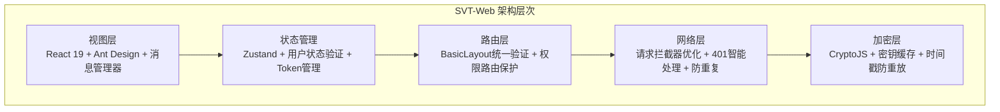
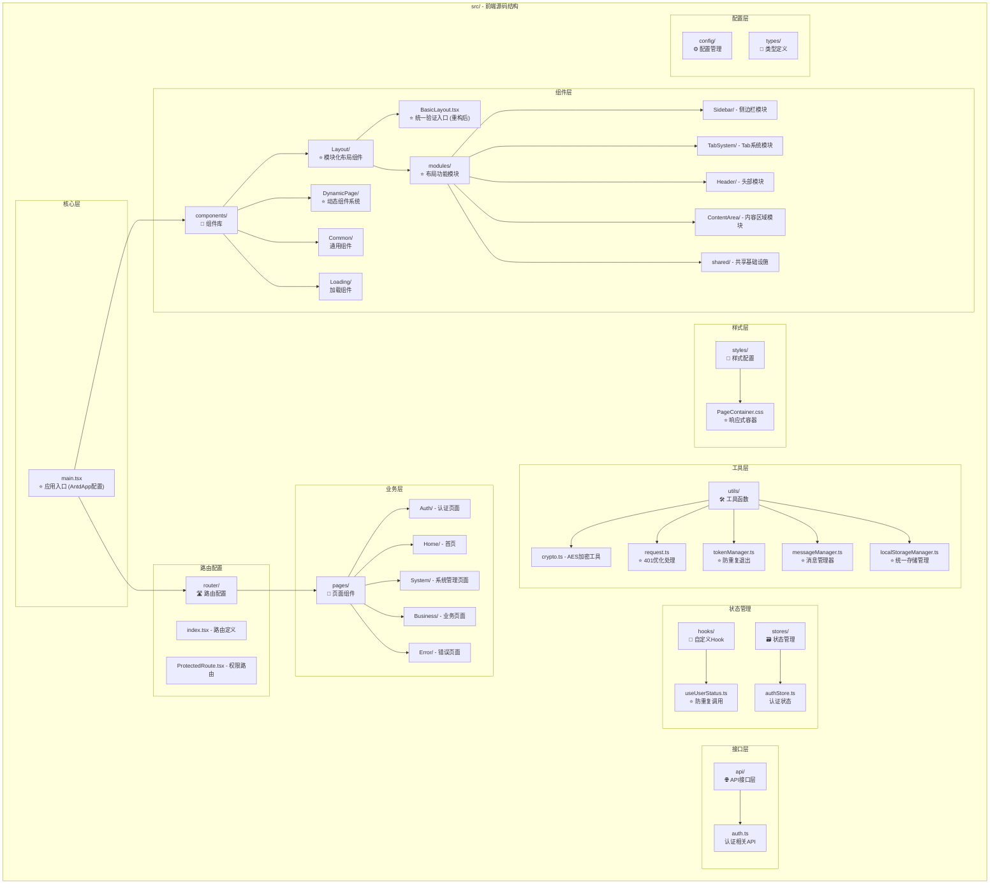
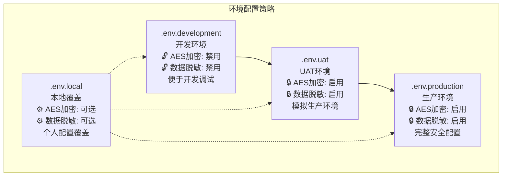

# SVT-Web 前端应用

## 📋 项目概述

SVT-Web是一个基于React 19的现代化前端应用，专为保密性要求较高的企业环境设计。系统采用TypeScript开发，集成了完整的AES加密通信、JWT状态管理和组件化架构。项目历经用户状态验证系统重大重构，实现了生产级的Token失效处理流程。

### 🏗️ 技术架构



## 🔒 核心安全特性 (2025-06-20 重大升级)

### 1. 用户状态验证系统 ⭐ 
**重大设计突破**: 解决Token失效验证问题
- **统一验证入口**: BasicLayout负责所有页面的用户状态验证
- **防重复调用机制**: useRef防重复+依赖优化，确保verify-user-status只调用1次
- **智能错误处理**: 401时先跳转再显示消息，避免全屏错误页面  
- **消息管理器**: 解决Ant Design静态消息Context警告，支持顶部toast提示
- **安全退出机制**: Token过期时直接清理本地状态，不调用后端logout API

### 2. 全局消息管理器 ⭐ 
**2025-06-20 专项优化**: 解决静态Context警告
- **全局消息管理**: messageManager统一管理所有提示消息
- **Context兼容**: 解决Ant Design静态消息警告
- **多类型支持**: success/error/warning/info/loading消息类型
- **智能显示**: 根据场景自动选择toast/notification显示方式

### 3. AES-256-CBC端到端加密
- **智能配置检测**: 自动检测密钥配置，智能启用/禁用加密
- **请求响应加密**: POST/PUT/PATCH请求体加密，所有响应解密
- **密钥缓存机制**: 1小时密钥缓存，避免重复解析环境变量
- **时间戳防重放**: 10分钟容差保护，防止重放攻击
- **响应头支持**: 自动处理`X-Encrypted`加密标识头

### 4. Token管理系统
- **自动续期**: Token即将过期时自动续期
- **状态同步**: 多Tab页面Token状态同步
- **安全存储**: localStorage+sessionStorage双重存储
- **过期清理**: Token过期时自动清理所有相关状态

### 5. 多Tab页面管理系统 ⭐
**2025-06-21 新增功能**: 类浏览器的多页面工作体验
- **智能Tab管理**: 无数量限制，支持水平滚动，用户自由管理
- **智能刷新机制**: 重复点击菜单时自动刷新页面内容，确保数据最新
- **丰富右键菜单**: 刷新、关闭当前、关闭左边/右边/其他，批量管理Tab
- **性能优化**: React Key机制强制重渲染，防重复操作，状态同步
- **用户体验**: 仪表盘保护，智能切换，操作安全防误触

### 6. 动态组件系统 ⭐
**2025-06-22 重大功能**: 基于约定的自动组件映射系统
- **自动路由映射**: 后端路径`/system/menu`自动映射到前端组件`/pages/System/Menu`
- **错误边界处理**: 组件加载失败时统一显示404页面，避免技术性错误暴露
- **权限验证集成**: 先检查用户权限，再尝试加载组件，确保安全性
- **懒加载优化**: 使用React.lazy()按需加载，减少初始包大小
- **DRY原则**: 移除硬编码组件映射，遵循约定优于配置

### 7. 响应式布局系统 ⭐
**2025-06-22 全面重构**: 三种页面容器类型，完全响应式设计
- **内容容器**: `.page-container-content` - 自适应高度，适用于仪表盘等内容页面
- **居中容器**: `.page-container-center` - 完美居中，适用于404、占位页面  
- **管理容器**: `.page-container-management` - 固定高度+内部滚动，适用于表格管理页面
- **全百分比设计**: 移除所有硬编码像素值，完全响应式适配
- **A4滚动效果**: 内容不足时保持最小高度，超出时自然滚动

### 8. Tab状态持久化系统 ⭐
**2025-06-22 新增功能**: localStorage持久化，浏览器刷新保持状态
- **完整状态恢复**: 浏览器刷新后完整恢复所有Tab状态和活跃Tab
- **统一数据管理**: 简化的localStorage管理，基于"一台电脑一个用户"假设
- **自动清理机制**: 登录、登出、Token失效时统一清理用户数据
- **状态同步**: 所有Tab操作都自动保存到localStorage
- **错误容错**: 所有localStorage操作都有try-catch保护

### 9. 模块化架构系统 ⭐
**2025-06-24 重大重构**: 从1073行巨石组件到模块化架构
- **架构重构**: BasicLayout从1073行重构为5个功能模块，代码量减少76%
- **单一职责**: Sidebar、TabSystem、Header、ContentArea、共享基础设施各司其职
- **可复用性**: 每个模块都可独立使用和测试，支持其他项目复用
- **Hook封装**: 7个专用Hook管理各模块状态，业务逻辑与UI分离
- **类型安全**: 完整的TypeScript类型定义，统一的工具函数和样式常量
- **命名规范**: 路由(/home) → 目录(Home/) → 文件(HomePage.tsx) → 组件(HomePage) 完全一致
- **固定首页**: 菜单系统添加固定首页选项，不依赖后端数据，确保用户始终能返回主页

## 🚀 核心技术栈

| 技术领域 | 技术选型 | 版本 | 说明 |
|----------|----------|------|------|
| **框架** | React | 19.x | 现代化UI框架 |
| **构建** | Vite | 6.x | 极速构建工具 |
| **语言** | TypeScript | 5.x | 类型安全 |
| **UI库** | Ant Design | 5.x | 企业级UI组件 |
| **状态** | Zustand | 5.x | 轻量状态管理 |
| **路由** | React Router | 7.x | 声明式路由 |
| **网络** | Axios | 1.x | HTTP客户端 |
| **加密** | CryptoJS | 4.x | AES-256-CBC |
| **表单** | React Hook Form + Zod | - | 表单验证 |
| **查询** | TanStack Query | 5.x | 服务器状态管理 |

## 📁 项目结构



## 🔄 动态组件系统详解 (2025-06-22)

### 核心设计理念
**约定优于配置**: 基于路径约定自动映射组件，移除硬编码维护

### 自动映射规则
```typescript
// 路径转换规则
/system/menu → /pages/System/Menu
/business/order → /pages/Business/Order
/user/profile → /pages/User/Profile

// pathToComponentPath函数实现
const pathToComponentPath = (menuPath: string): string => {
  const segments = menuPath.split('/').filter(Boolean);
  if (segments.length < 2) return '';
  
  const [category, page] = segments;
  return `/pages/${convertToPascalCase(category)}/${convertToPascalCase(page)}`;
};
```

### 关键代码实现

#### 1. 动态组件映射
```typescript
// DynamicPage/index.tsx - 核心组件
const createDynamicPageMap = (menuTrees: any[]) => {
  const pageMap: Record<string, React.LazyExoticComponent<React.ComponentType<any>>> = {};

  const processMenuTree = (menus: any[]) => {
    menus.forEach(menu => {
      if (menu.menuPath) {
        const componentPath = pathToComponentPath(menu.menuPath);
        
        if (componentPath) {
          try {
            const Component = importComponent(componentPath);
            if (Component) {
              pageMap[menu.menuPath] = Component;
            }
          } catch (error) {
            console.warn(`跳过无效组件路径: ${menu.menuPath} -> ${componentPath}`);
          }
        }
      }

      if (menu.children && menu.children.length > 0) {
        processMenuTree(menu.children);
      }
    });
  };

  processMenuTree(menuTrees);
  return pageMap;
};
```

#### 2. 错误边界处理
```typescript
// 错误边界组件
class ErrorBoundary extends Component<{ children: ReactNode }, ErrorBoundaryState> {
  constructor(props: { children: ReactNode }) {
    super(props);
    this.state = { hasError: false };
  }

  static getDerivedStateFromError(): ErrorBoundaryState {
    return { hasError: true };
  }

  componentDidCatch(error: Error, errorInfo: ErrorInfo) {
    console.error('组件加载错误:', error, errorInfo);
  }

  render() {
    if (this.state.hasError) {
      return <NotFoundPage />;
    }
    return this.props.children;
  }
}
```

#### 3. 权限验证集成
```typescript
// 权限检查
const checkPermission = (menus: any[], targetPath: string): boolean => {
  return menus.some(menu => {
    if (menu.menuPath === targetPath) {
      return true;
    }
    if (menu.children && menu.children.length > 0) {
      return checkPermission(menu.children, targetPath);
    }
    return false;
  });
};

// 如果没有权限，显示404
if (!hasPermission) {
  return <NotFoundPage />;
}
```

### 组件加载流程
```
用户访问 /system/menu
  ↓
DynamicPage检查用户权限
  ↓
权限验证通过 → 转换路径: /pages/System/Menu
  ↓
动态导入: import('@/pages/System/Menu')
  ↓
组件加载成功 → 渲染页面
  ↓
组件加载失败 → ErrorBoundary → 显示404页面
```

## 📱 响应式布局系统详解 (2025-06-22)

### 三种容器类型设计

#### 1. 内容容器 (.page-container-content)
```css
.page-container-content {
  width: 100%;
  min-height: 100%;
  background: transparent;
  padding: 1.5%;
  box-sizing: border-box;
}
```
**适用场景**: 仪表盘、内容展示页面
**特点**: 自适应高度，内容可自然扩展

#### 2. 居中容器 (.page-container-center)
```css
.page-container-center {
  width: 100%;
  height: 100%;
  min-height: 100%;
  display: flex;
  align-items: center;
  justify-content: center;
  background: transparent;
  overflow: hidden;
  box-sizing: border-box;
  flex: 1;
}
```
**适用场景**: 404页面、占位页面、登录页面
**特点**: 完美居中显示，固定高度

#### 3. 管理容器 (.page-container-management)
```css
.page-container-management {
  height: 100%;
  min-height: 100%;
  width: 100%;
  display: flex;
  flex-direction: column;
  overflow: hidden;
  background: #fff;
  padding: 2%;
  box-sizing: border-box;
}
```
**适用场景**: 表格管理页面、数据列表页面
**特点**: 固定高度，表格内部滚动（A4效果）

### 响应式断点设计
```css
/* 1200px以下 - 平板设备 */
@media (max-width: 1200px) {
  .page-container-management { padding: 1.5%; }
  .page-toolbar { flex-direction: column; }
}

/* 768px以下 - 移动设备 */
@media (max-width: 768px) {
  .page-container-management { padding: 1.2%; }
  .page-header { margin-bottom: 1.5%; }
}

/* 480px以下 - 小屏手机 */
@media (max-width: 480px) {
  .page-container-management { padding: 1%; }
  .page-header h1 { font-size: 1.125rem; }
}
```

## 💾 Tab状态持久化详解 (2025-06-22)

### localStorage管理架构
```typescript
// localStorageManager.ts - 统一管理工具
export const STORAGE_KEYS = {
  AUTH_STORAGE: 'auth-storage',
  TAB_STATE: 'svt-tab-state',
  ACTIVE_TAB: 'svt-active-tab',
} as const;

export const tabStorage = {
  save: (tabs: unknown[], activeTab: string): void => {
    localStorage.setItem(STORAGE_KEYS.TAB_STATE, JSON.stringify(tabs));
    localStorage.setItem(STORAGE_KEYS.ACTIVE_TAB, activeTab);
  },
  
  load: (): { tabs: unknown[], activeTab: string } => {
    const savedTabs = localStorage.getItem(STORAGE_KEYS.TAB_STATE);
    const savedActiveTab = localStorage.getItem(STORAGE_KEYS.ACTIVE_TAB);
    
    if (savedTabs && savedActiveTab) {
      return { tabs: JSON.parse(savedTabs), activeTab: savedActiveTab };
    }
    
    return {
      tabs: [{ key: '/dashboard', label: '仪表盘', path: '/dashboard', closable: false }],
      activeTab: '/dashboard'
    };
  },
  
  clear: (): void => {
    localStorage.removeItem(STORAGE_KEYS.TAB_STATE);
    localStorage.removeItem(STORAGE_KEYS.ACTIVE_TAB);
  }
};
```

### 统一刷新机制
```typescript
// BasicLayout.tsx - 统一刷新逻辑
const addTab = useCallback((path: string, forceRefresh = false) => {
  // 菜单点击: forceRefresh = true，强制刷新
  if (forceRefresh || isCurrentTab) {
    setIsPageRefreshing(true);
    setPageRefreshKey(prev => prev + 1); // 关键：强制重渲染
    
    setTimeout(() => {
      setIsPageRefreshing(false);
    }, 300);
  }
}, []);

const switchTab = useCallback((targetKey: string) => {
  // Tab切换: 也强制刷新，确保数据最新
  setIsPageRefreshing(true);
  setPageRefreshKey(prev => prev + 1); // 关键：强制重渲染
  
  setTimeout(() => {
    setIsPageRefreshing(false);
  }, 300);
}, []);
```

### 数据清理机制
```typescript
// 登录时清理
export const initializeStorageOnLogin = (): void => {
  clearAllUserData();
  console.log('[LocalStorage] 登录时存储初始化完成');
};

// 登出时清理
export const clearStorageOnLogout = (): void => {
  clearAllUserData();
  console.log('[LocalStorage] 登出时存储清理完成');
};

// Token失效时清理
export const clearStorageOnTokenExpired = (): void => {
  clearAllUserData();
  console.log('[LocalStorage] Token失效时存储清理完成');
};
```

## 🔑 用户状态验证系统详解 (2025-06-20)

### 核心设计理念
**统一验证 + 防重复调用**: 在BasicLayout统一处理所有页面的用户状态验证

### 关键代码实现

#### 1. useUserStatus Hook优化
```typescript
// useUserStatus.ts - 防重复调用机制
export const useUserStatus = () => {
  const hasVerifiedRef = useRef(false); // 关键：使用useRef避免循环依赖
  const [loading, setLoading] = useState(false);
  const [error, setError] = useState<string | null>(null);
  const { logout, isAuthenticated, token } = useAuthStore();

  useEffect(() => {
    const verifyStatus = async () => {
      // 关键修复：只在已认证且有token的情况下才进行验证
      if (!isAuthenticated || !token) {
        console.log('⚠️ 用户未认证，跳过状态验证');
        setLoading(false);
        return;
      }

      try {
        setLoading(true);
        const status = await verifyUserStatus();
        setUserStatus(status);

        if (!status.isValid) {
          message.error(status.message || '用户状态异常');
          await logout();
          navigate('/login');
        }
      } catch (err: any) {
        // 错误已由request拦截器统一处理
        console.warn('❌ 用户状态验证失败（由全局拦截器统一处理）:', err.message);
        setError(err.message || '验证失败');
      } finally {
        setLoading(false);
      }
    };

    // 防止重复调用：只在组件首次挂载且已认证时调用
    if (isAuthenticated && token && !hasVerifiedRef.current) {
      hasVerifiedRef.current = true;
      verifyStatus();
    }
  }, [isAuthenticated, token, logout, navigate]); // 依赖认证状态

  return { loading, error };
};
```

#### 2. BasicLayout统一验证入口
```typescript
// BasicLayout.tsx - 统一验证入口
const BasicLayout: React.FC<{ children: React.ReactNode }> = ({ children }) => {
  const { loading } = useUserStatus(); // 统一调用用户状态验证
  
  if (loading) {
    return <PageLoading />;
  }
  
  return (
    <Layout>
      <Header />
      <Content>{children}</Content>
      <Footer />
    </Layout>
  );
};
```

#### 3. 消息管理器实现
```typescript
// messageManager.ts - 全局消息管理
class MessageManager {
  private messageApi: any = null;
  
  init(messageApi: any) {
    this.messageApi = messageApi;
    console.log('✅ 消息管理器初始化成功');
  }
  
  success(content: string, duration: number = 3) {
    if (this.messageApi) {
      this.messageApi.success(content, duration);
    } else {
      console.warn('消息管理器未初始化');
    }
  }
  
  error(content: string, duration: number = 5) {
    if (this.messageApi) {
      this.messageApi.error(content, duration);
    } else {
      console.error('消息管理器未初始化:', content);
    }
  }
  
  warning(content: string, duration: number = 4) {
    if (this.messageApi) {
      this.messageApi.warning(content, duration);
    }
  }
  
  info(content: string, duration: number = 3) {
    if (this.messageApi) {
      this.messageApi.info(content, duration);
    }
  }
}

export const messageManager = new MessageManager();
```

#### 4. App入口配置
```typescript
// App.tsx - 消息管理器初始化
import { App as AntdApp } from 'antd';
import { messageManager } from './utils/messageManager';

const App: React.FC = () => {
  const { message } = AntdApp.useApp();
  
  useEffect(() => {
    messageManager.init(message);
  }, [message]);
  
  return <AppRoutes />;
};

// main.tsx - AntdApp配置  
const root = ReactDOM.createRoot(document.getElementById('root')!);
root.render(
  <StrictMode>
    <AntdApp>
      <App />
    </AntdApp>
  </StrictMode>
);
```

#### 5. 请求拦截器401处理优化
```typescript
// request.ts - 401智能处理
request.interceptors.response.use(
  async (response) => {
    // 成功响应处理...
    return response;
  },
  async (error) => {
    if (error.response?.status === 401) {
      const config = error.config;
      
      // 特殊处理verify-user-status接口
      if (config?.url?.includes('/auth/verify-user-status')) {
        // 先跳转，再显示消息
        authStore.clearAuthState();
        if (window.location.pathname !== '/login') {
          window.location.href = '/login';
        }
        
        // 延迟显示消息，确保跳转完成
        setTimeout(() => {
          const errorMessage = error.response?.data?.message || '登录已过期，请重新登录';
          messageManager.error(errorMessage);
        }, 100);
        
        return Promise.reject(error);
      }
      
      // 其他401错误的通用处理
      authStore.logout();
      messageManager.error('登录状态已失效，请重新登录');
    }
    
    return Promise.reject(error);
  }
);
```

### Token失效处理流程
```
用户访问 /dashboard
  ↓
BasicLayout.useUserStatus() 检查认证状态
  ↓
isAuthenticated && token? → 调用 verify-user-status (1次)
  ↓
Token失效返回401 → request拦截器处理
  ↓
authStore.clearAuthState() → 清理本地状态
  ↓
window.location.href = '/login' → 跳转登录页
  ↓
messageManager.error() → 显示顶部toast提示

未认证状态:
用户访问 /dashboard
  ↓
BasicLayout.useUserStatus() 检查认证状态
  ↓
!isAuthenticated || !token → 跳过验证，setLoading(false)
  ↓
由路由守卫处理跳转逻辑
```

## ⚙️ 环境配置

### 环境变量配置

**必需配置**:
```bash
# API基础地址
VITE_API_BASE_URL=http://localhost:8080/api

# AES加密密钥（32字节）
VITE_AES_KEY=wJ/6sgrWER8T14S3z1esg39g7sL8f8b+J5fCg6a5fGg=
```

### 📋 常用配置场景

#### 场景1：更改API地址
```bash
# 开发环境连接本地后端
VITE_API_BASE_URL=http://localhost:8080/api

# 测试环境连接测试服务器  
VITE_API_BASE_URL=https://test-api.company.com/api

# 生产环境连接生产服务器
VITE_API_BASE_URL=https://api.company.com/api
```

#### 场景2：启用/禁用AES加密
```bash
# 启用AES加密（生产环境推荐）
VITE_AES_ENABLED=true
VITE_AES_KEY=your-32-byte-base64-key

# 禁用AES加密（开发环境默认，便于调试）
VITE_AES_ENABLED=false
```

**⚠️ 重要说明**：
- **开发环境默认禁用AES加密**，便于调试和开发
- **生产环境强制启用AES加密**，确保数据安全
- 前后端AES配置需要保持一致，避免通信异常

#### 场景3：自定义系统信息
```bash
VITE_APP_TITLE=您的公司管理系统
VITE_APP_DESCRIPTION=专为您的公司定制的管理解决方案
VITE_ADMIN_EMAIL=admin@your-company.com
VITE_ADMIN_PHONE=400-123-4567
```

**可选配置**:
```bash
# AES加密开关（默认根据密钥自动检测）
VITE_AES_ENABLED=true

# 请求超时时间
VITE_API_TIMEOUT=15000

# 调试模式
VITE_ENABLE_DEBUG=false

# 主题配置
VITE_THEME_PRIMARY_COLOR=#1890ff
```

### AES加密系统

#### 1. 自动加密检测
```typescript
// utils/crypto.ts - 智能配置检测
class CryptoConfigManager {
  private enabled: boolean = false;
  
  init() {
    const aesKey = import.meta.env.VITE_AES_KEY;
    const enabled = import.meta.env.VITE_AES_ENABLED;
    
    // 智能检测：有密钥且未明确禁用则启用
    this.enabled = Boolean(aesKey) && enabled !== 'false';
    
    if (import.meta.env.DEV) {
      console.log('🔐 AES加密状态:', this.enabled ? '启用' : '禁用');
      if (!this.enabled && !aesKey) {
        console.warn('⚠️ 未配置AES密钥，建议添加VITE_AES_KEY环境变量');
      }
    }
  }
  
  isEnabled(): boolean {
    return this.enabled;
  }
}

export const cryptoConfig = new CryptoConfigManager();
```

#### 2. AES加密工具类
```typescript
// utils/crypto.ts - AES-256-GCM加密实现
export class AESCryptoUtils {
  private static readonly algorithm = 'AES-CBC';
  private static readonly keyLength = 256;
  private static readonly ivLength = 16;  // CBC模式使用16字节IV
  
  static async encryptForAPI(data: any): Promise<EncryptedRequest> {
    if (!cryptoConfig.isEnabled()) {
      throw new Error('AES加密功能未启用');
    }
    
    const plaintext = JSON.stringify(data);
    const key = await this.getKey();
    const iv = crypto.getRandomValues(new Uint8Array(this.ivLength));
    
    const encoder = new TextEncoder();
    const plaintextBytes = encoder.encode(plaintext);
    
    const cryptoKey = await crypto.subtle.importKey(
      'raw',
      key,
      { name: this.algorithm },
      false,
      ['encrypt']
    );
    
    const cipherBuffer = await crypto.subtle.encrypt(
      { name: this.algorithm, iv },
      cryptoKey,
      plaintextBytes
    );
    
    return {
      encrypted: true,
      data: this.arrayBufferToBase64(cipherBuffer),
      iv: this.arrayBufferToBase64(iv),
      timestamp: Date.now(),
      version: '2.0'
    };
  }
  
  static async decryptFromAPI(encryptedData: EncryptedResponse): Promise<any> {
    if (!encryptedData.encrypted) {
      return encryptedData;
    }
    
    const key = await this.getKey();
    const iv = this.base64ToArrayBuffer(encryptedData.iv);
    const ciphertext = this.base64ToArrayBuffer(encryptedData.data);
    
    const cryptoKey = await crypto.subtle.importKey(
      'raw',
      key,
      { name: this.algorithm },
      false,
      ['decrypt']
    );
    
    const decryptedBuffer = await crypto.subtle.decrypt(
      { name: this.algorithm, iv },
      cryptoKey,
      ciphertext
    );
    
    const decoder = new TextDecoder();
    const decryptedText = decoder.decode(decryptedBuffer);
    
    return JSON.parse(decryptedText);
  }
  
  static isEnabled(): boolean {
    return cryptoConfig.isEnabled();
  }
  
  private static async getKey(): Promise<ArrayBuffer> {
    const keyString = import.meta.env.VITE_AES_KEY;
    if (!keyString) {
      throw new Error('AES密钥未配置');
    }
    
    // 密钥派生确保32字节长度
    const encoder = new TextEncoder();
    const keyData = encoder.encode(keyString);
    const hash = await crypto.subtle.digest('SHA-256', keyData);
    return hash;
  }
}
```

#### 3. 请求拦截器集成
```typescript
// utils/request.ts - AES加密集成
request.interceptors.request.use(
  async (config) => {
    // 添加通用请求头
    config.headers['Content-Type'] = 'application/json';
    config.headers['Accept'] = 'application/json';
    
    // JWT Token处理
    const token = authStore.getToken();
    if (token) {
      config.headers.Authorization = `Bearer ${token}`;
    }
    
    // AES加密处理（POST/PUT请求的body数据）
    if (AESCryptoUtils.isEnabled()) {
      const encryptMethods = ['POST', 'PUT', 'PATCH'];
      if (encryptMethods.includes(config.method?.toUpperCase() || '')) {
        if (config.data && !isEncryptedData(config.data)) {
          console.log('🔐 正在加密请求数据...');
          const encryptedData = await AESCryptoUtils.encryptForAPI(config.data);
          config.data = encryptedData;
          console.log('✅ 请求数据加密完成');
        }
      }
    }
    
    return config;
  },
  (error) => Promise.reject(error)
);

// 响应解密处理
request.interceptors.response.use(
  async (response) => {
    // AES解密处理
    if (AESCryptoUtils.isEnabled()) {
      const encryptedHeader = response.headers['x-encrypted'];
      if (encryptedHeader === 'true' && response.data) {
        console.log('🔓 正在解密响应数据...');
        try {
          const decryptedData = await AESCryptoUtils.decryptFromAPI(response.data);
          response.data = decryptedData;
          console.log('✅ 响应数据解密完成');
        } catch (error) {
          console.error('❌ 响应解密失败:', error);
          messageManager.error('数据解密失败，请检查网络连接');
          return Promise.reject(new Error('解密失败'));
        }
      }
    }
    
    return response;
  },
  // ... 错误处理
);
```

### 多环境文件



**配置原则**：
- **开发环境**：关闭加密和脱敏，便于开发调试
- **测试/生产环境**：启用所有安全特性，确保数据保护

## 🚀 快速开始

### 1. 环境准备
```bash
# 检查Node.js版本 (需要18+)
node --version

# 检查npm版本 (需要8+)
npm --version
```

### 2. 安装依赖
```bash
# 安装项目依赖
npm install

# 或使用yarn
yarn install
```

### 3. 配置环境变量
```bash
# 复制环境变量模板
cp .env.development .env.local

# 编辑本地配置
nano .env.local
```

### 4. 启动开发服务器
```bash
# 开发环境启动
npm run dev

# UAT环境启动
npm run dev:uat

# 生产配置测试
npm run dev:prod
```

### 5. 验证启动
```bash
# 访问应用
http://localhost:5173

# 检查控制台输出
# 确认AES配置状态
# 确认消息管理器初始化
```

## 🔧 AES加密系统详解

### 核心组件详解

**1. CryptoConfigManager (配置管理器)**
```typescript
class CryptoConfigManager {
  private config: CryptoConfig;
  
  // 智能配置检测
  private init(): void {
    const aesEnabled = import.meta.env.VITE_AES_ENABLED;
    
    if (aesEnabled !== undefined) {
      this.config.enabled = aesEnabled === 'true';
    } else {
      // 自动检测：有密钥则启用
      const hasAesKey = !!import.meta.env.VITE_AES_KEY;
      this.config.enabled = hasAesKey;
    }
  }
}
```

**2. AESCryptoUtils (加密工具类)**
```typescript
export class AESCryptoUtils {
  // 密钥缓存机制
  private static async getKey(): Promise<CryptoJS.lib.WordArray> {
    const now = Date.now();
    
    if (cachedKey && now < keyExpiry) {
      return cachedKey; // 使用缓存的密钥
    }
    
    // 重新解析密钥并缓存
    const keyString = import.meta.env.VITE_AES_KEY;
    cachedKey = CryptoJS.enc.Utf8.parse(keyString);
    keyExpiry = now + cryptoConfig.get().keyCacheExpiry;
    
    return cachedKey;
  }
  
  // API加密方法
  static async encryptForAPI(data: any): Promise<EncryptedData> {
    const plainText = JSON.stringify(data);
    const { encryptedData, iv } = await this.encryptWithIV(plainText);
    
    return {
      encrypted: true,
      data: encryptedData,
      iv: iv,
      timestamp: Date.now(), // 防重放时间戳
      version: '1.0'
    };
  }
}
```

**3. 请求拦截器 (request.ts)**
```typescript
// 请求拦截器逻辑
request.interceptors.request.use(async (config) => {
  if (AESCryptoUtils.isEnabled()) {
    const method = config.method?.toLowerCase() || '';
    
    // 对POST/PUT/PATCH请求体进行加密
    if (config.data && ['post', 'put', 'patch'].includes(method)) {
      const encryptedData = await AESCryptoUtils.encryptForAPI(config.data);
      config.data = encryptedData;
      config.headers['X-Encrypted'] = 'true';
    }
    // 对所有API请求设置加密响应标识
    else if (config.url?.startsWith('/')) {
      config.headers['X-Encrypted'] = 'true';
    }
  }
  
  return config;
});
```

**4. 响应拦截器 (request.ts)**
```typescript
// 响应拦截器逻辑  
request.interceptors.response.use(async (response) => {
  let { data } = response;
  
  // 检查响应是否加密
  const encryptedHeader = response.headers['x-encrypted'];
  
  if (AESCryptoUtils.isEnabled() && encryptedHeader === 'true') {
    if (isEncryptedData(data)) {
      const decryptedData = await AESCryptoUtils.decryptFromAPI(data);
      response.data = decryptedData;
      data = decryptedData; // 🔧 关键修复：更新本地变量
    }
  }
  
  return response;
});
```

### 加密数据格式验证

**isEncryptedData函数**:
```typescript
export function isEncryptedData(data: any): data is EncryptedData {
  return (
    typeof data === 'object' &&
    data !== null &&
    data.encrypted === true &&
    typeof data.data === 'string' &&
    typeof data.iv === 'string' &&
    typeof data.timestamp === 'number' &&
    typeof data.version === 'string'
  );
}
```

### 安全特性

**时间戳防重放攻击**:
```typescript
// 验证时间戳
const timestampValid = cryptoConfig.isTimestampValid(encryptedResponse.timestamp);
if (!timestampValid) {
  console.warn('响应时间戳异常，可能存在重放攻击');
}
```

**数据大小限制**:
```typescript
// 检查数据大小
const dataSize = new Blob([plainText]).size;
if (!cryptoConfig.isDataSizeValid(dataSize)) {
  throw new Error(`数据大小超过限制: ${config.maxDataSize} bytes`);
}
```

## 🎨 组件化设计

### 加密配置面板组件
```typescript
// CryptoConfigPanel.tsx
const CryptoConfigPanel: React.FC = () => {
  const [enabled, setEnabled] = useState(cryptoConfig.isEnabled());
  
  const handleToggle = (checked: boolean) => {
    if (checked) {
      cryptoConfig.enable();
    } else {
      cryptoConfig.disable();
    }
    setEnabled(checked);
  };
  
  return (
    <Card title="AES加密配置">
      <Switch 
        checked={enabled}
        onChange={handleToggle}
        checkedChildren="启用"
        unCheckedChildren="禁用"
      />
      {/* 配置详情展示 */}
    </Card>
  );
};
```

## 🔍 调试与监控

### 开发工具集成
```typescript
// 开发环境调试信息
if (import.meta.env.DEV) {
  console.log('AES配置状态:', cryptoConfig.getSummary());
  console.log('密钥状态:', AESCryptoUtils.validateKey());
  console.log('消息管理器状态:', messageManager.isInitialized());
}
```

### 错误处理机制
```typescript
// 统一错误处理
try {
  const result = await AESCryptoUtils.encryptForAPI(data);
  return result;
} catch (error) {
  console.error('加密失败:', error);
  messageManager.error('数据加密失败');
  throw new Error('数据加密失败');
}
```

## 🧪 测试与验证

### Token失效验证流程测试
```bash
# 1. 正常登录流程
访问 http://localhost:5173/login
→ 输入正确账号密码
→ 期望：跳转到/dashboard，显示正常页面

# 2. Token失效验证流程  
登录成功后 → 手动让后端Token失效 → 刷新/dashboard页面
→ 期望：
  - verify-user-status调用1次返回401
  - 跳转到/login页面
  - 顶部显示toast消息（非全屏错误）
  - 不再有疯狂重复请求

# 3. 消息管理器验证
打开浏览器控制台 → 查看是否有Ant Design Context警告
→ 期望：无警告信息，消息正常显示

# 4. AES加密验证
检查Network面板 → 查看API请求是否加密
→ 期望：POST请求体加密，响应解密正常
```

### 性能验证
```bash
# 验证useUserStatus防重复调用
打开React DevTools → 监控useEffect执行次数
→ 期望：只执行1次，无重复调用

# 验证消息管理器性能
连续触发多个消息 → 观察内存使用情况
→ 期望：内存使用稳定，无内存泄漏
```

## 📚 技术文档导航

### 核心文档
- **[用户状态验证设计](./docs/User-Status-Verification.md)** - 状态验证机制详细设计
- **[消息管理器架构](./docs/Message-Manager.md)** - 全局消息管理方案
- **[AES加密配置](./docs/AES-Encryption-Config.md)** - 前端加密配置
- **[Token管理设计](./docs/Token-Management.md)** - Token生命周期管理
- **[Tab系统设计](./docs/Tab-System-Design.md)** - 多Tab页面管理系统设计 ⭐

### 组件文档
- **[BasicLayout组件](./docs/components/BasicLayout.md)** - 基础布局组件
- **[ProtectedRoute组件](./docs/components/ProtectedRoute.md)** - 权限路由组件
- **[Loading组件](./docs/components/Loading.md)** - 加载状态组件

### Hook文档
- **[useUserStatus](./docs/hooks/useUserStatus.md)** - 用户状态验证Hook
- **[useAuth](./docs/hooks/useAuth.md)** - 认证状态Hook
- **[useCrypto](./docs/hooks/useCrypto.md)** - 加密工具Hook

## 🏆 架构亮点总结

### 用户体验 (A级别)
1. **统一状态验证**: BasicLayout集中处理，避免重复验证
2. **智能消息提示**: 顶部toast替代全屏错误，用户体验友好
3. **防重复调用**: useRef机制确保API只调用1次
4. **快速响应**: 本地状态管理，毫秒级响应

### 安全性 (A级别)
1. **端到端加密**: AES-256-CBC全链路数据保护
2. **Token安全管理**: 自动续期+过期清理+状态同步
3. **防重放攻击**: 时间戳验证+数据大小限制
4. **智能配置**: 自动检测密钥，智能启用加密

### 可维护性 (A级别)
1. **模块化设计**: Hook+组件+工具类清晰分层
2. **TypeScript支持**: 完整类型定义，编译时错误检查
3. **配置管理**: 多环境配置，自动检测机制
4. **完整文档**: 代码注释+技术文档+使用示例

### 性能 (A级别)
1. **智能缓存**: 密钥缓存+消息管理器缓存
2. **防重复执行**: useRef+useCallback优化
3. **代码分割**: Vite构建优化，按需加载
4. **内存管理**: 自动清理机制，防内存泄漏

## 📚 相关文档

### 🎨 前端设计
- **[模块化架构设计](./docs/Modular-Architecture.md)** - 从巨石组件到模块化架构的完整重构 ⭐
- **[前端设计原理](./docs/Frontend-Design-Principles.md)** - 前端架构和安全机制设计原理
- **[动态组件系统](./docs/Dynamic-Component-System.md)** - 自动组件映射和错误边界处理 ⭐
- **[响应式布局系统](./docs/Responsive-Layout-System.md)** - 三种容器类型和响应式设计 ⭐
- **[Tab状态持久化](./docs/Tab-State-Persistence.md)** - localStorage管理和状态恢复 ⭐
- [组件结构说明](./docs/Component-Structure.md)
- [状态管理指南](./docs/State-Management.md)
- [环境变量配置说明](./docs/环境变量配置说明.md)
- [开发指南](./docs/开发指南.md)

### 🔐 安全实现
- [AES加密实现](./docs/API-Encryption-AES.md)
- [Schema配置规范](./docs/Schema配置规范.md)

### 🏗️ 架构设计
- [架构设计决策记录 (ADR)](../docs/architecture/ADR.md) - 关键架构决策的背景和理由

---

**最后更新**: 2025-06-24 (模块化架构重构完成)
**架构状态**: 生产就绪 🚀
**用户体验**: A级别 ✨
**安全等级**: A级别 🛡️
**自动化程度**: A级别 🤖
