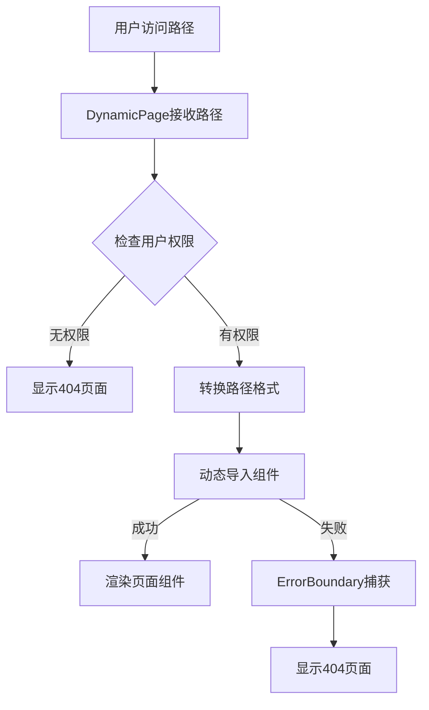

# 动态组件系统设计文档

## 概述

动态组件系统是SVT前端架构的核心创新功能，实现了基于约定的自动组件映射，彻底解决了硬编码维护问题。

## 设计理念

### 约定优于配置 (Convention over Configuration)
- **核心思想**: 通过统一的路径约定，自动映射后端菜单路径到前端组件
- **零配置**: 新增页面无需手动配置路由映射
- **DRY原则**: 消除重复的硬编码组件映射

## 自动映射规则

### 路径转换算法
```typescript
// 转换规则示例
/system/menu     → /pages/System/Menu
/business/order  → /pages/Business/Order  
/user/profile    → /pages/User/Profile

// 实现函数
const pathToComponentPath = (menuPath: string): string => {
  const segments = menuPath.split('/').filter(Boolean);
  if (segments.length < 2) return '';
  
  const [category, page] = segments;
  return `/pages/${convertToPascalCase(category)}/${convertToPascalCase(page)}`;
};
```

### PascalCase转换
```typescript
const convertToPascalCase = (str: string): string => {
  return str.charAt(0).toUpperCase() + str.slice(1).toLowerCase();
};
```

## 核心组件架构

### DynamicPage组件结构
```
DynamicPage/
├── index.tsx              # 主组件文件
├── types.ts              # 类型定义
└── utils.ts              # 工具函数
```

### 关键实现

#### 1. 动态组件映射
```typescript
// 基于后端菜单数据的动态组件映射
const createDynamicPageMap = (menuTrees: MenuItem[]) => {
  const pageMap: Record<string, React.LazyExoticComponent<React.ComponentType<Record<string, unknown>>>> = {};

  const processMenuTree = (menus: MenuItem[]) => {
    menus.forEach(menu => {
      if (menu.menuPath) {
        const path = menu.menuPath;
        const componentPath = pathToComponentPath(path);
        
        if (componentPath) {
          try {
            const Component = importComponent(componentPath);
            if (Component) {
              pageMap[path] = Component;
            }
          } catch {
            // 组件导入失败时，不添加到pageMap中，统一显示404页面
            console.warn(`跳过无效组件路径: ${path} -> ${componentPath}`);
          }
        }
      }

      // 递归处理子菜单
      if (menu.children && menu.children.length > 0) {
        processMenuTree(menu.children);
      }
    });
  };

  processMenuTree(menuTrees);
  return pageMap;
};
```

#### 2. 组件动态导入
```typescript
const importComponent = (componentPath: string): React.LazyExoticComponent<React.ComponentType<any>> | null => {
  try {
    // 动态导入组件
    return React.lazy(() => import(`@${componentPath}`));
  } catch {
    return null;
  }
};
```

#### 3. 错误边界处理
```typescript
class ErrorBoundary extends Component<{ children: ReactNode }, ErrorBoundaryState> {
  constructor(props: { children: ReactNode }) {
    super(props);
    this.state = { hasError: false };
  }

  static getDerivedStateFromError(): ErrorBoundaryState {
    return { hasError: true };
  }

  componentDidCatch(error: Error, errorInfo: ErrorInfo) {
    console.error('组件加载错误:', error, errorInfo);
  }

  render() {
    if (this.state.hasError) {
      return <NotFoundPage />;
    }
    return this.props.children;
  }
}
```

## 权限验证集成

### 权限检查算法
```typescript
const checkPermission = (menus: MenuItem[], targetPath: string): boolean => {
  return menus.some(menu => {
    if (menu.menuPath === targetPath) {
      return true;
    }
    if (menu.children && menu.children.length > 0) {
      return checkPermission(menu.children, targetPath);
    }
    return false;
  });
};
```

### 安全机制
1. **先权限后组件**: 先检查用户权限，再尝试加载组件
2. **无权限统一处理**: 无权限时统一显示404页面
3. **错误隔离**: 组件加载失败不影响其他页面

## 组件加载流程



## 性能优化

### 懒加载策略
- **React.lazy()**: 按需加载组件，减少初始包大小
- **代码分割**: 每个页面组件独立打包
- **缓存机制**: 已加载组件自动缓存

### 错误处理优化
- **静默失败**: 组件加载失败不抛出异常
- **统一降级**: 所有错误统一降级到404页面
- **开发友好**: 开发环境详细错误信息

## 扩展性设计

### 支持多级路径
```typescript
// 支持更深层级的路径
/system/user/management  → /pages/System/User/Management
/business/order/detail   → /pages/Business/Order/Detail
```

### 自定义映射规则
```typescript
// 可扩展的映射规则配置
const customMappingRules = {
  '/special/path': '/pages/Custom/SpecialPage',
  // 更多自定义规则...
};
```

## 开发指南

### 新增页面步骤
1. **创建组件文件**: 按约定路径创建组件文件
2. **实现页面逻辑**: 使用统一的页面容器
3. **后端配置菜单**: 在后端系统中配置菜单路径
4. **自动生效**: 系统自动识别并加载新页面

### 目录结构约定
```
src/pages/
├── System/           # 系统管理页面
│   ├── Menu/         # 菜单管理
│   ├── User/         # 用户管理
│   └── Role/         # 角色管理
├── Business/         # 业务页面
│   ├── Order/        # 订单管理
│   └── Product/      # 产品管理
└── Dashboard/        # 仪表盘
```

### 页面组件规范
```typescript
// 标准页面组件模板
import React from 'react';

const MenuManagement: React.FC = () => {
  return (
    <div className="page-container-management">
      <div className="page-header">
        <h1>菜单管理</h1>
      </div>
      <div className="page-content">
        {/* 页面内容 */}
      </div>
    </div>
  );
};

export default MenuManagement;
```

## 故障排除

### 常见问题

#### 1. 组件加载失败
**现象**: 页面显示404
**排查**: 
- 检查文件路径是否符合约定
- 确认组件文件是否存在
- 查看控制台警告信息

#### 2. 权限验证失败
**现象**: 有权限但显示404
**排查**:
- 检查用户菜单数据
- 确认路径格式是否正确
- 验证权限检查逻辑

#### 3. 路径映射错误
**现象**: 路径转换不正确
**排查**:
- 检查路径分割逻辑
- 确认PascalCase转换
- 验证目录结构

## 最佳实践

### 1. 命名规范
- **文件名**: 使用PascalCase，如`MenuManagement.tsx`
- **目录名**: 使用PascalCase，如`System/`, `Business/`
- **路径一致性**: 保持前后端路径命名一致

### 2. 错误处理
- **优雅降级**: 组件加载失败时显示友好的404页面
- **错误隔离**: 单个组件错误不影响整体应用
- **日志记录**: 详细记录错误信息便于调试

### 3. 性能考虑
- **按需加载**: 使用React.lazy()实现懒加载
- **缓存策略**: 合理利用浏览器缓存
- **代码分割**: 避免单个bundle过大

## 版本历史

- **v1.0.0** (2025-06-22): 初始版本，实现基础动态组件映射
- **v1.1.0** (计划): 支持多级路径映射
- **v1.2.0** (计划): 自定义映射规则配置

---

**文档维护**: 前端架构团队  
**最后更新**: 2025-06-22  
**版本**: v1.0.0 