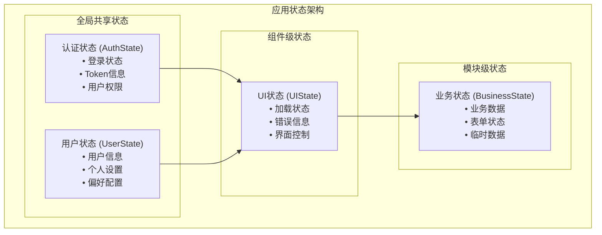
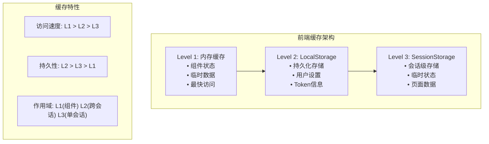

# SVT 前端设计原理文档

**项目**: SVT-Web 前端设计原理
**版本**: v1.0
**创建时间**: 2025-06-21
**文档类型**: 前端设计原理
**适用领域**: 保密性要求较高的企业内部系统

## 📋 文档说明

本文档详细阐述SVT前端的设计原理，包括架构设计思想、状态管理策略、安全机制实现和用户体验优化。所有设计都基于高安全性业务场景的特殊要求。

---

## 🎯 前端设计目标

### 核心目标
1. **安全性**: 确保前端数据传输和存储安全
2. **可靠性**: 提供稳定可靠的用户界面
3. **易用性**: 符合企业用户的操作习惯
4. **性能**: 快速响应和流畅体验
5. **可维护性**: 清晰的代码结构和组件设计

---

## 🏗️ 架构设计原理

### 技术选型理由

#### React 19 - 核心框架
```typescript
// 选择理由
1. 并发特性: 提升用户体验，特别是数据加载场景
2. 生态成熟: 丰富的第三方库和工具链
3. 团队熟悉: 降低学习成本和开发风险
4. 企业级应用: 大量高安全性项目的成功实践
```

#### TypeScript 5 - 类型系统
```typescript
// 金融系统的类型安全要求
interface UserInfo {
  userId: string;
  userName: string;
  roles: Role[];
  permissions: Permission[];
  lastLoginTime: Date;
}

// 编译时错误检查，避免运行时业务数据错误
```

#### Zustand - 状态管理
```typescript
// 轻量级状态管理的优势
interface AuthStore {
  user: UserInfo | null;
  token: string | null;
  isAuthenticated: boolean;
  login: (credentials: LoginCredentials) => Promise<void>;
  logout: () => void;
  refreshToken: () => Promise<void>;
}

// 相比Redux更简单，适合中型项目
```

---

## 🔐 前端安全设计

### 1. 用户状态验证机制

#### 设计原理
高安全性系统需要实时验证用户状态，确保会话安全性。

#### 核心实现
```typescript
// useUserStatus Hook - 防重复调用设计
export const useUserStatus = () => {
  const hasVerifiedRef = useRef(false);
  const { isAuthenticated, token, logout } = useAuthStore();
  
  useEffect(() => {
    // 关键设计：只在已认证且有token时验证
    if (!isAuthenticated || !token) {
      console.log('⚠️ 用户未认证，跳过状态验证');
      setLoading(false);
      return;
    }

    // 防重复调用机制
    if (isAuthenticated && token && !hasVerifiedRef.current) {
      hasVerifiedRef.current = true;
      verifyStatus();
    }
  }, [isAuthenticated, token, logout, navigate]);
};
```

#### 设计亮点
1. **防重复调用**: 使用useRef避免循环依赖
2. **智能检查**: 只在必要时进行状态验证
3. **错误处理**: 统一的错误处理机制
4. **性能优化**: 避免不必要的API调用

### 2. AES加密通信

#### 加密策略
```typescript
// 前端AES加密实现
class AESCrypto {
  private key: CryptoKey | null = null;
  
  async encrypt(data: string): Promise<EncryptedData> {
    const iv = crypto.getRandomValues(new Uint8Array(16));
    const encodedData = new TextEncoder().encode(data);
    
    const encrypted = await crypto.subtle.encrypt(
      { name: 'AES-CBC', iv },
      this.key!,
      encodedData
    );
    
    return {
      data: this.arrayBufferToBase64(encrypted),
      iv: this.arrayBufferToBase64(iv),
      timestamp: Date.now(),
      version: '1.0'
    };
  }
}
```

#### 安全考量
1. **密钥管理**: 环境变量管理，避免硬编码
2. **IV随机性**: 每次加密使用新的随机IV
3. **时间戳验证**: 防重放攻击保护
4. **错误处理**: 加密失败的优雅降级

### 3. Token管理策略

#### 自动续期机制
```typescript
// Token自动续期设计
class TokenManager {
  private refreshTimer: NodeJS.Timeout | null = null;
  
  startAutoRefresh(token: string) {
    const payload = this.parseJWT(token);
    const expirationTime = payload.exp * 1000;
    const currentTime = Date.now();
    const timeUntilExpiry = expirationTime - currentTime;
    
    // 在过期前10分钟自动续期
    const refreshTime = Math.max(timeUntilExpiry - 10 * 60 * 1000, 0);
    
    this.refreshTimer = setTimeout(() => {
      this.refreshToken();
    }, refreshTime);
  }
}
```

---

## 📊 状态管理设计

### 1. 全局状态架构

#### 状态分层设计



```typescript
// 对应的TypeScript接口定义
interface AppState {
  auth: AuthState;      // 认证状态 - 全局共享
  user: UserState;      // 用户状态 - 全局共享
  ui: UIState;          // UI状态 - 组件级别
  business: BusinessState; // 业务状态 - 模块级别
}
```

#### 状态更新策略
```typescript
// 不可变状态更新
const authStore = create<AuthState>((set, get) => ({
  user: null,
  token: null,
  isAuthenticated: false,
  
  login: async (credentials) => {
    const response = await authApi.login(credentials);
    set({
      user: response.user,
      token: response.token,
      isAuthenticated: true
    });
  },
  
  logout: () => {
    set({
      user: null,
      token: null,
      isAuthenticated: false
    });
  }
}));
```

### 2. 缓存策略

#### 多级缓存设计



```typescript
// 对应的实现代码
class CacheManager {
  // Level 1: 内存缓存 (组件状态)
  private memoryCache = new Map<string, any>();

  // Level 2: LocalStorage (持久化)
  private persistentCache = {
    set: (key: string, value: any) => {
      localStorage.setItem(key, JSON.stringify(value));
    },
    get: (key: string) => {
      const item = localStorage.getItem(key);
      return item ? JSON.parse(item) : null;
    }
  };

  // Level 3: SessionStorage (会话级)
  private sessionCache = {
    set: (key: string, value: any) => {
      sessionStorage.setItem(key, JSON.stringify(value));
    },
    get: (key: string) => {
      const item = sessionStorage.getItem(key);
      return item ? JSON.parse(item) : null;
    }
  };
}
```

---

## 🎨 用户体验设计

### 1. 错误处理策略

#### 全局错误边界
```typescript
// 错误边界组件设计
class ErrorBoundary extends Component<Props, State> {
  constructor(props: Props) {
    super(props);
    this.state = { hasError: false, error: null };
  }
  
  static getDerivedStateFromError(error: Error): State {
    return { hasError: true, error };
  }
  
  componentDidCatch(error: Error, errorInfo: ErrorInfo) {
    // 记录错误到监控系统
    errorReporter.captureException(error, {
      extra: errorInfo,
      tags: { component: 'ErrorBoundary' }
    });
  }
  
  render() {
    if (this.state.hasError) {
      return <ErrorFallback error={this.state.error} />;
    }
    
    return this.props.children;
  }
}
```

### 2. 加载状态管理

#### 统一Loading设计
```typescript
// 全局Loading状态管理
interface LoadingState {
  global: boolean;
  components: Record<string, boolean>;
  requests: Record<string, boolean>;
}

const useLoading = () => {
  const [loading, setLoading] = useState<LoadingState>({
    global: false,
    components: {},
    requests: {}
  });
  
  const setComponentLoading = (component: string, isLoading: boolean) => {
    setLoading(prev => ({
      ...prev,
      components: {
        ...prev.components,
        [component]: isLoading
      }
    }));
  };
  
  return { loading, setComponentLoading };
};
```

### 3. 消息提示系统

#### 全局消息管理
```typescript
// MessageManager - 解决Context警告
class MessageManager {
  private messageApi: MessageInstance | null = null;
  
  setMessageApi(api: MessageInstance) {
    this.messageApi = api;
  }
  
  error(content: string, duration: number = 5) {
    if (this.messageApi) {
      this.messageApi.error(content, duration);
    } else {
      console.error('MessageAPI not initialized:', content);
    }
  }
  
  success(content: string, duration: number = 3) {
    if (this.messageApi) {
      this.messageApi.success(content, duration);
    }
  }
}

export const messageManager = new MessageManager();
```

---

## 🚀 性能优化策略

### 1. 组件优化

#### 懒加载设计
```typescript
// 路由级别懒加载
const Dashboard = lazy(() => import('../pages/Dashboard'));
const UserManagement = lazy(() => import('../pages/UserManagement'));

// 组件级别懒加载
const HeavyComponent = lazy(() => import('../components/HeavyComponent'));

// 使用Suspense包装
<Suspense fallback={<Loading />}>
  <Routes>
    <Route path="/dashboard" element={<Dashboard />} />
    <Route path="/users" element={<UserManagement />} />
  </Routes>
</Suspense>
```

#### 渲染优化
```typescript
// React.memo优化
const UserCard = React.memo<UserCardProps>(({ user, onEdit }) => {
  return (
    <Card>
      <h3>{user.name}</h3>
      <p>{user.email}</p>
      <Button onClick={() => onEdit(user.id)}>编辑</Button>
    </Card>
  );
}, (prevProps, nextProps) => {
  // 自定义比较函数
  return prevProps.user.id === nextProps.user.id &&
         prevProps.user.name === nextProps.user.name;
});
```

### 2. 网络优化

#### 请求优化
```typescript
// 请求去重和缓存
class RequestManager {
  private pendingRequests = new Map<string, Promise<any>>();
  private cache = new Map<string, { data: any; timestamp: number }>();
  
  async request<T>(url: string, options?: RequestOptions): Promise<T> {
    const cacheKey = this.getCacheKey(url, options);
    
    // 检查缓存
    const cached = this.getFromCache(cacheKey);
    if (cached) return cached;
    
    // 检查是否有相同请求正在进行
    if (this.pendingRequests.has(cacheKey)) {
      return this.pendingRequests.get(cacheKey)!;
    }
    
    // 发起新请求
    const promise = this.makeRequest<T>(url, options);
    this.pendingRequests.set(cacheKey, promise);
    
    try {
      const result = await promise;
      this.setCache(cacheKey, result);
      return result;
    } finally {
      this.pendingRequests.delete(cacheKey);
    }
  }
}
```

---

## 📱 响应式设计

### 1. 布局适配

#### 响应式断点
```typescript
// 响应式断点定义
const breakpoints = {
  xs: '480px',
  sm: '768px', 
  md: '992px',
  lg: '1200px',
  xl: '1600px'
};

// 响应式Hook
const useResponsive = () => {
  const [screenSize, setScreenSize] = useState<ScreenSize>('lg');
  
  useEffect(() => {
    const handleResize = () => {
      const width = window.innerWidth;
      if (width < 480) setScreenSize('xs');
      else if (width < 768) setScreenSize('sm');
      else if (width < 992) setScreenSize('md');
      else if (width < 1200) setScreenSize('lg');
      else setScreenSize('xl');
    };
    
    handleResize();
    window.addEventListener('resize', handleResize);
    return () => window.removeEventListener('resize', handleResize);
  }, []);
  
  return screenSize;
};
```

---

## 🔧 开发体验优化

### 1. 开发工具配置

#### 环境配置策略
```typescript
// 环境变量管理
interface EnvConfig {
  API_BASE_URL: string;
  AES_ENABLED: boolean;
  AES_KEY?: string;
  DEBUG_MODE: boolean;
}

const getEnvConfig = (): EnvConfig => {
  return {
    API_BASE_URL: import.meta.env.VITE_API_BASE_URL,
    AES_ENABLED: import.meta.env.VITE_AES_ENABLED === 'true',
    AES_KEY: import.meta.env.VITE_AES_KEY,
    DEBUG_MODE: import.meta.env.DEV
  };
};
```

### 2. 调试支持

#### 开发环境调试
```typescript
// 开发环境调试工具
if (import.meta.env.DEV) {
  // 全局调试对象
  (window as any).__SVT_DEBUG__ = {
    authStore,
    messageManager,
    cryptoUtils,
    requestManager
  };
  
  // 请求日志
  console.log('🚀 SVT开发模式启动');
  console.log('📡 API地址:', import.meta.env.VITE_API_BASE_URL);
  console.log('🔐 AES加密:', import.meta.env.VITE_AES_ENABLED);
}
```

---

**相关文档**:
- [组件结构说明](./Component-Structure.md)
- [状态管理指南](./State-Management.md)
- [环境变量配置](./环境变量配置说明.md)
- [开发指南](./开发指南.md)
- [AES加密实现](./API-Encryption-AES.md)

**文档维护**: 本文档随前端架构演进持续更新  
**最后更新**: 2025-06-21  
**下次审查**: 2025-08-21  
**前端责任人**: 前端架构师 + UI/UX设计师
