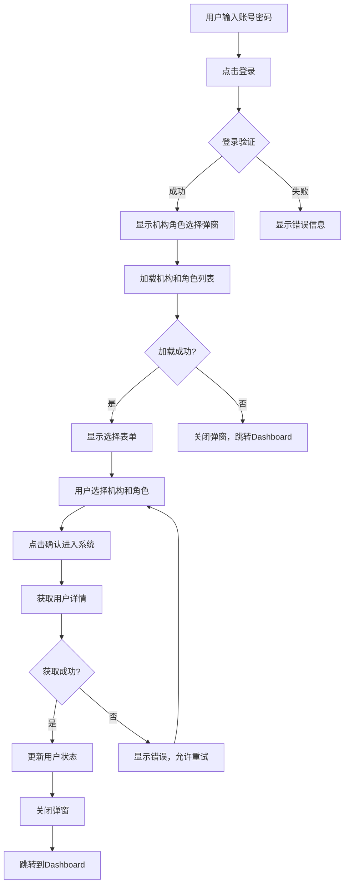

# 机构角色选择弹窗实现说明

## 概述

将机构角色选择功能从独立页面改为弹窗模式，集成到登录页面中，提供更流畅的用户体验。

## 设计优势

### 弹窗方案 vs 中转页面方案

| 特性 | 弹窗方案 ✅ | 中转页面方案 ❌ |
|------|------------|----------------|
| 用户体验 | 流畅，无页面跳转 | 需要额外页面跳转 |
| 视觉连贯性 | 保持登录页面环境 | 视觉断层 |
| 操作直观性 | 明确是登录流程一部分 | 可能造成困惑 |
| 路由复杂度 | 简单，无额外路由 | 需要额外路由守卫 |
| 现代化程度 | 符合现代UI设计 | 相对传统 |

## 实现特性

### 1. 集成到登录页面
- 登录成功后自动显示机构角色选择弹窗
- 弹窗居中显示，背景遮罩，防止误操作
- 支持ESC键和点击遮罩关闭（会跳转到dashboard）

### 2. 智能预选择
- 如果用户只有一个机构，自动选择该机构
- 如果用户只有一个角色，自动选择该角色
- 减少用户操作步骤

### 3. 搜索功能
- 机构和角色下拉框都支持搜索过滤
- 支持中文名称搜索
- 提高大量选项时的选择效率

### 4. 错误处理
- 加载机构角色列表失败时，自动关闭弹窗并跳转到dashboard
- 获取用户详情失败时，显示错误提示并允许重试
- 完善的错误边界处理

### 5. 加载状态
- 弹窗打开时显示加载动画
- 提交时显示提交状态
- 友好的加载提示文案

## 技术实现

### 核心组件结构
```tsx
// 登录页面集成机构角色选择弹窗
const LoginPage: React.FC = () => {
  // 使用统一的认证hook
  const { isAuthenticated, user, login, logout } = useAuth();
  
  // 会话状态管理
  const {
    showOrgRoleModal,
    orgList,
    roleList,
    selectedOrgId,
    selectedRoleId,
    isLoadingOrgRole,
    isSubmittingOrgRole,
    showOrgRoleSelection,
    selectOrganization,
    selectRole,
    submitOrgRoleSelection,
    closeOrgRoleModal
  } = useSessionStore();
  
  // 登录成功后显示弹窗
  useEffect(() => {
    if (isAuthenticated && !user) {
      showOrgRoleSelection();
    }
  }, [isAuthenticated, user]);
  
  // 弹窗内容
  const renderOrgRoleModal = () => (
    <Modal
      title="选择机构和角色"
      open={showOrgRoleModal}
      onCancel={() => {
        closeOrgRoleModal();
        navigate('/dashboard');
      }}
      footer={[
        <Button key="cancel" onClick={() => {
          closeOrgRoleModal();
          navigate('/dashboard');
        }}>
          跳过
        </Button>,
        <Button
          key="submit"
          type="primary"
          loading={isSubmittingOrgRole}
          disabled={!selectedOrgId || !selectedRoleId}
          onClick={submitOrgRoleSelection}
        >
          确认进入系统
        </Button>
      ]}
      width={600}
      centered
      maskClosable={false}
      destroyOnClose
    >
      {/* 机构选择和角色选择表单 */}
    </Modal>
  );
};
```

### 状态管理架构

#### 多Store协调架构
```typescript
// 1. SessionStore - 会话和登录流程管理
interface SessionState {
  loginStep: LoginStep;
  showOrgRoleModal: boolean;
  orgList: UserOrgInfo[];
  roleList: UserRoleInfo[];
  selectedOrgId: string | null;
  selectedRoleId: string | null;
  isLoadingOrgRole: boolean;
  isSubmittingOrgRole: boolean;
}

// 2. AuthStore - 认证令牌管理
interface AuthState {
  isAuthenticated: boolean;
  accessToken: string | null;
  refreshToken: string | null;
  tokenExpiry: number | null;
}

// 3. UserStore - 用户信息管理
interface UserState {
  user: UserInfo | null;
  currentOrg: UserOrgInfo | null;
  currentRole: UserRoleInfo | null;
  permissions: string[];
}

// 4. useAuth - 统一认证Hook
const useAuth = () => {
  const authStore = useAuthStore();
  const userStore = useUserStore();
  const sessionStore = useSessionStore();
  
  return {
    // 认证状态
    isAuthenticated: authStore.isAuthenticated,
    user: userStore.user,
    
    // 认证操作
    login: async (credentials) => {
      const tokens = await authApi.login(credentials);
      authStore.setTokens(tokens);
      sessionStore.setLoginStep('org_role_selection');
    },
    
    logout: () => {
      authStore.clearTokens();
      userStore.clearUser();
      sessionStore.reset();
    }
  };
};
```

### API调用流程
1. **登录成功** → 设置登录步骤为`org_role_selection`
2. **显示弹窗** → `showOrgRoleSelection()`触发弹窗显示
3. **并行加载** → 同时调用`getUserOrgList()`和`getUserRoleList()`
4. **智能预选** → 如果只有一个选项，自动选择
5. **用户选择** → 用户在弹窗中选择机构和角色
6. **提交选择** → 调用`getUserDetails()`获取完整用户信息
7. **状态更新** → 更新UserStore中的用户信息和当前机构角色
8. **完成登录** → 设置登录步骤为`completed`，跳转到dashboard

### 核心技术特性

#### 1. JWT会话管理
```typescript
// 自动令牌刷新机制
const tokenRefreshInterval = setInterval(async () => {
  if (shouldRefreshToken()) {
    await refreshAccessToken();
  }
}, 60000); // 每分钟检查一次

// 会话状态监控
const monitorSessionStatus = () => {
  const currentStatus = getCurrentSessionStatus();
  if (currentStatus !== previousStatus) {
    handleSessionStatusChange(currentStatus);
  }
};
```

#### 2. 类型安全保障
```typescript
// 完整的类型定义
interface UserOrgInfo {
  orgId: string;
  orgName: string;
  orgNameEn?: string;
  orgCode: string;
  orgType: string;
  isDefault: boolean;
}

interface UserRoleInfo {
  roleId: string;
  roleName: string;
  roleNameEn?: string;
  roleCode: string;
  roleType: string;
  permissions: string[];
}
```

#### 3. 模态框管理
```typescript
// 全局模态框管理器
class ModalManager {
  private modals: Map<string, ModalConfig> = new Map();
  
  show(id: string, config: ModalConfig) {
    this.modals.set(id, config);
    this.render();
  }
  
  hide(id: string) {
    this.modals.delete(id);
    this.render();
  }
}
```

## 用户交互流程



## 配置说明

### 环境变量
无需额外配置，使用现有的API配置即可。

### API接口
- `GET /auth/get-user-org-list` - 获取用户机构列表
- `GET /auth/get-user-role` - 获取用户角色列表
- `POST /auth/get-user-details` - 获取用户详情
- `POST /auth/refresh-token` - 刷新访问令牌
- `POST /auth/logout` - 退出登录

### 样式定制
弹窗使用Ant Design的Modal组件，可通过以下方式定制：
- 修改`width`属性调整弹窗宽度（当前设置为600px）
- 使用`style`属性自定义样式
- 通过CSS类名覆盖默认样式
- 支持`centered`居中显示
- 通过`destroyOnClose`确保每次重新渲染
- 通过`maskClosable={false}`防止意外关闭

## 优化建议

### 性能优化
1. **预加载机构角色数据** - 可以在登录请求时一并返回
2. **缓存机构角色列表** - 避免重复请求（已实现Zustand持久化）
3. **懒加载弹窗内容** - 使用`destroyOnClose`属性（已实现）
4. **并行API调用** - 机构和角色列表并行加载（已实现）
5. **智能预选择** - 自动选择唯一选项（已实现）

### 用户体验优化
1. **记住上次选择** - 可以缓存用户的上次选择
2. **快捷键支持** - 支持Tab键切换和Enter键确认
3. **移动端适配** - 针对移动设备优化弹窗尺寸
4. **搜索功能** - 下拉框支持搜索过滤（已实现）
5. **双语支持** - 支持中英文名称显示（已实现）
6. **加载状态** - 完善的加载动画和提示（已实现）

### 安全性考虑
1. **权限验证** - 确保用户只能选择有权限的机构和角色（已实现）
2. **会话管理** - JWT令牌自动刷新机制（已实现）
3. **错误处理** - 避免敏感信息泄露（已实现）
4. **会话监控** - 实时监控会话状态（已实现）
5. **令牌安全** - 安全的令牌存储和传输（已实现）

### 已实现的高级特性
1. **多Store架构** - SessionStore、AuthStore、UserStore协调工作
2. **统一认证Hook** - useAuth提供统一的认证接口
3. **类型安全** - 完整的TypeScript类型定义
4. **模态框管理** - 全局模态框管理器
5. **会话持久化** - 基于localStorage的状态持久化
6. **错误边界** - 完善的错误处理和恢复机制
7. **调试支持** - 完整的日志记录和调试工具

## 总结

机构角色选择弹窗方案相比独立页面方案具有明显优势：
- ✅ 用户体验更流畅
- ✅ 减少页面跳转
- ✅ 视觉连贯性更好
- ✅ 代码结构更简洁
- ✅ 符合现代UI设计趋势

这种设计模式在现代Web应用中被广泛采用，为用户提供了更好的交互体验。 