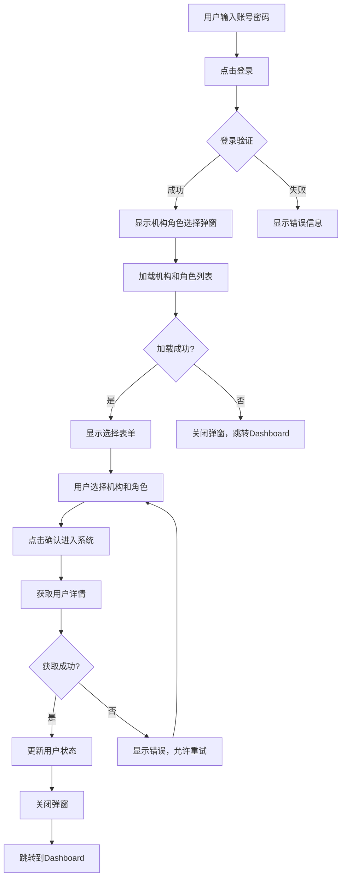

# 机构角色选择弹窗实现说明

## 概述

将机构角色选择功能从独立页面改为弹窗模式，集成到登录页面中，提供更流畅的用户体验。

## 设计优势

### 弹窗方案 vs 中转页面方案

| 特性 | 弹窗方案 ✅ | 中转页面方案 ❌ |
|------|------------|----------------|
| 用户体验 | 流畅，无页面跳转 | 需要额外页面跳转 |
| 视觉连贯性 | 保持登录页面环境 | 视觉断层 |
| 操作直观性 | 明确是登录流程一部分 | 可能造成困惑 |
| 路由复杂度 | 简单，无额外路由 | 需要额外路由守卫 |
| 现代化程度 | 符合现代UI设计 | 相对传统 |

## 实现特性

### 1. 集成到登录页面
- 登录成功后自动显示机构角色选择弹窗
- 弹窗居中显示，背景遮罩，防止误操作
- 支持ESC键和点击遮罩关闭（会跳转到dashboard）

### 2. 智能预选择
- 如果用户只有一个机构，自动选择该机构
- 如果用户只有一个角色，自动选择该角色
- 减少用户操作步骤

### 3. 搜索功能
- 机构和角色下拉框都支持搜索过滤
- 支持中文名称搜索
- 提高大量选项时的选择效率

### 4. 错误处理
- 加载机构角色列表失败时，自动关闭弹窗并跳转到dashboard
- 获取用户详情失败时，显示错误提示并允许重试
- 完善的错误边界处理

### 5. 加载状态
- 弹窗打开时显示加载动画
- 提交时显示提交状态
- 友好的加载提示文案

## 技术实现

### 核心组件结构
```tsx
// 登录页面集成机构角色选择弹窗
const LoginPage: React.FC = () => {
  // 弹窗状态管理
  const [showOrgRoleModal, setShowOrgRoleModal] = useState(false);
  const [orgRoleLoading, setOrgRoleLoading] = useState(false);
  const [orgRoleSubmitting, setOrgRoleSubmitting] = useState(false);
  
  // 数据状态
  const [orgList, setOrgList] = useState<UserOrgInfo[]>([]);
  const [roleList, setRoleList] = useState<UserRoleInfo[]>([]);
  
  // 登录成功后显示弹窗
  useEffect(() => {
    if (isAuthenticated) {
      showOrgRoleSelection();
    }
  }, [isAuthenticated]);
  
  // ... 其他实现
};
```

### API调用流程
1. **登录成功** → 触发`showOrgRoleSelection()`
2. **并行加载** → 同时调用`getUserOrgList()`和`getUserRoleList()`
3. **用户选择** → 用户在弹窗中选择机构和角色
4. **获取详情** → 调用`getUserDetails()`获取完整用户信息
5. **更新状态** → 更新认证状态和本地缓存
6. **跳转首页** → 关闭弹窗并跳转到dashboard

### 状态管理
- 使用`useState`管理弹窗状态和数据
- 集成到现有的`authStore`中
- 支持用户信息的实时更新

## 用户交互流程



## 配置说明

### 环境变量
无需额外配置，使用现有的API配置即可。

### API接口
- `GET /auth/get-user-org-list` - 获取用户机构列表
- `GET /auth/get-user-role` - 获取用户角色列表
- `POST /auth/get-user-details` - 获取用户详情

### 样式定制
弹窗使用Ant Design的Modal组件，可通过以下方式定制：
- 修改`width`属性调整弹窗宽度
- 使用`style`属性自定义样式
- 通过CSS类名覆盖默认样式

## 优化建议

### 性能优化
1. **预加载机构角色数据** - 可以在登录请求时一并返回
2. **缓存机构角色列表** - 避免重复请求
3. **懒加载弹窗内容** - 使用`destroyOnClose`属性

### 用户体验优化
1. **记住上次选择** - 可以缓存用户的上次选择
2. **快捷键支持** - 支持Tab键切换和Enter键确认
3. **移动端适配** - 针对移动设备优化弹窗尺寸

### 安全性考虑
1. **权限验证** - 确保用户只能选择有权限的机构和角色
2. **会话管理** - 选择后及时更新会话信息
3. **错误处理** - 避免敏感信息泄露

## 总结

机构角色选择弹窗方案相比独立页面方案具有明显优势：
- ✅ 用户体验更流畅
- ✅ 减少页面跳转
- ✅ 视觉连贯性更好
- ✅ 代码结构更简洁
- ✅ 符合现代UI设计趋势

这种设计模式在现代Web应用中被广泛采用，为用户提供了更好的交互体验。 