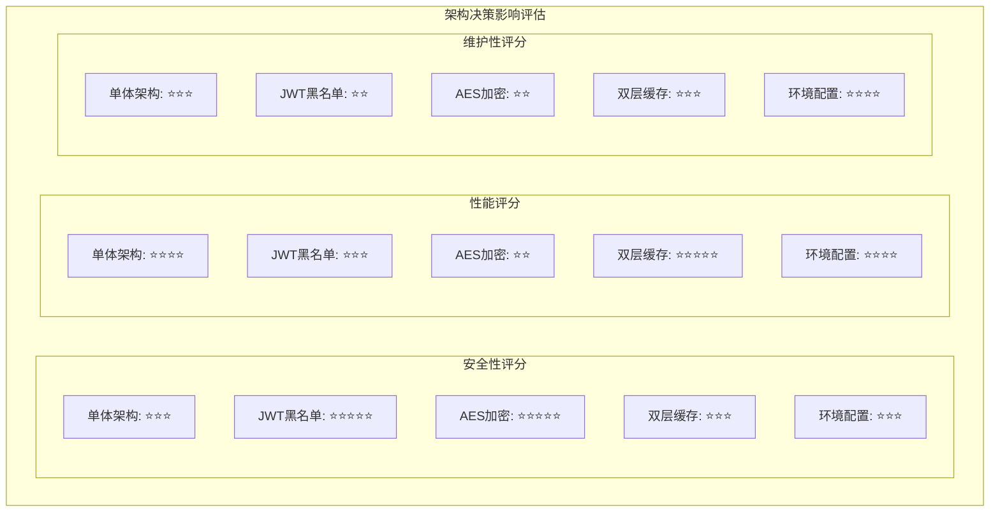

# SVT 架构设计决策记录 (ADR)

**项目**: SVT管理系统
**版本**: v1.0
**创建时间**: 2025-06-21
**文档类型**: 架构决策记录
**适用领域**: 保密性要求较高的企业内部系统

## 📋 文档说明

本文档记录SVT项目的关键架构设计决策，包括决策背景、考虑因素、选择理由和预期影响。每个决策都基于高安全性要求的企业环境和约束条件。

---

## 🏗️ ADR-001: 采用单体架构而非微服务

### 决策状态
✅ **已采用** - 2025-06-20

### 背景
项目初期需要在架构复杂度和开发效率之间做出选择，同时考虑团队规模和高安全性系统的特殊要求。

### 决策
采用**分层单体架构**，为未来微服务演进预留设计空间。

### 理由
1. **团队规模考量**
   - 当前团队规模适合单体架构的开发和维护
   - 避免微服务带来的分布式复杂性

2. **高安全性系统特性**
   - 企业核心系统对数据一致性要求极高
   - 单体架构更容易保证ACID事务特性
   - 减少分布式事务的复杂性

3. **开发效率**
   - 快速迭代和部署
   - 统一的错误处理和监控
   - 简化的测试策略

4. **演进策略**
   - 采用分层架构，模块边界清晰
   - 为未来微服务拆分预留接口
   - 计划在后期开设微服务分支

### 影响
- ✅ 开发效率高，部署简单
- ✅ 数据一致性保证
- ⚠️ 单点故障风险
- ⚠️ 扩展性受限

### 后续行动
- 监控系统性能指标
- 在适当时机评估微服务拆分

---

## 🔐 ADR-002: JWT + 黑名单混合认证机制

### 决策状态
✅ **已采用** - 2025-06-20

### 背景
需要在JWT的无状态特性和高安全性系统的安全要求之间找到平衡。

### 决策
采用**JWT + 智能黑名单**的混合认证机制。

### 理由
1. **安全性要求**
   - 高安全性系统需要能够立即撤销Token
   - 防止Token被盗用后的安全风险
   - 满足企业对访问控制的严格要求

2. **性能考量**
   - 智能区分系统Token vs 恶意Token
   - 避免恶意Token攻击导致黑名单无限膨胀
   - 使用Caffeine本地缓存提高查询性能

3. **业务需求**
   - 支持用户主动登出
   - 支持管理员强制下线用户
   - 支持IP变化检测

### 核心设计
```java
// 智能黑名单策略
if (!jwtUtils.isValidSystemToken(token)) {
    // 恶意Token直接拒绝，不加入黑名单
    return false;
} else {
    // 系统Token失效时才加入黑名单
    blacklistCache.put(token, "INVALID");
}
```

### 影响
- ✅ 提高安全性，满足企业安全要求
- ✅ 防止恶意Token攻击
- ⚠️ 增加内存开销
- ⚠️ 违背JWT无状态设计

---

## 🔒 ADR-003: AES-256-CBC端到端加密

### 决策状态
✅ **已采用** - 2025-06-20

### 背景
企业敏感数据传输需要额外的加密保护，即使在HTTPS基础上也需要应用层加密。

### 决策
采用**AES-256-CBC**进行API数据的端到端加密。

### 理由
1. **合规要求**
   - 企业敏感数据传输的安全要求
   - 多层防护策略的一部分
   - 满足安全等级保护要求

2. **技术选择**
   - CBC模式相比GCM模式实现更简单
   - 兼容性更好，支持更多客户端
   - 性能开销可接受

3. **威胁模型**
   - 防止中间人攻击
   - 防止内网嗅探
   - 防止日志泄露敏感数据

### 实现细节
```yaml
# 配置策略
svt:
  security:
    aes:
      enabled: true                      # 生产环境强制启用
      debug: false                       # 开发环境可选调试模式
      algorithm: "AES/CBC/PKCS5Padding"  # CBC模式
      key: ${AES_SECRET_KEY}             # 环境变量管理密钥
```

### 影响
- ✅ 提高数据传输安全性
- ✅ 满足企业合规要求
- ⚠️ 增加CPU开销
- ⚠️ 增加开发复杂度

---

## 💾 ADR-004: Caffeine + Redis双层缓存策略

### 决策状态
✅ **已采用** - 2025-06-20

### 背景
需要在性能和一致性之间找到平衡，同时考虑单体架构的特点。

### 决策
采用**Caffeine本地缓存 + Redis分布式缓存**的双层策略。

### 理由
1. **性能优化**
   - Caffeine提供毫秒级本地访问
   - 减少网络IO开销
   - 提高JWT验证性能

2. **架构考量**
   - 当前单体架构适合本地缓存
   - 为未来分布式部署预留Redis
   - Session Sticky部署模式下本地缓存有效

3. **数据特性**
   - JWT黑名单数据量可控
   - 用户会话数据访问频繁
   - 数据一致性要求适中

### 缓存策略
```java
// JWT黑名单缓存配置
Caffeine.newBuilder()
    .maximumSize(10000)                    // 最大条目数
    .expireAfterWrite(Duration.ofMinutes(1)) // 1分钟TTL
    .build();
```

### 影响
- ✅ 显著提升性能
- ✅ 降低数据库压力
- ⚠️ 增加内存使用
- ⚠️ 缓存一致性挑战

---

## 🛡️ ADR-005: 开发环境安全配置策略

### 决策状态
✅ **已采用** - 2025-06-21

### 背景
需要在开发效率和生产一致性之间找到平衡。

### 决策
开发环境**默认禁用**AES加密和数据脱敏，生产环境**强制启用**。

### 理由
1. **开发效率**
   - 便于调试和问题排查
   - 减少开发环境配置复杂度
   - 提高开发体验

2. **安全考量**
   - 开发环境通常在内网
   - 使用测试数据，安全风险较低
   - 生产环境严格启用所有安全特性

3. **配置管理**
   - 通过环境变量控制
   - 清晰的环境区分
   - 避免配置错误

### 配置策略
```yaml
# 开发环境
svt:
  security:
    aes:
      enabled: false    # 禁用加密，便于调试
    sensitive:
      enabled: false    # 禁用脱敏，便于开发

# 生产环境  
svt:
  security:
    aes:
      enabled: true     # 强制启用加密
    sensitive:
      enabled: true     # 强制启用脱敏
```

### 影响
- ✅ 提高开发效率
- ✅ 降低学习成本
- ⚠️ 环境差异风险
- ⚠️ 需要严格的部署检查

---

## 📊 决策影响矩阵



---

**文档维护**: 本文档随架构演进持续更新  
**最后更新**: 2025-06-21  
**下次审查**: 2025-07-21
