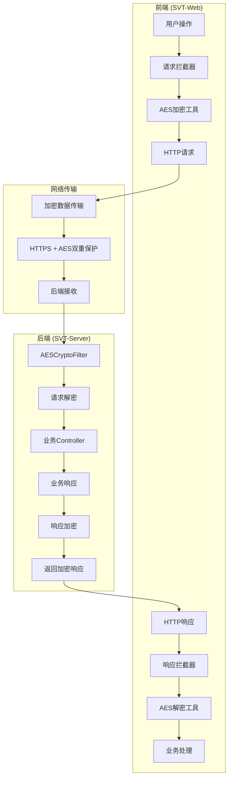
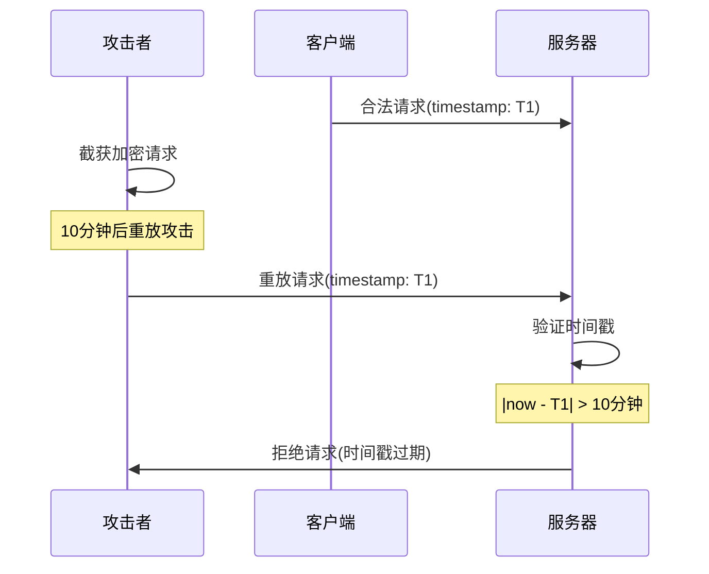

# SVT AES加密系统完整设计文档

## 📋 文档信息

**文档标题**: SVT AES加密系统完整设计文档  
**创建时间**: 2025-06-18 18:58:17 +08:00  
**文档版本**: v2.0  
**作者**: SEVENTEEN & Development Team  
**适用版本**: SVT v1.0.0  

## 🎯 概述

SVT AES加密系统是一个完整的端到端加密解决方案，采用AES-256-CBC算法，为前后端通信提供透明的加密保护。系统设计包含调试模式、智能配置检测、时间戳防重放攻击、密钥缓存等高级特性。

### 🏗️ 系统架构



## 🔒 核心设计特性

### 1. 调试模式设计

#### 1.1 后端调试模式

**配置方式**:
```yaml
# application-dev.yml
svt:
  security:
    aes:
      enabled: true     # 启用AES加密
      debug: true       # 调试模式：返回明文响应
```

**实现逻辑**:
```java
// AESCryptoFilter.java
private void processResponse(HttpServletRequest request, 
                           HttpServletResponse response, 
                           AESResponseWrapper responseWrapper) {
    // 🔧 调试模式检查（优先级最高）
    if (aesConfig.isDebug()) {
        log.debug("调试模式启用，跳过响应加密");
        return; // 直接返回明文响应
    }
    
    // 正常加密逻辑...
}
```

**调试模式特性**:
- **请求解密**: 仍然执行，保证后端能处理加密请求
- **响应加密**: 跳过加密，直接返回明文响应
- **时间戳验证**: 只警告不阻止，便于开发调试
- **日志增强**: 输出详细的加密解密过程信息

#### 1.2 前端调试支持

**配置检测**:
```typescript
// crypto.ts
if (import.meta.env.DEV) {
  console.log('AES配置状态:', cryptoConfig.getSummary());
  console.log('密钥状态:', AESCryptoUtils.validateKey());
}
```

**动态控制**:
```typescript
// 开发环境下可动态控制
window.cryptoConfig?.enable();   // 启用加密
window.cryptoConfig?.disable();  // 禁用加密
```

### 2. 过滤器执行顺序设计

#### 2.1 后端过滤器链

```java
// 执行顺序（@Order注解控制）
HTTP请求 
→ AESCryptoFilter(@Order(10))        // 最高优先级，首先解密
→ RequestWrapperFilter(@Order(50))   // 请求包装
→ JwtAuthenticationFilter(@Order(70)) // JWT认证
→ 业务Controller
```

**设计原理**:
- **AESCryptoFilter优先级最高**: 确保请求在任何其他处理之前被解密
- **RequestWrapperFilter次之**: 提供请求体的多次读取能力
- **JwtAuthenticationFilter最后**: 在明文请求上进行认证

#### 2.2 关键实现

```java
@Component
@Order(10) // 确保在其他过滤器之前执行
public class AESCryptoFilter implements Filter {
    
    @Override
    public void doFilter(ServletRequest request, ServletResponse response, 
                        FilterChain chain) throws IOException, ServletException {
        
        HttpServletRequest httpRequest = (HttpServletRequest) request;
        HttpServletResponse httpResponse = (HttpServletResponse) response;
        
        // 1. 处理请求（解密）
        ServletRequest processedRequest = processRequest(httpRequest);
        
        // 2. 创建响应包装器
        AESResponseWrapper responseWrapper = new AESResponseWrapper(httpResponse);
        
        // 3. 继续过滤器链
        chain.doFilter(processedRequest, responseWrapper);
        
        // 4. 处理响应（加密）
        processResponse(httpRequest, httpResponse, responseWrapper);
    }
}
```

### 3. CORS配置对加密的支持

#### 3.1 暴露加密标识头

```java
// WebMvcConfig.java
@Override
public void addCorsMappings(CorsRegistry registry) {
    registry.addMapping("/**")
            .allowedOriginPatterns("*")
            .allowedMethods("GET", "POST", "PUT", "DELETE", "OPTIONS")
            .allowedHeaders("*")
            .allowCredentials(true)
            .exposedHeaders("X-Encrypted", "Content-Type") // 🔧 关键配置
            .maxAge(3600);
}
```

**设计意义**:
- **X-Encrypted头暴露**: 前端能够检测响应是否加密
- **跨域支持**: 确保加密通信在跨域环境下正常工作
- **Content-Type保持**: 维持JSON响应的正确类型

#### 3.2 前端响应头处理

```typescript
// request.ts - 响应拦截器
const encryptedHeader = response.headers['x-encrypted']; // axios自动转小写

if (AESCryptoUtils.isEnabled() && encryptedHeader === 'true') {
    // 执行解密逻辑
}
```

### 4. 时间戳防重放攻击机制

#### 4.1 攻击防护原理



#### 4.2 后端实现

```java
// AESUtils.java
public String decryptFromAPI(Map<String, Object> encryptedData) throws BusinessException {
    // 验证时间戳（防重放攻击）
    Object timestampObj = encryptedData.get("timestamp");
    if (timestampObj instanceof Number) {
        long timestamp = ((Number) timestampObj).longValue();
        long currentTime = System.currentTimeMillis();
        long timeDiff = Math.abs(currentTime - timestamp);
        
        // 检查时间戳容差（默认10分钟）
        if (timeDiff > aesConfig.getTimestampTolerance()) {
            log.warn("时间戳验证失败，时间差: {}ms", timeDiff);
            // 在调试模式下只警告，不阻止解密
            if (!aesConfig.isDebug()) {
                throw new BusinessException("请求时间戳超出允许范围");
            }
        }
    }
    
    // 继续解密逻辑...
}
```

#### 4.3 前端时间戳生成

```typescript
// crypto.ts
static async encryptForAPI(data: any): Promise<EncryptedData> {
    const plainText = JSON.stringify(data);
    const { encryptedData, iv } = await this.encryptWithIV(plainText);
    
    return {
        encrypted: true,
        data: encryptedData,
        iv: iv,
        timestamp: Date.now(), // 🔧 防重放时间戳
        version: '1.0'
    };
}
```

#### 4.4 配置参数

```yaml
# 后端配置
svt:
  security:
    aes:
      timestamp-tolerance: 600000  # 10分钟容差(毫秒)
```

```typescript
// 前端配置
const DEFAULT_CONFIG: CryptoConfig = {
    timestampTolerance: 10 * 60 * 1000, // 10分钟
};
```

### 5. 密钥缓存机制

#### 5.1 前端密钥缓存

```typescript
// crypto.ts
let cachedKey: CryptoJS.lib.WordArray | null = null;
let keyExpiry: number = 0;

private static async getKey(): Promise<CryptoJS.lib.WordArray> {
    const now = Date.now();
    
    // 检查缓存是否有效
    if (cachedKey && now < keyExpiry) {
        return cachedKey; // 使用缓存的密钥
    }
    
    // 重新解析密钥并缓存
    const keyString = import.meta.env.VITE_AES_KEY;
    if (!keyString) {
        throw new Error('AES密钥未配置');
    }
    
    // 解析并缓存密钥
    cachedKey = CryptoJS.enc.Utf8.parse(keyString);
    keyExpiry = now + cryptoConfig.get().keyCacheExpiry; // 1小时后过期
    
    return cachedKey;
}
```

**缓存策略**:
- **缓存时长**: 1小时（可配置）
- **失效检查**: 每次使用前检查过期时间
- **内存存储**: 避免频繁的环境变量解析
- **安全清理**: 页面卸载时清理缓存

#### 5.2 后端密钥管理

```java
// AESConfig.java
@ConfigurationProperties(prefix = "svt.security.aes")
public class AESConfig {
    
    private long keyCacheExpiry = 3600000L; // 1小时
    
    // 密钥缓存逻辑（Spring Boot自动管理）
    // 配置文件变更时自动刷新
}
```

### 6. 数据大小限制保护

#### 6.1 防护机制

```java
// AESUtils.java
private static final int MAX_DATA_SIZE = 10 * 1024 * 1024; // 10MB

public String encrypt(String plainText, String ivString) throws BusinessException {
    // 检查数据大小
    byte[] data = plainText.getBytes(StandardCharsets.UTF_8);
    if (!aesConfig.isDataSizeValid(data.length)) {
        throw new BusinessException("数据大小超过限制: " + aesConfig.getMaxDataSize() + " bytes");
    }
    
    // 继续加密逻辑...
}
```

```typescript
// crypto.ts
static async encrypt(plainText: string, ivString: string): Promise<string> {
    // 检查数据大小
    const dataSize = new Blob([plainText]).size;
    if (!cryptoConfig.isDataSizeValid(dataSize)) {
        const config = cryptoConfig.get();
        throw new Error(`数据大小超过限制: ${config.maxDataSize} bytes`);
    }
    
    // 继续加密逻辑...
}
```

#### 6.2 配置管理

```yaml
# 后端配置
svt:
  security:
    aes:
      max-data-size: 10485760  # 10MB
```

```typescript
// 前端配置
const DEFAULT_CONFIG: CryptoConfig = {
    maxDataSize: 10 * 1024 * 1024, // 10MB
};
```

### 7. 请求方法智能过滤

#### 7.1 前端请求过滤逻辑

```typescript
// request.ts
request.interceptors.request.use(async (config) => {
    if (AESCryptoUtils.isEnabled()) {
        const method = config.method?.toLowerCase() || '';
        
        // 对POST/PUT/PATCH请求的data进行加密
        if (config.data && ['post', 'put', 'patch'].includes(method)) {
            const encryptedData = await AESCryptoUtils.encryptForAPI(config.data);
            config.data = encryptedData;
            config.headers['X-Encrypted'] = 'true';
        }
        // 对所有API请求（包括GET）设置加密响应标识
        else if (config.url?.startsWith('/')) {
            config.headers['X-Encrypted'] = 'true';
        }
    }
    
    return config;
});
```

#### 7.2 后端请求过滤逻辑

```java
// AESCryptoFilter.java
private boolean isEncryptableMethod(String method) {
    return "POST".equalsIgnoreCase(method) || 
           "PUT".equalsIgnoreCase(method) || 
           "PATCH".equalsIgnoreCase(method);
}

private ServletRequest processRequest(HttpServletRequest request) {
    String encryptedHeader = request.getHeader("X-Encrypted");
    
    // 检查是否为加密请求
    if (!"true".equalsIgnoreCase(encryptedHeader)) {
        return request;
    }

    // 只处理POST、PUT、PATCH请求
    String method = request.getMethod();
    if (!isEncryptableMethod(method)) {
        return request;
    }
    
    // 执行解密逻辑...
}
```

### 8. URL过滤规则设计

#### 8.1 后端URL过滤

```java
// AESCryptoFilter.java
private boolean shouldSkipEncryption(String uri) {
    if (uri == null) return true;
    
    // 静态资源过滤
    String[] staticExtensions = {".js", ".css", ".html", ".htm", ".png", 
                                ".jpg", ".jpeg", ".gif", ".ico", ".svg"};
    for (String ext : staticExtensions) {
        if (uri.endsWith(ext)) return true;
    }
    
    // 监控和文档页面过滤
    String[] excludePaths = {"/druid", "/swagger", "/api-docs", "/actuator"};
    for (String path : excludePaths) {
        if (uri.contains(path)) return true;
    }
    
    return false;
}
```

#### 8.2 前端URL过滤

```typescript
// request.ts
// 对所有API请求（包括GET）设置加密响应标识
else if (config.url?.startsWith('/')) {
    if (config.headers) {
        config.headers['X-Encrypted'] = 'true';
    }
}
```

### 9. 响应包装器双重支持

#### 9.1 设计背景

Spring Boot的JSON序列化可能使用`OutputStream`或`Writer`，需要同时支持两种方式。

#### 9.2 实现方案

```java
// AESResponseWrapper.java
public class AESResponseWrapper extends HttpServletResponseWrapper {
    private ByteArrayOutputStream outputStream;
    private PrintWriter writer;
    private boolean usingWriter = false;
    private boolean usingOutputStream = false;
    
    @Override
    public ServletOutputStream getOutputStream() throws IOException {
        if (usingWriter) {
            throw new IllegalStateException("getWriter() has already been called");
        }
        usingOutputStream = true;
        
        if (outputStream == null) {
            outputStream = new ByteArrayOutputStream();
        }
        
        return new ServletOutputStream() {
            @Override
            public void write(int b) throws IOException {
                outputStream.write(b);
            }
            
            // 其他方法实现...
        };
    }
    
    @Override
    public PrintWriter getWriter() throws IOException {
        if (usingOutputStream) {
            throw new IllegalStateException("getOutputStream() has already been called");
        }
        usingWriter = true;
        
        if (writer == null) {
            outputStream = new ByteArrayOutputStream();
            writer = new PrintWriter(new OutputStreamWriter(outputStream, getCharacterEncoding()));
        }
        
        return writer;
    }
    
    public byte[] getResponseData() throws IOException {
        if (writer != null) {
            writer.flush();
        }
        return outputStream != null ? outputStream.toByteArray() : new byte[0];
    }
}
```

### 10. 响应拦截器变量作用域修复

#### 10.1 问题描述

原始代码中使用`const { data }`导致解密后的数据无法正确传递给后续的成功条件检查。

#### 10.2 修复方案

```typescript
// request.ts - 修复前
request.interceptors.response.use(async (response) => {
    const { data } = response; // ❌ 问题：const导致无法修改
    
    if (AESCryptoUtils.isEnabled() && encryptedHeader === 'true') {
        if (isEncryptedData(data)) {
            const decryptedData = await AESCryptoUtils.decryptFromAPI(data);
            response.data = decryptedData;
            // data仍然是加密数据，导致后续判断错误
        }
    }
    
    // 成功响应判断使用的是加密数据
    if (data.code === 200 || data.success === true) { // ❌ 错误
        return response;
    }
});

// request.ts - 修复后
request.interceptors.response.use(async (response) => {
    let { data } = response; // ✅ 使用let允许修改
    
    if (AESCryptoUtils.isEnabled() && encryptedHeader === 'true') {
        if (isEncryptedData(data)) {
            const decryptedData = await AESCryptoUtils.decryptFromAPI(data);
            response.data = decryptedData;
            data = decryptedData; // ✅ 关键修复：更新本地变量
        }
    }
    
    // 成功响应判断使用解密后的数据
    if (data.code === 200 || data.success === true) { // ✅ 正确
        return response;
    }
});
```

### 11. 智能配置检测机制

#### 11.1 前端智能检测

```typescript
// crypto.ts
class CryptoConfigManager {
    private init(): void {
        const aesEnabled = import.meta.env.VITE_AES_ENABLED;
        
        if (aesEnabled !== undefined) {
            // 显式设置了VITE_AES_ENABLED
            this.config.enabled = aesEnabled === 'true';
        } else {
            // 未设置时，检查是否有AES密钥，有密钥则默认启用
            const hasAesKey = !!import.meta.env.VITE_AES_KEY;
            this.config.enabled = hasAesKey;
        }
        
        console.log(`AES加密${this.config.enabled ? '已启用' : '已禁用'}`);
    }
}
```

#### 11.2 配置优先级

1. **显式禁用**: `VITE_AES_ENABLED=false` → 强制禁用
2. **显式启用**: `VITE_AES_ENABLED=true` → 强制启用
3. **自动检测**: 未设置时根据`VITE_AES_KEY`是否存在决定

### 12. 加密数据格式验证

#### 12.1 标准格式定义

```typescript
export interface EncryptedData {
    encrypted: boolean;    // 加密标识
    data: string;         // Base64编码的密文
    iv: string;           // Base64编码的初始化向量
    timestamp: number;    // 时间戳（防重放）
    version: string;      // 版本标识
}
```

#### 12.2 格式验证函数

```typescript
export function isEncryptedData(data: any): data is EncryptedData {
    return (
        typeof data === 'object' &&
        data !== null &&
        data.encrypted === true &&
        typeof data.data === 'string' &&
        typeof data.iv === 'string' &&
        typeof data.timestamp === 'number' &&
        typeof data.version === 'string'
    );
}
```

#### 12.3 后端格式验证

```java
// AESUtils.java
private boolean isValidEncryptedData(Map<String, Object> encryptedData) {
    if (encryptedData == null || encryptedData.isEmpty()) {
        return false;
    }
    
    // 验证必需字段
    return Boolean.TRUE.equals(encryptedData.get("encrypted")) &&
           encryptedData.get("data") instanceof String &&
           encryptedData.get("iv") instanceof String &&
           encryptedData.get("timestamp") instanceof Number &&
           encryptedData.get("version") instanceof String;
}
```

### 13. 配置文件加密集成

#### 13.1 Jasypt集成

```java
// JasyptConfig.java
@Configuration
@EnableEncryptableProperties
public class JasyptConfig {
    
    @Bean("jasyptStringEncryptor")
    public StringEncryptor stringEncryptor() {
        PooledPBEStringEncryptor encryptor = new PooledPBEStringEncryptor();
        SimpleStringPBEConfig config = new SimpleStringPBEConfig();
        
        config.setPassword(getEncryptorPassword());
        config.setAlgorithm("PBEWITHHMACSHA512ANDAES_256");
        config.setKeyObtentionIterations("1000");
        config.setPoolSize("1");
        config.setProviderName("SunJCE");
        config.setSaltGeneratorClassName("org.jasypt.salt.RandomSaltGenerator");
        config.setIvGeneratorClassName("org.jasypt.iv.RandomIvGenerator");
        config.setStringOutputType("base64");
        
        encryptor.setConfig(config);
        return encryptor;
    }
    
    private String getEncryptorPassword() {
        String password = System.getenv("JASYPT_ENCRYPTOR_PASSWORD");
        if (password == null) {
            throw new IllegalStateException("JASYPT_ENCRYPTOR_PASSWORD environment variable not set");
        }
        return password;
    }
}
```

#### 13.2 配置文件加密示例

```yaml
# application-prod.yml
spring:
  datasource:
    password: ENC(MgtqLx7TCcVS9OlboFeo8Qi+Awm0knkLom756drzSsl/nKPXIQapluwRYA9PGJUD)
    
svt:
  security:
    aes:
      key: ENC(xvH9KqM3N8pL2rE6wT5yU7iO1qA4sD9fG2hJ6kL8mN3pQ5rT7vY0zX2cE4gI6kM8)
```

### 14. 系统启动配置验证

#### 14.1 启动监听器

```java
// SystemStartupListener.java
@Component
@Slf4j
public class SystemStartupListener {
    
    @Autowired
    private AESUtils aesUtils;
    
    @Autowired
    private AESConfig aesConfig;
    
    @EventListener(ApplicationReadyEvent.class)
    public void onApplicationReady(ApplicationReadyEvent event) {
        log.info("=== SVT系统启动配置验证 ===");
        
        // 验证AES配置
        validateAESConfiguration();
        
        // 验证数据库连接
        validateDatabaseConnection();
        
        // 验证Redis连接
        validateRedisConnection();
        
        log.info("=== 系统启动验证完成 ===");
    }
    
    private void validateAESConfiguration() {
        try {
            if (aesConfig.isEnabled()) {
                // 验证密钥有效性
                boolean keyValid = aesUtils.validateKey();
                if (keyValid) {
                    log.info("✅ AES配置验证通过");
                } else {
                    log.error("❌ AES密钥验证失败");
                }
                
                // 验证加密解密功能
                String testData = "SVT-TEST-DATA";
                String iv = aesUtils.generateIV();
                String encrypted = aesUtils.encrypt(testData, iv);
                String decrypted = aesUtils.decrypt(encrypted, iv);
                
                if (testData.equals(decrypted)) {
                    log.info("✅ AES加密解密功能验证通过");
                } else {
                    log.error("❌ AES加密解密功能验证失败");
                }
            } else {
                log.info("ℹ️ AES加密已禁用");
            }
        } catch (Exception e) {
            log.error("❌ AES配置验证异常: {}", e.getMessage());
        }
    }
}
```

### 15. 错误处理机制

#### 15.1 分层错误处理

```java
// 后端错误处理
@ControllerAdvice
public class GlobalExceptionHandler {
    
    @ExceptionHandler(BusinessException.class)
    public ResponseEntity<Result<?>> handleBusinessException(BusinessException e) {
        if (e.getMessage().contains("加密") || e.getMessage().contains("解密")) {
            log.error("AES加密相关异常: {}", e.getMessage());
            return ResponseEntity.ok(Result.error("数据处理失败，请重试"));
        }
        return ResponseEntity.ok(Result.error(e.getMessage()));
    }
}
```

```typescript
// 前端错误处理
request.interceptors.response.use(
    async (response) => {
        // 成功处理逻辑
    },
    (error: AxiosError) => {
        if (error.message.includes('加密') || error.message.includes('解密')) {
            console.error('AES加密相关错误:', error);
            message.error('数据传输异常，请刷新页面重试');
        }
        return Promise.reject(error);
    }
);
```

#### 15.2 调试模式容错

```java
// 调试模式下的容错处理
if (aesConfig.isDebug()) {
    try {
        // 尝试解密
        String decrypted = aesUtils.decrypt(data, iv);
        return decrypted;
    } catch (Exception e) {
        log.warn("调试模式：解密失败，返回原始数据: {}", e.getMessage());
        return originalData; // 返回原始数据，不阻止流程
    }
}
```

## 🧪 测试与验证

### 1. 功能测试用例

#### 1.1 加密解密基础测试

```java
@Test
public void testAESEncryptionDecryption() {
    String plainText = "Hello SVT System";
    String iv = aesUtils.generateIV();
    
    // 测试加密
    String encrypted = aesUtils.encrypt(plainText, iv);
    assertNotNull(encrypted);
    assertNotEquals(plainText, encrypted);
    
    // 测试解密
    String decrypted = aesUtils.decrypt(encrypted, iv);
    assertEquals(plainText, decrypted);
}
```

#### 1.2 API格式测试

```java
@Test
public void testAPIEncryptionFormat() {
    String jsonData = "{\"username\":\"admin\",\"password\":\"123456\"}";
    
    Map<String, Object> encrypted = aesUtils.encryptForAPI(jsonData);
    
    // 验证格式
    assertTrue((Boolean) encrypted.get("encrypted"));
    assertNotNull(encrypted.get("data"));
    assertNotNull(encrypted.get("iv"));
    assertNotNull(encrypted.get("timestamp"));
    assertEquals("1.0", encrypted.get("version"));
    
    // 测试解密
    String decrypted = aesUtils.decryptFromAPI(encrypted);
    assertEquals(jsonData, decrypted);
}
```

#### 1.3 时间戳防重放测试

```java
@Test
public void testTimestampValidation() {
    Map<String, Object> encryptedData = new HashMap<>();
    encryptedData.put("encrypted", true);
    encryptedData.put("data", "test-data");
    encryptedData.put("iv", "test-iv");
    encryptedData.put("timestamp", System.currentTimeMillis() - 15 * 60 * 1000); // 15分钟前
    encryptedData.put("version", "1.0");
    
    // 应该抛出时间戳异常
    assertThrows(BusinessException.class, () -> {
        aesUtils.decryptFromAPI(encryptedData);
    });
}
```

### 2. 前端测试

#### 2.1 配置检测测试

```typescript
// 测试智能配置检测
describe('CryptoConfig', () => {
    test('should enable encryption when key is present', () => {
        // 模拟环境变量
        import.meta.env.VITE_AES_KEY = 'test-key';
        delete import.meta.env.VITE_AES_ENABLED;
        
        const config = new CryptoConfigManager();
        expect(config.isEnabled()).toBe(true);
    });
    
    test('should disable encryption when explicitly set to false', () => {
        import.meta.env.VITE_AES_ENABLED = 'false';
        import.meta.env.VITE_AES_KEY = 'test-key';
        
        const config = new CryptoConfigManager();
        expect(config.isEnabled()).toBe(false);
    });
});
```

### 3. 集成测试

#### 3.1 端到端加密测试

```bash
# 测试脚本
curl -X POST http://localhost:8080/api/auth/login \
  -H "Content-Type: application/json" \
  -H "X-Encrypted: true" \
  -d '{
    "encrypted": true,
    "data": "encrypted-login-data",
    "iv": "random-iv",
    "timestamp": 1640995200000,
    "version": "1.0"
  }'
```

## 📊 性能监控

### 1. 加密性能指标

```java
// 性能监控切面
@Aspect
@Component
public class AESPerformanceAspect {
    
    @Around("execution(* com.seventeen.svt.common.util.AESUtils.encrypt*(..))")
    public Object monitorEncryption(ProceedingJoinPoint joinPoint) throws Throwable {
        long startTime = System.currentTimeMillis();
        
        try {
            Object result = joinPoint.proceed();
            long duration = System.currentTimeMillis() - startTime;
            
            log.debug("AES加密耗时: {}ms", duration);
            return result;
        } catch (Exception e) {
            log.error("AES加密异常", e);
            throw e;
        }
    }
}
```

### 2. 前端性能监控

```typescript
// 性能监控
class PerformanceMonitor {
    static async measureEncryption<T>(operation: () => Promise<T>): Promise<T> {
        const start = performance.now();
        
        try {
            const result = await operation();
            const duration = performance.now() - start;
            
            console.debug(`加密操作耗时: ${duration.toFixed(2)}ms`);
            return result;
        } catch (error) {
            console.error('加密操作失败:', error);
            throw error;
        }
    }
}
```

## 🔧 故障排查指南

### 1. 常见问题诊断

#### 1.1 加密失败

**症状**: 前端显示"数据加密失败"
**可能原因**:
- AES密钥未配置或格式错误
- 数据大小超过10MB限制
- 密钥缓存过期但环境变量不可用

**排查步骤**:
```javascript
// 1. 检查密钥配置
console.log('AES密钥:', !!import.meta.env.VITE_AES_KEY);

// 2. 验证密钥格式
AESCryptoUtils.validateKey().then(console.log);

// 3. 检查数据大小
console.log('数据大小:', new Blob([JSON.stringify(data)]).size);
```

#### 1.2 解密失败

**症状**: 后端日志显示"AES解密失败"
**可能原因**:
- 前后端密钥不一致
- IV损坏或格式错误
- 数据在传输过程中被修改

**排查步骤**:
```java
// 1. 验证密钥一致性
log.info("后端AES密钥摘要: {}", DigestUtils.md5Hex(aesConfig.getKey()));

// 2. 检查数据格式
log.info("加密数据格式: {}", encryptedData);

// 3. 验证IV格式
byte[] iv = Base64.decode(ivString);
log.info("IV长度: {}", iv.length); // 应该是16
```

#### 1.3 CORS问题

**症状**: 前端无法读取`X-Encrypted`响应头
**解决方案**:
```java
// 确保CORS配置正确
.exposedHeaders("X-Encrypted", "Content-Type")
```

### 2. 日志配置

```xml
<!-- log4j2-spring.xml -->
<Configuration>
    <Appenders>
        <RollingFile name="AESLog">
            <FileName>logs/aes.log</FileName>
            <FilePattern>logs/aes.%d{yyyy-MM-dd}.%i.log</FilePattern>
            <PatternLayout pattern="%d{yyyy-MM-dd HH:mm:ss.SSS} [%t] %-5level %logger{36} - %msg%n"/>
            <Policies>
                <TimeBasedTriggeringPolicy/>
                <SizeBasedTriggeringPolicy size="100MB"/>
            </Policies>
        </RollingFile>
    </Appenders>
    
    <Loggers>
        <Logger name="com.seventeen.svt.common.filter.AESCryptoFilter" level="DEBUG" additivity="false">
            <AppenderRef ref="AESLog"/>
        </Logger>
        <Logger name="com.seventeen.svt.common.util.AESUtils" level="DEBUG" additivity="false">
            <AppenderRef ref="AESLog"/>
        </Logger>
    </Loggers>
</Configuration>
```

## 📈 未来优化方向

### 1. 性能优化

- **硬件加速**: 使用AES-NI指令集
- **批量处理**: 支持批量加密解密
- **异步处理**: 大数据量异步加密
- **缓存优化**: 智能缓存策略

### 2. 安全增强

- **密钥轮换**: 自动密钥轮换机制
- **多密钥支持**: 支持多个密钥版本
- **审计日志**: 完整的加密操作审计
- **入侵检测**: 异常加密行为检测

### 3. 功能扩展

- **压缩支持**: 加密前数据压缩
- **签名验证**: 数字签名防篡改
- **多算法支持**: 支持国密SM4算法
- **流式处理**: 大文件流式加密

## 📞 技术支持

### 联系方式
- **技术负责人**: SEVENTEEN
- **邮箱**: tech-support@svt.com
- **文档仓库**: [SVT Project Documentation]

### 更新记录
- **v2.0** (2025-06-18): 完整设计文档，包含所有实现细节
- **v1.0** (2025-06-17): 初始版本，基础AES加密实现

---

**文档状态**: ✅ 已完成  
**最后更新**: 2025-06-18 18:58:17 +08:00  
**下次审核**: 2025-07-18 