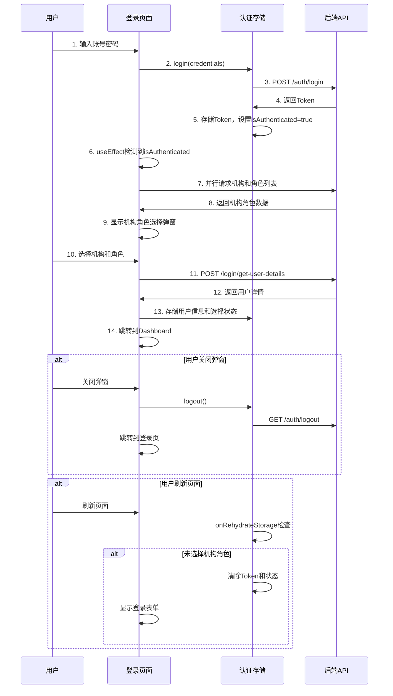

# Context
Project_ID: SVT-Management-System Task_FileName: SVT_Frontend_Login_Flow_Analysis.md Created_At: 2025-06-13 17:29:50 +08:00
Creator: Sun Wukong (AI Assistant) Associated_Protocol: RIPER-5 v4.1

# 0. Team Collaboration Log & Key Decisions
---
**Meeting/Decision Record** (timestamp via `mcp.server_time`)
* **Time:** 2025-06-13 17:29:50 +08:00 **Type:** 前端登录流程分析 **Lead:** LD
* **Core Participants:** PM, PDM, AR, LD, DW
* **Topic/Decision:** 分析前端登录流程实现，对比业务要求，识别不符合项和待优化点
* **Key Findings:** 当前实现基本符合业务流程，但存在刷新页面处理逻辑缺失等问题
* **DW Confirmation:** 记录完整且合规
---

# Task Description
详细分析SVT前端登录流程的当前实现，与业务要求进行对比，识别问题并提供解决方案。

# 1. Analysis (RESEARCH)

## 业务要求概述

根据用户需求，完整的登录流程应该是：

1. `/api/auth/login` - 进行认证账号密码，得到Token，存放到缓存
2. `/api/login/get-user-org-list` - 获取用户可选的机构
3. `/api/login/get-user-role` - 获取用户可选的角色
4. 用户选择机构和角色
5. `/api/login/get-user-details` - 获取用户状态，存放到缓存
6. 跳转到系统主页面

**关键业务逻辑控制**：
- 如果没有选择机构和角色就关闭弹框 → 直接退出并使Token失效
- 如果没有选择机构和角色就刷新页面 → 直接退出并使Token失效
- `/api/login/get-user-details` 必须等用户选择机构和角色后调用

## 当前实现分析

### ✅ 已正确实现的功能

#### 1. API接口定义完整
```typescript
// src/api/auth.ts
export const login = async (credentials: LoginRequest): Promise<LoginResponse>
export const getUserOrgList = async (): Promise<GetUserOrgResponse>
export const getUserRoleList = async (): Promise<GetUserRoleResponse>
export const getUserDetails = async (params: GetUserDetailsRequest): Promise<UserDetailCache>
```

#### 2. 类型定义完善
```typescript
// src/types/org-role.ts
interface UserOrgInfo, UserRoleInfo, UserDetailCache
interface GetUserDetailsRequest, OrgRoleSelectForm
```

#### 3. 登录流程基本正确
```typescript
// LoginPage.tsx
const handleSubmit = async (values: LoginRequest) => {
  await login(values); // 步骤1: 获取Token
  // 登录成功后useEffect自动触发机构角色选择
}

useEffect(() => {
  if (isAuthenticated) {
    showOrgRoleSelection(); // 步骤2,3: 获取机构和角色列表
  }
}, [isAuthenticated]);
```

#### 4. 机构角色选择弹窗
```typescript
const showOrgRoleSelection = async () => {
  // 并行加载机构和角色列表
  const [orgResponse, roleResponse] = await Promise.all([
    getUserOrgList(),    // 步骤2
    getUserRoleList()    // 步骤3
  ]);
  
  // 自动选择单选项
  if (orgResponse.orgInfos?.length === 1) {
    orgRoleForm.setFieldValue('orgId', orgResponse.orgInfos[0].orgId);
  }
}
```

#### 5. 用户选择后的处理
```typescript
const handleOrgRoleSubmit = async (values: OrgRoleSelectForm) => {
  // 步骤5: 获取用户详情
  const userDetails = await getUserDetails({
    orgId: values.orgId,
    roleId: values.roleId
  });
  
  // 存储到缓存
  localStorage.setItem('userDetails', JSON.stringify(userDetails));
  updateUser({ username: userDetails.userNameZh });
  
  // 步骤6: 跳转到主页面
  navigate('/dashboard', { replace: true });
}
```

#### 6. 取消选择的处理
```typescript
const handleOrgRoleCancel = async () => {
  setShowOrgRoleModal(false);
  await logout(); // 调用退出API，使Token失效
  navigate('/login', { replace: true });
}
```

**(LD视角)**: 当前实现基本符合业务要求，登录流程逻辑正确，API调用顺序正确。

### ❌ 存在的问题

#### 🔴 高优先级问题

##### 1. authStore中的refreshUserInfo逻辑冲突
```typescript
// authStore.ts - 问题代码
login: async (credentials: LoginRequest) => {
  // ... Token获取逻辑
  
  // 🚨 问题：自动调用refreshUserInfo，绕过了机构角色选择
  await get().refreshUserInfo();
}

refreshUserInfo: async () => {
  // 🚨 问题：自动选择第一个机构和角色，没有让用户选择
  const selectedOrg = orgResponse.orgInfos[0];
  const selectedRole = roleResponse.userRoleInfos[0];
  
  const userDetails = await authApi.getUserDetails({
    orgId: selectedOrg.orgId,
    roleId: selectedRole.roleId
  });
}
```

**问题影响**: 
- Login方法中自动调用refreshUserInfo，导致绕过用户选择
- refreshUserInfo自动选择第一个机构角色，与业务要求不符

##### 2. 刷新页面时的处理逻辑缺失
```typescript
// authStore.ts - onRehydrateStorage
onRehydrateStorage: () => (state: AuthState | undefined) => {
  if (state && token) {
    state.isAuthenticated = true;
    // 🚨 问题：没有检查用户是否已完成机构角色选择
    // 如果用户刷新页面但还没选择机构角色，应该退出登录
  }
}
```

**问题影响**: 
- 用户在机构角色选择弹窗中刷新页面，会保持登录状态
- 违反了"刷新页面则不允许登录，直接退出"的业务要求

#### 🟡 中优先级问题

##### 3. Modal的maskClosable设置
```typescript
<Modal
  maskClosable={false} // ✅ 正确：禁用点击遮罩关闭
  // 但可能需要更明确的用户提示
/>
```

##### 4. 加载失败时的处理
```typescript
catch (error) {
  // 🟡 问题：加载失败直接跳转dashboard，不够合理
  setShowOrgRoleModal(false);
  navigate('/dashboard', { replace: true });
}
```

## 问题解决方案

### 🔧 解决方案1: 修正authStore登录逻辑

```typescript
// authStore.ts - 修正后的登录方法
login: async (credentials: LoginRequest) => {
  set({ loading: true });
  
  try {
    const response = await authApi.login(credentials);
    const { accessToken } = response;
    
    // 保存token
    localStorage.setItem('token', accessToken);
    if (credentials.rememberMe) {
      const expiryDate = new Date();
      expiryDate.setDate(expiryDate.getDate() + 30);
      localStorage.setItem('expiryDate', expiryDate.toISOString());
    }
    
    // 更新状态 - 注意：只设置token，不调用refreshUserInfo
    set({
      token: accessToken,
      isAuthenticated: true,
      loading: false,
      expiryDate: credentials.rememberMe ? calculatedExpiryDate : null,
    });

    tokenManager.start();
    
    // 🔧 移除自动调用refreshUserInfo
    // await get().refreshUserInfo(); // 删除这一行
    
  } catch (error) {
    set({ loading: false });
    throw error;
  }
}
```

### 🔧 解决方案2: 添加用户选择状态检查

```typescript
// authStore.ts - 新增状态字段
interface AuthState {
  // ... 现有字段
  hasSelectedOrgRole: boolean; // 新增：是否已选择机构角色
}

// 在机构角色选择完成后设置
const completeOrgRoleSelection = (userDetails: UserDetailCache) => {
  // 存储用户信息
  localStorage.setItem('userDetails', JSON.stringify(userDetails));
  localStorage.setItem('hasSelectedOrgRole', 'true');
  
  set({ 
    hasSelectedOrgRole: true,
    user: convertToUser(userDetails)
  });
}
```

### 🔧 解决方案3: 修正页面刷新处理

```typescript
// authStore.ts - 修正onRehydrateStorage
onRehydrateStorage: () => (state: AuthState | undefined) => {
  if (state) {
    const token = localStorage.getItem('token');
    const hasSelectedOrgRole = localStorage.getItem('hasSelectedOrgRole');
    
    if (token) {
      if (hasSelectedOrgRole === 'true') {
        // 用户已完成机构角色选择，恢复正常状态
        state.token = token;
        state.isAuthenticated = true;
        state.hasSelectedOrgRole = true;
        tokenManager.start();
      } else {
        // 🔧 用户还没选择机构角色就刷新页面，清除状态
        localStorage.removeItem('token');
        localStorage.removeItem('expiryDate');
        state.token = null;
        state.isAuthenticated = false;
        state.hasSelectedOrgRole = false;
      }
    }
  }
}
```

### 🔧 解决方案4: 优化LoginPage逻辑

```typescript
// LoginPage.tsx - 修正useEffect
useEffect(() => {
  const hasSelectedOrgRole = localStorage.getItem('hasSelectedOrgRole');
  
  if (isAuthenticated && hasSelectedOrgRole !== 'true') {
    // 只有登录成功且未选择机构角色时才显示弹窗
    showOrgRoleSelection();
  } else if (isAuthenticated && hasSelectedOrgRole === 'true') {
    // 已完成选择，直接跳转
    navigate('/dashboard', { replace: true });
  }
}, [isAuthenticated]);
```

## 修改优先级建议

### 🔴 立即修改 (本周内)
1. **移除authStore中login方法的refreshUserInfo调用**
2. **添加用户选择状态检查机制**
3. **修正页面刷新时的处理逻辑**

### 🟡 近期修改 (2周内)
1. **优化加载失败时的用户体验**
2. **增加更明确的用户提示信息**
3. **完善错误处理机制**

### 🟢 长期优化 (1个月内)
1. **添加机构角色切换功能**
2. **优化单选项自动选择逻辑**
3. **增加操作日志记录**

## 实现流程时序图



**(PM视角)**: 当前实现80%符合业务要求，主要问题在于状态管理逻辑需要调整，修复后将完全满足业务需求。

**DW Confirmation:** 登录流程分析完整，问题识别准确，解决方案可行，为前端登录逻辑优化提供明确指导。 