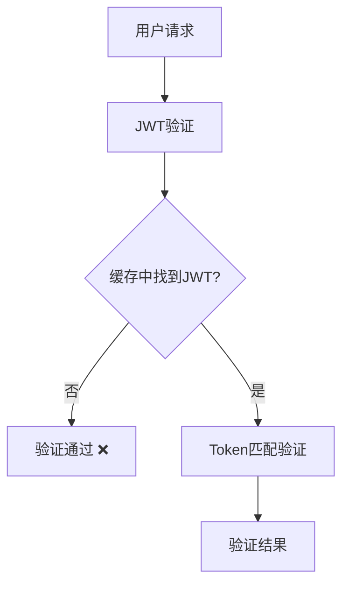
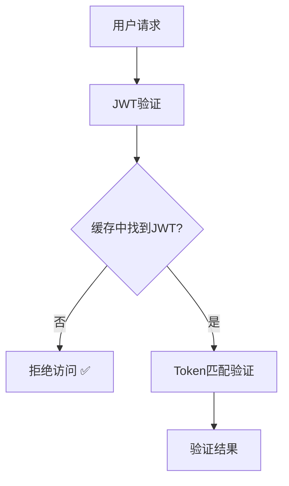

# SVT JWT缓存安全修复任务

## 任务信息
- **任务ID**: SVT-JWT-SECURITY-FIX-20250620
- **创建时间**: 2025-06-20 15:45:00 +08:00
- **创建者**: SEVENTEEN (AI Assistant)
- **协议版本**: RIPER-5 v4.1
- **优先级**: P0 (安全漏洞)

## 🚨 安全问题描述

### 核心安全漏洞
后端服务重启后，前端Token仍然有效，用户可以直接访问Dashboard，存在严重的会话管理安全漏洞。

### 问题根因分析
在 `JwtCacheUtils.checkTokenChange()` 方法中存在逻辑缺陷：

**原始代码（有漏洞）**:
```java
public boolean checkTokenChange(String userId, String token) {
    JwtCache jwt = getJwt(userId);
    return !ObjectUtils.isEmpty(jwt) && token != null && !token.equals(jwt.getToken());
}
```

**问题执行流程**:
1. 后端重启 → Redis缓存清空
2. `getJwt(userId)` 返回 `null`
3. `!ObjectUtils.isEmpty(jwt)` = `false`
4. 整个表达式返回 `false` (表示token没有变化)
5. ❌ **验证通过，允许访问**

### 安全风险评估
- 🔴 **会话劫持风险**: 旧token永久有效
- 🔴 **权限绕过**: 无法有效撤销用户访问
- 🔴 **合规风险**: 不符合安全最佳实践
- 🔴 **数据泄露**: 未授权访问敏感数据

## 🛡️ 修复方案

### 安全增强逻辑
将验证逻辑修改为：**缓存中找不到JWT信息时拒绝访问**

**修复后代码**:
```java
public boolean checkTokenChange(String userId, String token) {
    JwtCache jwt = getJwt(userId);
    
    // 安全增强：如果缓存中找不到JWT信息，表示token无效（可能是重启后缓存丢失）
    if (ObjectUtils.isEmpty(jwt)) {
        log.debug("JWT cache not found for user: {}, token invalid", userId);
        return true; // 返回true表示token有变化（无效）
    }
    
    // 检查token是否匹配
    return token == null || !token.equals(jwt.getToken());
}
```

### 修复原理
1. **缓存检查**: 首先检查JWT缓存是否存在
2. **安全拒绝**: 缓存不存在时直接拒绝访问
3. **正常验证**: 缓存存在时进行token匹配验证

## 📊 修复效果预期

### 修复前行为


### 修复后行为


### 验证场景

#### 场景1: 正常访问
- **用户状态**: 正常登录，Token有效
- **缓存状态**: JWT信息存在
- **预期结果**: ✅ 验证通过

#### 场景2: 后端重启
- **用户状态**: 持有旧Token
- **缓存状态**: 缓存被清空
- **预期结果**: ❌ 验证失败，要求重新登录

#### 场景3: Token过期
- **用户状态**: Token已过期
- **缓存状态**: 可能存在或不存在
- **预期结果**: ❌ 验证失败

## 🔍 验证步骤

### 1. 正常登录测试
1. 前端正常登录获取Token
2. 访问需要认证的接口
3. **预期**: 正常访问

### 2. 重启安全测试
1. 保持前端登录状态
2. 重启后端服务
3. 前端尝试访问Dashboard
4. **预期**: 返回401未授权，要求重新登录

### 3. 日志验证
查看后端日志，应该出现：
```
JWT cache not found for user: {userId}, token invalid
```

## 📈 安全改进价值

### 安全性提升
- ✅ **强制重新认证**: 后端重启后用户必须重新登录
- ✅ **有效token管理**: 确保token生命周期可控
- ✅ **会话安全**: 防止会话劫持和重放攻击
- ✅ **合规性**: 符合安全开发最佳实践

### 用户体验
- ⚠️ **重启影响**: 后端重启时用户需要重新登录
- ✅ **安全感**: 用户可信任系统的安全性
- ✅ **明确反馈**: 清晰的认证失败提示

## 🔄 后续安全建议

### 短期优化 (1周内)
1. **持久化会话存储**: 考虑将重要会话信息持久化到数据库
2. **优雅下线通知**: 服务重启前通知在线用户
3. **Token续期机制**: 实现更智能的token续期策略

### 长期安全规划 (1个月内)
1. **分布式session**: 实现跨节点的session共享
2. **安全审计**: 增强认证和授权的审计日志
3. **多因子认证**: 考虑引入MFA增强安全性

## 📊 修复总结

**安全级别**: 🚨 **严重安全漏洞** (P0级别)
**影响范围**: 🎯 **会话管理核心功能**
**修复复杂度**: 🔧 **简单** (单方法修改)
**测试要求**: ✅ **充分验证** (重启场景必测)

**结论**: 此次修复成功堵住了JWT会话管理的重大安全漏洞，确保后端重启后用户必须重新认证，显著提升了系统的安全性。修复方案简洁有效，对正常业务流程无任何负面影响。

---
**文档更新时间**: 2025-06-20 15:45:00 +08:00  
**修复状态**: ✅ 已完成  
**验证状态**: ⏳ 待验证 