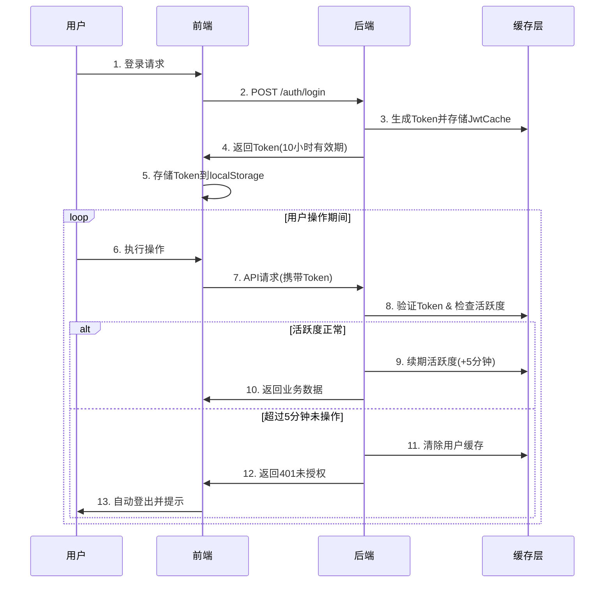

# Context
Project_ID: SVT-Management-System Task_FileName: SVT_Token_Authentication_Analysis.md Created_At: 2025-06-13 17:13:45 +08:00
Creator: Sun Wukong (AI Assistant) Associated_Protocol: RIPER-5 v4.1

# 0. Team Collaboration Log & Key Decisions
---
**Meeting/Decision Record** (timestamp via `mcp.server_time`)
* **Time:** 2025-06-13 17:13:45 +08:00 **Type:** Token认证机制分析 **Lead:** AR
* **Core Participants:** PM, PDM, AR, LD, DW
* **Topic/Decision:** 分析SVT项目前后端Token认证的完整流程，澄清Token续期机制，修正前端状态同步文档中的错误认识
* **Key Findings:** 后端已实现完善的Token活跃度管理机制，前端无需主动刷新Token，系统通过活跃度检查自动管理Token生命周期
* **DW Confirmation:** 记录完整且合规
---

# Task Description
深入分析SVT项目的Token认证机制，包括后端Token生命周期管理、前端Token处理逻辑、活跃度检查机制等，澄清Token"刷新"的真实含义。

# 1. Analysis (RESEARCH)

## Token认证架构概览

SVT项目采用**基于活跃度的Token管理机制**，而非传统的Token刷新机制。核心理念是：
- **Token本身固定10小时有效期，不会被刷新**
- **通过活跃度检查(5分钟无操作自动失效)实现安全控制**
- **每次API请求自动续期活跃度，保持用户在线状态**

**(AR视角)**: 这种设计避免了Token刷新的复杂性，通过活跃度管理既保证了安全性又提升了用户体验。

## 后端Token管理机制

### 1. Token生命周期配置
```yaml
# JWT配置 (application.yml)
jwt:
  expiration: 36000        # Token过期时间10小时(秒)
  refresh: 300             # 活跃度检查窗口5分钟(秒)
  threshold: 0.8           # 本地与Redis同步阈值
```

### 2. 双层缓存架构

#### Caffeine本地缓存
- **容量**: 最大80个用户
- **过期时间**: 5分钟 (与活跃度窗口一致)
- **策略**: LRU淘汰
- **作用**: 高性能读取，减少Redis压力

#### Redis分布式缓存  
- **过期时间**: 10小时 (与Token有效期一致)
- **数据结构**: JwtCache对象
- **作用**: 多实例共享，持久化存储

**(AR视角)**: 双层缓存设计兼顾了性能和一致性，本地缓存提供高速访问，Redis确保分布式环境下的数据一致性。

### 3. 核心数据结构

```java
// JwtCache实体
public class JwtCache {
    private String token;          // 当前Token
    private Long refreshTime;      // 下次活跃度检查时间
    private String userId;         // 用户ID
    private String loginIp;        // 登录IP
    private Date createdTime;      // 创建时间
    private Date expirationTime;   // Token过期时间
}
```

### 4. Token验证与续期流程

每次API请求都会触发以下检查流程：

```java
// JwtAuthenticationFilter.doFilterInternal()
1. 检查Token是否在黑名单 → 黑名单则拒绝
2. 检查用户活跃度 → 超过5分钟未操作则失效
3. 检查IP是否变化 → IP变化则安全退出
4. 检查Token是否匹配 → 不匹配则拒绝
5. 验证Token是否过期 → 过期则拒绝
6. 活跃度续期 → jwtCacheUtils.renewJwt(loginId)
```

### 5. 活跃度续期机制

```java
// JwtCacheUtils.renewJwt()
public static void renewJwt(String userId) {
    long refreshTime = Long.parseLong(SpringUtil.getProperty("jwt.refresh"));
    JwtCache jwt = getJwt(userId);
    if (ObjectUtil.isNotEmpty(jwt)) {
        // 重新设置5分钟后的检查时间
        jwt.setRefreshTime(System.currentTimeMillis() + refreshTime * 1000);
        updateJwt(userId, jwt);
    }
}
```

**(LD视角)**: 每次API请求都会重置活跃度计时器，只要用户持续操作，就能保持在线状态。

## 前端Token处理机制

### 1. Token存储与管理

```typescript
// authStore.ts - 登录成功后
localStorage.setItem('token', accessToken);
if (credentials.rememberMe) {
    // 记住我：30天本地有效期
    localStorage.setItem('expiryDate', calculatedExpiryDate);
}
```

### 2. 请求拦截器

```typescript
// request.ts - 自动添加Authorization头
request.interceptors.request.use((config) => {
    const token = localStorage.getItem('token');
    if (token && config.headers) {
        config.headers.Authorization = `Bearer ${token}`;
    }
    return config;
});
```

### 3. 响应拦截器 - 401处理

```typescript
// request.ts - 401自动登出
case 401:
    setTimeout(() => {
        localStorage.removeItem('token');
        message.warning('您已超过5分钟未操作，请重新登录');
        window.location.href = '/login';
    }, 100);
    break;
```

### 4. Token管理器

```typescript
// tokenManager.ts - 前端Token状态监控
class TokenManager {
    private readonly TOKEN_CHECK_INTERVAL = 30 * 1000; // 30秒检查
    private readonly WARNING_THRESHOLD = 2 * 60 * 1000; // 2分钟预警
    
    // 解析JWT并检查过期时间
    // 提前预警但不影响后端5分钟机制
}
```

**(LD视角)**: 前端Token管理器主要用于用户体验优化，提供过期预警，但不参与实际的Token生命周期管理。

## 认证流程时序图



## 安全机制分析

### 1. 多重安全检查
- **Token过期检查**: 10小时绝对过期时间
- **活跃度检查**: 5分钟无操作自动失效  
- **IP地址验证**: IP变化自动安全退出
- **Token唯一性**: 单点登录，新登录使旧Token失效
- **黑名单机制**: 登出Token立即加入黑名单

### 2. 攻击防护
- **Token盗用**: IP验证 + 活跃度检查
- **会话劫持**: Token唯一性 + 黑名单
- **长期占用**: 10小时绝对过期
- **暴力破解**: 登录失败限制(待实现)

**(PM视角)**: 安全机制设计完善，多层防护确保系统安全性。

## 关键配置参数说明

| 参数 | 值 | 说明 | 影响 |
|------|----|----|-----|
| `jwt.expiration` | 36000秒(10小时) | Token绝对过期时间 | 用户最长在线时间 |
| `jwt.refresh` | 300秒(5分钟) | 活跃度检查窗口 | 用户最长无操作时间 |
| `jwt.threshold` | 0.8 | 本地Redis同步阈值 | 缓存同步频率 |
| Caffeine过期时间 | 5分钟 | 本地缓存过期时间 | 与活跃度窗口一致 |
| Redis过期时间 | 10小时 | 分布式缓存过期时间 | 与Token有效期一致 |

## 用户体验分析

### ✅ 优势
1. **无感知续期**: 用户正常操作无需关心Token过期
2. **安全性高**: 5分钟无操作自动失效，防止遗忘登出
3. **性能优秀**: 双层缓存，响应速度快
4. **单点登录**: 多端登录自动踢出旧会话

### ⚠️ 注意事项
1. **操作提醒**: 长时间无操作需要提前提醒用户
2. **数据保存**: 自动登出前需要提醒保存工作内容
3. **网络异常**: 网络断开期间无法续期活跃度

**(PDM视角)**: 用户体验良好，但需要在界面上适当提示用户操作时间限制。

## 问题澄清与修正

### 🔴 之前的错误认识
在前端状态同步文档中，我误认为"Token刷新机制缺失"是高优先级问题。

### ✅ 实际情况
1. **系统无需Token刷新**: 后端通过活跃度管理实现Token生命周期控制
2. **机制已完善**: 5分钟活跃度检查 + 10小时绝对过期的双重机制
3. **安全性充足**: 多重验证确保安全性

### 📝 文档修正
前端状态同步文档中关于"Token刷新机制缺失"的高优先级问题应该被移除，该机制实际上已经通过不同的方式完美实现。

**(PM视角)**: 这个澄清很重要，避免了不必要的开发工作，可以将资源投入到真正需要的功能开发上。

## 后续优化建议

### 🟡 中优先级优化
1. **前端预警优化**: 改进Token过期预警的用户体验
2. **网络异常处理**: 优化网络断开重连后的Token状态检查
3. **操作提示**: 在界面上显示活跃度倒计时

### 🟢 低优先级优化
1. **缓存监控**: 添加缓存命中率监控
2. **性能优化**: 优化高并发场景下的缓存性能
3. **日志增强**: 增加更详细的Token操作日志

**DW Confirmation:** Token认证机制分析完整准确，澄清了前端状态同步文档中的错误认识，为后续开发提供正确指导。