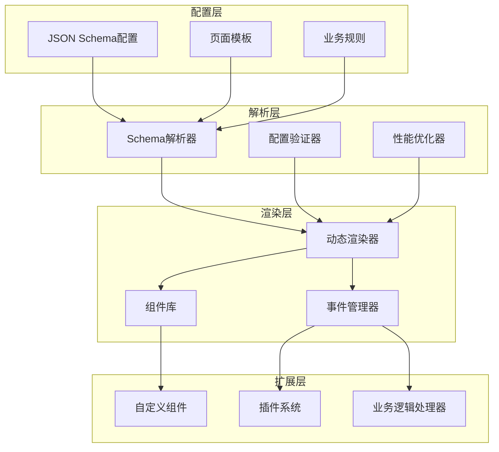
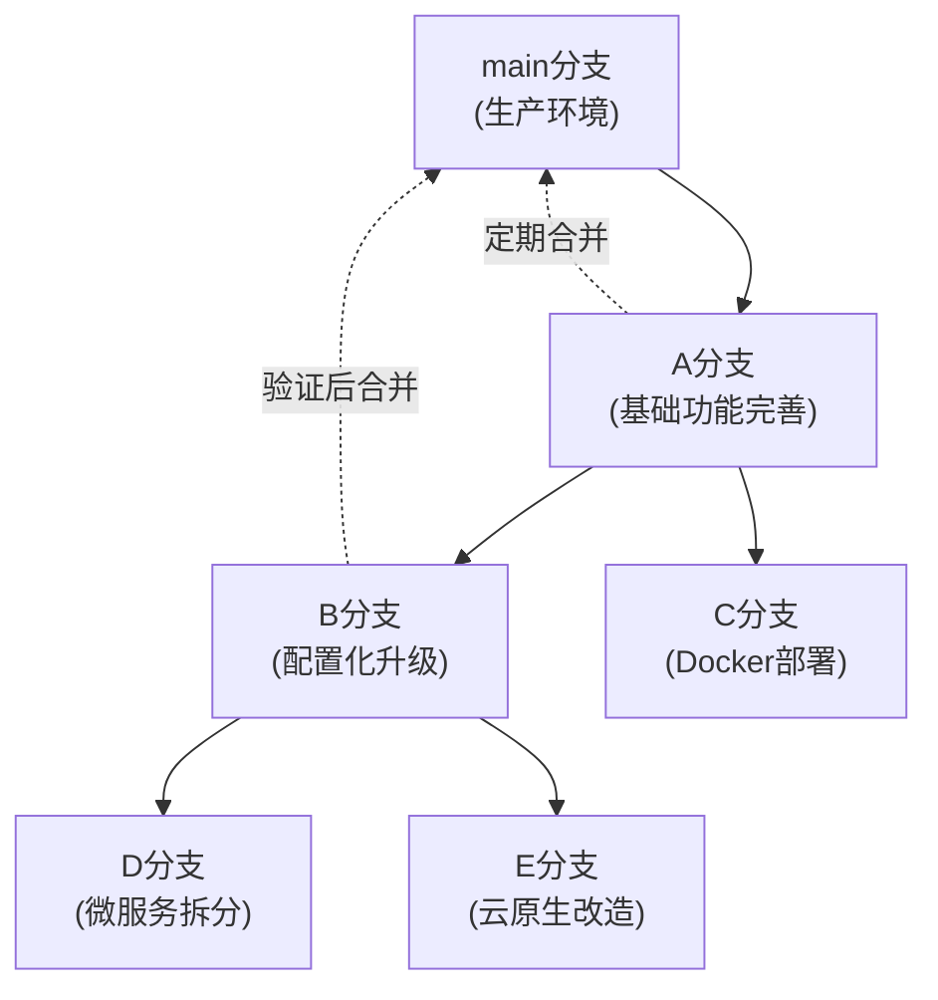

# SVT 前端动态组件系统设计方案

**项目**: SVT-Web 前端动态组件系统
**版本**: v1.0
**创建时间**: 2025-06-21 21:27:30 +08:00
**文档类型**: 技术设计方案
**适用领域**: 高安全性企业内部系统

## 📋 文档说明

本文档详细阐述SVT前端动态组件系统的完整设计方案，旨在通过配置驱动的方式简化前端页面开发，提高开发效率和代码复用性。

---

## 🎯 项目目标

### 核心目标
1. **简化开发**：通过配置文件快速生成页面，减少重复代码
2. **提高效率**：将页面开发从"编程题"变成"填空题"
3. **统一规范**：标准化页面结构和交互模式
4. **易于维护**：配置化管理，需求变更只需修改配置文件

### 业务价值
- 开发效率提升60%以上
- 代码复用率提升80%
- 维护成本降低50%
- 新人上手时间缩短70%

---

## 🏗️ 技术架构

### 整体架构设计



### 核心设计原则

#### 1. 80-15-5原则
- **80%场景**：纯配置解决（标准CRUD页面）
- **15%场景**：配置+扩展解决（复杂业务逻辑）
- **5%场景**：完全自定义解决（特殊UI需求）

#### 2. 渐进式增强
```typescript
// Level 1: 基础配置
interface BasicConfig {
  pageType: 'list' | 'info';
  title: string;
  api: ApiConfig;
  fields: FieldConfig[];
}

// Level 2: 增强配置
interface EnhancedConfig extends BasicConfig {
  events?: EventConfig[];
  validation?: ValidationConfig;
  dependencies?: DependencyConfig;
}

// Level 3: 高级配置
interface AdvancedConfig extends EnhancedConfig {
  customComponents?: CustomComponentConfig;
  businessLogic?: BusinessLogicConfig;
  extensions?: ExtensionConfig;
}
```

---

## 🔧 核心组件设计

### 1. 页面组成结构

```typescript
interface PageStructure {
  // 检索框组件
  searchForm?: SearchFormConfig;
  
  // 工具栏按钮
  toolbar?: ToolbarConfig;
  
  // 数据表格
  table?: TableConfig;
  
  // 详情表单
  infoForm?: InfoFormConfig;
  
  // 自定义区域
  customAreas?: CustomAreaConfig[];
}
```

### 2. 智能码值管理

```typescript
// 码值管理器
class CodeValueManager {
  private cache = new Map<string, any>();
  private dependencies = new Map<string, string[]>();
  
  // 获取码值选项
  async getCodeOptions(codeType: string, context?: any): Promise<Option[]> {
    const cacheKey = this.generateCacheKey(codeType, context);
    
    if (this.cache.has(cacheKey)) {
      return this.cache.get(cacheKey);
    }
    
    const options = await this.fetchCodeValues(codeType, context);
    this.cache.set(cacheKey, options);
    return options;
  }
  
  // 处理依赖更新
  invalidateDependencies(changedField: string): void {
    const dependentFields = this.dependencies.get(changedField) || [];
    dependentFields.forEach(field => {
      this.clearCache(field);
    });
  }
}
```

### 3. 事件驱动联动机制

```typescript
// 全局事件管理器
class PageEventManager {
  private eventBus = new EventEmitter();
  private actionExecutor = new ActionExecutor();
  
  // 处理配置事件
  handleConfigEvent(eventConfig: EventConfig, triggerData: any): void {
    eventConfig.actions.forEach(action => {
      this.actionExecutor.execute(action, triggerData);
    });
  }
  
  // 支持的动作类型
  private supportedActions = [
    'apiCall',        // API调用
    'updateComponent', // 更新组件
    'showModal',      // 显示弹窗
    'hideComponent',  // 隐藏组件
    'customLogic'     // 自定义逻辑
  ];
}
```

---

## 📄 配置规范示例

### 完整页面配置
```json
{
  "pageType": "list",
  "title": "用户管理",
  
  "globalData": {
    "selectedUser": null,
    "userRiskProfile": null
  },
  
  "events": [
    {
      "name": "userSelected",
      "trigger": {
        "component": "searchForm",
        "field": "userId",
        "event": "onChange"
      },
      "actions": [
        {
          "type": "apiCall",
          "api": "/api/users/{userId}/risk-profile",
          "target": "globalData.userRiskProfile"
        },
        {
          "type": "updateComponent",
          "component": "userTable",
          "action": "refresh"
        }
      ]
    }
  ],
  
  "searchForm": {
    "layout": "inline",
    "fields": [
      {
        "key": "userName",
        "label": "用户名",
        "type": "input",
        "placeholder": "请输入用户名"
      },
      {
        "key": "status",
        "label": "状态",
        "type": "select",
        "codeType": "USER_STATUS"
      }
    ]
  },
  
  "toolbar": {
    "buttons": [
      {
        "key": "add",
        "label": "新增",
        "type": "primary",
        "action": "openModal",
        "target": "userInfoModal"
      }
    ]
  },
  
  "table": {
    "api": "/api/users",
    "selection": true,
    "columns": [
      {
        "key": "userName",
        "title": "用户名",
        "width": 120
      },
      {
        "key": "status",
        "title": "状态",
        "width": 80,
        "render": "codeValue",
        "codeType": "USER_STATUS"
      }
    ]
  }
}
```

---

## 🚀 实施计划

### 总体策略：渐进式开发
**A分支（基础功能）→ B分支（配置化升级）→ 其他环境分支**

### 阶段一：A分支 - 基础功能完善（6-8周）

#### 1. Demo页面开发（2周）
- [ ] 菜单管理页面 (List + Info)
- [ ] 用户管理页面 (List + Info)
- [ ] 角色管理页面 (List + Info)
- [ ] 权限管理页面 (List + Info)
- [ ] 使用传统组件方式，不引入配置化复杂度

#### 2. API体系完善（2周）
- [ ] 菜单管理API (CRUD + 树形结构)
- [ ] 用户管理API (CRUD + 状态管理)
- [ ] 角色管理API (CRUD + 权限分配)
- [ ] 权限管理API (CRUD + 层级管理)

#### 3. 权限控制系统（2-3周）
- [ ] 页面级权限控制
- [ ] 按钮级权限控制（元素显示/隐藏）
- [ ] API级权限控制（请求拦截）
- [ ] 权限控制组件库
- [ ] 权限管理界面

#### 4. 测试和优化（1周）
- [ ] 功能测试
- [ ] 性能优化
- [ ] 代码重构
- [ ] 文档完善

### 阶段二：B分支 - 配置化升级（4-6周）

#### 1. 配置化架构搭建（2周）
- [ ] 基于A分支创建B分支
- [ ] Schema解析器实现
- [ ] 动态渲染器开发
- [ ] 配置验证器

#### 2. 页面配置化改造（2周）
- [ ] 提取A分支页面配置Schema
- [ ] 改造为配置驱动模式
- [ ] 保持API和权限系统兼容
- [ ] 功能完全对等验证

#### 3. 配置化工具开发（1-2周）
- [ ] Schema生成器
- [ ] 配置管理界面
- [ ] 页面预览工具
- [ ] 配置迁移工具

### 阶段三：其他环境分支（并行开发）

#### 基于A分支或B分支创建
- [ ] C分支：Docker容器化部署
- [ ] D分支：微服务架构拆分
- [ ] E分支：云原生改造
- [ ] 根据具体需求选择基础分支

---

## 🔄 分支管理策略

### 分支关系图


### 分支策略说明

#### A分支：基础功能分支
- **目标**：完善核心业务功能和权限体系
- **特点**：使用传统开发方式，稳定可靠
- **合并策略**：功能稳定后定期合并到main分支

#### B分支：配置化升级分支
- **目标**：在A分支基础上实现配置化升级
- **特点**：保持功能完全兼容，提升开发效率
- **合并策略**：充分验证后合并到main分支

#### 其他环境分支
- **基础选择**：根据需求选择基于A分支或B分支
- **并行开发**：可以在A分支稳定后并行进行
- **合并策略**：根据具体情况决定合并时机

### 开发流程

#### 1. 当前阶段（A分支开发）
```bash
# 在A分支进行基础功能开发
git checkout A-branch
# 开发菜单管理、用户管理等核心功能
# 完善权限控制系统
```

#### 2. 配置化阶段（B分支开发）
```bash
# 基于A分支创建B分支
git checkout A-branch
git checkout -b B-config-upgrade
# 进行配置化改造
```

#### 3. 环境改造阶段（其他分支）
```bash
# 根据需要选择基础分支
git checkout A-branch  # 或 B-branch
git checkout -b C-docker-deployment
# 进行环境特定改造
```

### 质量保证

#### 代码审查
- A分支：重点关注功能完整性和权限安全性
- B分支：重点关注配置化架构和兼容性
- 其他分支：重点关注环境适配和部署稳定性

#### 测试策略
- **单元测试**：每个分支都要保证单元测试覆盖率
- **集成测试**：A分支重点测试业务流程
- **兼容性测试**：B分支重点测试与A分支的功能对等性
- **环境测试**：其他分支重点测试部署和运行环境

---

## ⚠️ 风险评估

### 技术风险
1. **配置复杂度**：复杂业务场景配置文件可能过于复杂
   - **缓解措施**：提供配置生成工具和模板
2. **性能问题**：动态渲染可能影响性能
   - **缓解措施**：实现智能缓存和懒加载
3. **调试困难**：配置错误时排查困难
   - **缓解措施**：提供详细的错误信息和调试工具

### 业务风险
1. **学习成本**：开发者需要学习新的配置规范
   - **缓解措施**：提供完整的文档和培训
2. **扩展限制**：某些特殊需求可能无法配置化
   - **缓解措施**：保留完全自定义的能力

---

## 📈 预期收益

### 开发效率提升
- 标准页面开发时间从2-3天缩短到0.5-1天
- 代码复用率从30%提升到80%
- Bug率降低40%（标准化减少错误）

### 维护成本降低
- 需求变更响应时间缩短60%
- 代码维护工作量减少50%
- 新人培训时间缩短70%

---

## 🔍 技术实现细节

### 1. 核心Hook设计

```typescript
// 统一数据管理Hook
export const useSchemaPage = <T = any>(config: {
  schemaPath: string;
  id?: string;
  mode?: 'view' | 'edit' | 'create';
}) => {
  const [data, setData] = useState<T>();
  const [loading, setLoading] = useState(false);
  const [schema, setSchema] = useState<PageSchema>();

  // 自动加载Schema配置
  useEffect(() => {
    loadSchema(config.schemaPath).then(setSchema);
  }, [config.schemaPath]);

  // 自动处理数据加载
  useEffect(() => {
    if (config.id && schema?.api?.detail) {
      setLoading(true);
      loadData(schema.api.detail, config.id)
        .then(setData)
        .finally(() => setLoading(false));
    }
  }, [config.id, schema]);

  // 保存数据
  const save = useCallback(async (formData: T) => {
    const api = config.id ? schema?.api?.update : schema?.api?.create;
    if (api) {
      return await saveData(api, formData, config.id);
    }
  }, [config.id, schema]);

  return { data, loading, save, schema };
};
```

### 2. 动态渲染器实现

```typescript
// 字段渲染器
export const FieldRenderer: React.FC<FieldRendererProps> = ({
  field,
  value,
  onChange,
  formData,
  pageContext
}) => {
  const { codeValueManager, eventManager } = pageContext;

  // 处理码值字段
  const [options, setOptions] = useState<Option[]>([]);

  useEffect(() => {
    if (field.codeType) {
      const dependencies = field.dependencies?.reduce((acc, dep) => {
        acc[dep] = formData[dep];
        return acc;
      }, {} as Record<string, any>);

      codeValueManager.getCodeOptions(field.codeType, dependencies)
        .then(setOptions);
    }
  }, [field.codeType, field.dependencies, formData]);

  // 处理字段变化
  const handleChange = useCallback((newValue: any) => {
    onChange(newValue);

    // 触发事件
    eventManager.emit('fieldChange', {
      field: field.key,
      value: newValue,
      formData: { ...formData, [field.key]: newValue }
    });
  }, [onChange, field.key, formData, eventManager]);

  // 根据字段类型渲染
  switch (field.type) {
    case 'input':
      return <Input {...field} value={value} onChange={handleChange} />;
    case 'select':
      return (
        <Select
          {...field}
          value={value}
          onChange={handleChange}
          options={options}
        />
      );
    case 'date':
      return <DatePicker {...field} value={value} onChange={handleChange} />;
    default:
      return null;
  }
};
```

### 3. 复杂联动处理

```typescript
// 动作执行器
export class ActionExecutor {
  constructor(
    private pageContext: PageContext,
    private componentRegistry: ComponentRegistry
  ) {}

  async execute(action: ActionConfig, context: any): Promise<any> {
    switch (action.type) {
      case 'apiCall':
        return this.executeApiCall(action, context);
      case 'updateComponent':
        return this.updateComponent(action, context);
      case 'conditionalAction':
        return this.executeConditionalAction(action, context);
      case 'customLogic':
        return this.executeCustomLogic(action, context);
    }
  }

  private async executeApiCall(action: ApiCallAction, context: any) {
    const url = this.interpolateUrl(action.api, context);
    const result = await api.request({
      url,
      method: action.method || 'GET',
      data: action.data
    });

    // 将结果存储到指定位置
    if (action.target) {
      this.setNestedValue(this.pageContext.globalData, action.target, result);
    }

    return result;
  }

  private updateComponent(action: UpdateComponentAction, context: any) {
    const component = this.componentRegistry.get(action.component);
    if (component) {
      component.update(action.action, action.params);
    }
  }

  private async executeConditionalAction(action: ConditionalAction, context: any) {
    const condition = this.evaluateCondition(action.condition, context);
    if (condition) {
      for (const subAction of action.actions) {
        await this.execute(subAction, context);
      }
    }
  }
}
```

## 🛠️ 开发工具支持

### 1. Schema验证器
```typescript
// 配置文件验证
export const validateSchema = (schema: any): ValidationResult => {
  const errors: string[] = [];

  // 验证必填字段
  if (!schema.pageType) {
    errors.push('pageType is required');
  }

  // 验证字段配置
  if (schema.fields) {
    schema.fields.forEach((field: any, index: number) => {
      if (!field.key) {
        errors.push(`Field at index ${index} missing key`);
      }
      if (!field.type) {
        errors.push(`Field ${field.key} missing type`);
      }
    });
  }

  return {
    valid: errors.length === 0,
    errors
  };
};
```

### 2. 配置生成器
```typescript
// 可视化配置工具
export class SchemaBuilder {
  private schema: PageSchema = {
    pageType: 'list',
    title: '',
    fields: []
  };

  addField(fieldConfig: FieldConfig): this {
    this.schema.fields.push(fieldConfig);
    return this;
  }

  addEvent(eventConfig: EventConfig): this {
    if (!this.schema.events) {
      this.schema.events = [];
    }
    this.schema.events.push(eventConfig);
    return this;
  }

  export(): PageSchema {
    return { ...this.schema };
  }

  preview(): React.ComponentType {
    return () => <DynamicPage schema={this.schema} />;
  }
}
```

---

**文档状态**: 详细设计完成
**下一步**: 开始实施阶段一的基础框架开发
**负责人**: 前端开发团队
**预计完成时间**: 2025-08-21

---

## 📝 更新日志

### v1.1 (2025-06-21 21:27:30 +08:00)
- 调整实施策略为渐进式开发
- 重新规划为A分支（基础功能）→ B分支（配置化升级）
- 添加详细的分支管理策略
- 完善权限控制系统设计
- 优化开发流程和质量保证机制

### v1.0 (2025-06-21 21:27:30 +08:00)
- 初始版本创建
- 完成整体架构设计
- 定义核心组件和配置规范
- 制定实施计划和风险评估
