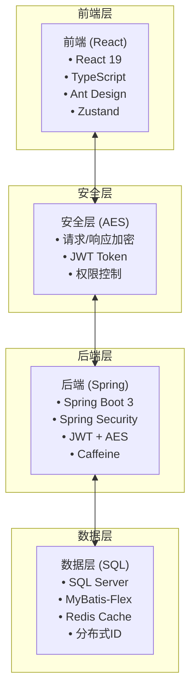
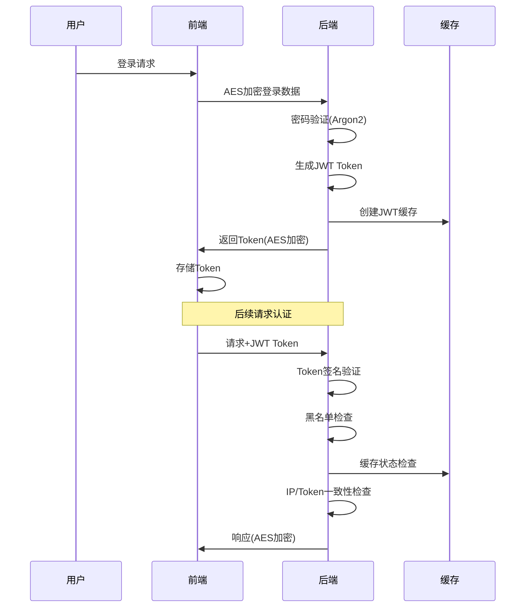
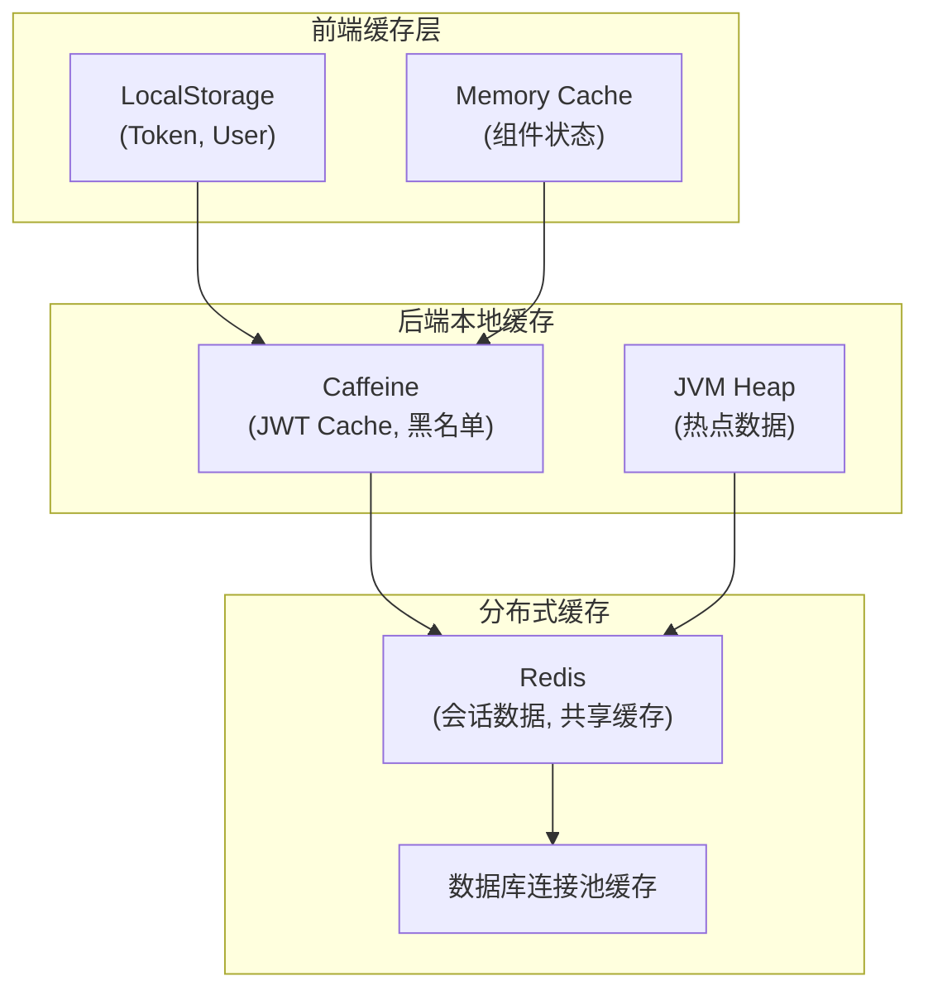
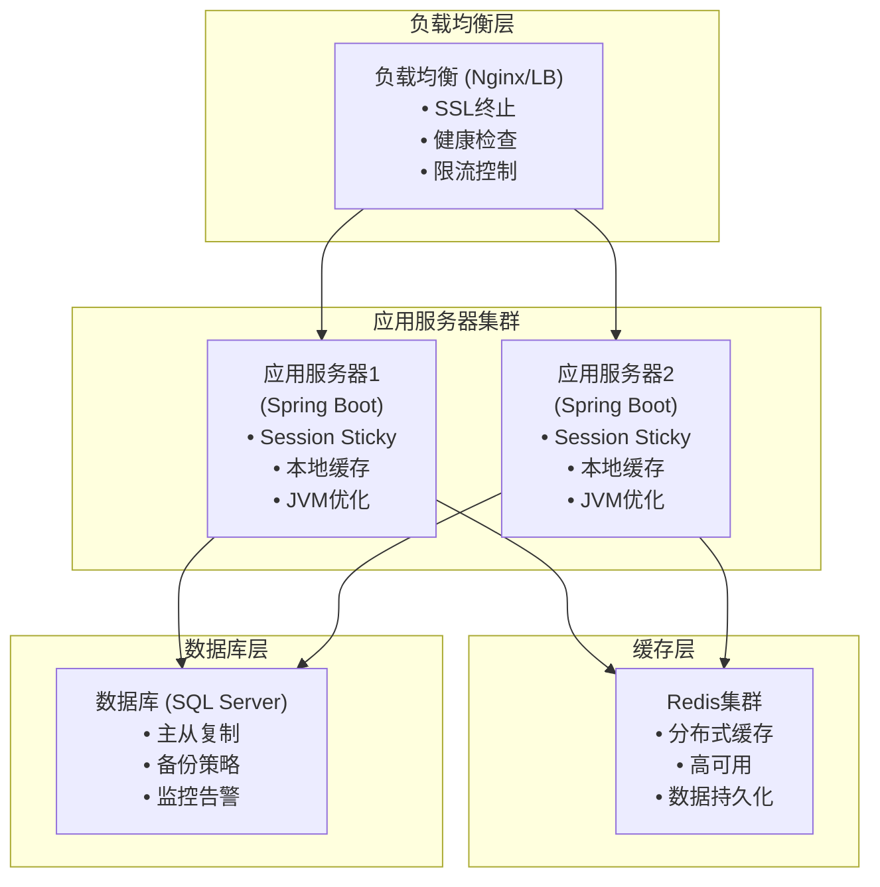

# SVT 核心架构设计文档

**项目**: SVT管理系统  
**版本**: v2.0  
**更新时间**: 2025-06-20 18:30:00 +08:00  
**文档类型**: 架构设计  
**状态**: 当前生产版本

## 🏗️ 整体架构概览

### 技术架构图



## 🔐 安全架构设计

### 多层安全防护
1. **传输层安全**: AES-256-CBC 端到端加密
2. **认证层安全**: JWT Token + 黑名单机制
3. **授权层安全**: RBAC权限控制
4. **数据层安全**: Argon2密码哈希 + 数据脱敏

### JWT认证流程


## 🏎️ 缓存架构设计

### 多级缓存策略



### 缓存一致性策略
- **JWT缓存**: 本地缓存 + Session Sticky负载均衡
- **用户数据**: Redis分布式缓存 + 本地热点缓存
- **权限数据**: 分层缓存，权限变更时主动失效

## 📡 API设计规范

### RESTful API 设计
```
基础路径: /api/v1
认证路径: /auth/*
业务路径: /system/*
管理路径: /admin/*
```

### 请求/响应规范
```typescript
// 统一响应格式
interface ApiResponse<T> {
  code: number;        // 状态码
  message: string;     // 消息
  data: T;            // 数据
  timestamp: string;   // 时间戳
  traceId: string;    // 链路追踪ID
}

// AES加密标识
Headers: {
  'X-Encrypted': 'true',          // 响应加密标识
  'Content-Type': 'application/json'
}
```

## 🗄️ 数据库设计

### 核心实体关系
```sql
用户表 (UserInfo)
├── 用户机构关系 (UserOrg)
├── 用户角色关系 (UserRole)
└── 审计日志 (AuditLog)

权限体系
├── 机构表 (OrgInfo)
├── 角色表 (RoleInfo) 
├── 权限表 (PermissionInfo)
├── 角色菜单关系 (RoleMenu)
└── 角色权限关系 (RolePermission)

系统表
├── 菜单表 (MenuInfo)
├── 代码库表 (CodeLibrary)
└── 分布式ID表 (DbKey)
```

### 关键索引策略
```sql
-- 用户查询优化
INDEX idx_user_username ON UserInfo(username);
INDEX idx_user_org ON UserOrg(user_id, org_id);

-- 权限查询优化  
INDEX idx_role_menu ON RoleMenu(role_id);
INDEX idx_role_permission ON RolePermission(role_id);

-- 审计日志优化
INDEX idx_audit_user_time ON AuditLog(user_id, operation_time);
```

## 🚀 性能优化策略

### 后端性能优化
1. **数据库优化**
   - 索引优化，查询性能提升60%+
   - 分页查询，大数据集处理
   - 连接池优化，并发支持

2. **缓存优化**
   - 缓存命中率 > 95%
   - 缓存更新策略优化
   - 内存使用控制

3. **异步处理**
   - 审计日志异步写入
   - 文件上传异步处理
   - 邮件发送异步队列

### 前端性能优化
1. **代码分割**
   - 路由级别懒加载
   - 组件级别动态导入
   - 第三方库按需加载

2. **资源优化**
   - 图片压缩和懒加载
   - CSS/JS文件压缩
   - CDN资源加速

3. **用户体验**
   - Loading状态管理
   - 错误边界保护
   - 响应式设计

## 🔧 部署架构

### 生产环境架构



### 容器化部署
```dockerfile
# Spring Boot应用
FROM openjdk:21-jdk-slim
COPY target/svt-server.jar app.jar
EXPOSE 8080
ENTRYPOINT ["java", "-jar", "/app.jar"]

# React前端
FROM nginx:alpine  
COPY dist/ /usr/share/nginx/html/
COPY nginx.conf /etc/nginx/nginx.conf
EXPOSE 80
```

## 📊 监控和运维

### 关键监控指标
1. **应用性能**
   - 响应时间 < 200ms (P95)
   - 吞吐量 > 1000 TPS
   - 错误率 < 0.1%

2. **系统资源**
   - CPU使用率 < 70%
   - 内存使用率 < 80% 
   - 磁盘使用率 < 85%

3. **业务指标**
   - 用户登录成功率 > 99.5%
   - JWT验证成功率 > 99.9%
   - 缓存命中率 > 95%

### 告警策略
```yaml
告警级别:
  - 紧急: 系统不可用，影响业务
  - 严重: 性能严重下降，用户体验受影响  
  - 警告: 指标异常，需要关注
  - 信息: 状态变更通知

通知方式:
  - 短信: 紧急、严重级别
  - 邮件: 所有级别
  - 企业微信: 严重及以上级别
```

## 🔮 架构演进规划

### 短期目标 (1-3个月)
1. **完善监控体系** - APM监控，链路追踪
2. **提升测试覆盖率** - 单元测试80%+，E2E测试
3. **性能调优** - 查询优化，缓存策略优化

### 中期目标 (3-6个月)  
1. **微服务架构** - 服务拆分，API网关
2. **容器化部署** - Docker + K8s，CI/CD流水线
3. **多环境治理** - 开发/测试/生产环境标准化

### 长期目标 (6-12个月)
1. **云原生架构** - Service Mesh，云基础设施
2. **大数据分析** - 用户行为分析，业务智能
3. **AI集成** - 智能运维，自动化决策

---

## 📋 技术债务清单

### 高优先级 (立即处理)
- [ ] 补充单元测试覆盖率至80%+
- [ ] 完善API文档 (Swagger/OpenAPI)
- [ ] 实施APM监控和告警

### 中优先级 (1个月内)
- [ ] 前端错误边界实现
- [ ] 数据库查询性能优化
- [ ] 日志结构化和分析

### 低优先级 (3个月内)
- [ ] 代码重构和优化
- [ ] 第三方库版本升级
- [ ] 文档翻译和国际化

---

## 📚 相关文档

### 核心文档
- [SVT-Server 后端操作手册](../SVT-Server/README.md)
- [SVT-Web 前端开发指南](../SVT-Web/README.md)
- [API接口文档](./API-Documentation.md)
- [部署运维手册](./Deployment-Guide.md)

### 设计文档 (2025-06-21新增)
- [架构设计决策记录 (ADR)](./SVT_架构设计决策记录_2025-06-21.md) - 关键架构决策的背景和理由
- [技术选型说明文档](./SVT_技术选型说明_2025-06-21.md) - 详细的技术选型分析和对比
- [安全设计原理文档](./SVT_安全设计原理_2025-06-21.md) - 完整的安全架构设计原理
- [业务设计逻辑文档](./SVT_业务设计逻辑_2025-06-21.md) - 核心业务流程和规则设计

### 文档说明
以上设计文档补充了原有架构文档中缺失的设计思想和决策过程，为项目的长期维护和演进提供了完整的设计依据。

---

**文档维护**: 本文档需要在架构变更时及时更新
**最后更新**: 2025-06-21 (补充设计文档链接)
**下次审查**: 2025-07-20